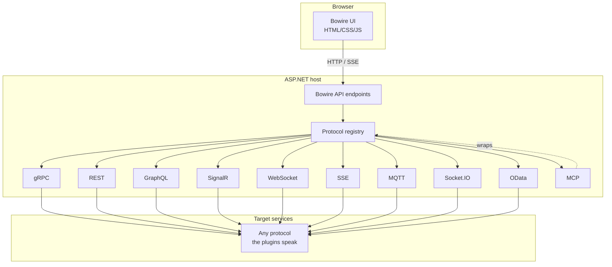
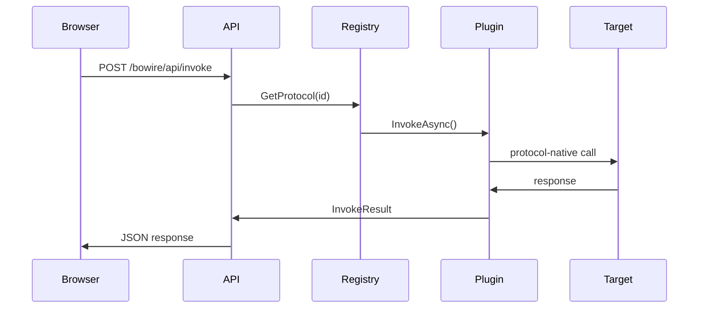

# Architecture

Bowire is a modular API browser built on ASP.NET. The core library provides the UI shell and a protocol-agnostic dispatch layer. Every protocol plugin &mdash; gRPC, REST, GraphQL, SignalR, WebSocket, SSE, MQTT, Socket.IO, OData, MCP, plus your own &mdash; handles the specifics behind a common `IBowireProtocol` contract.

## High-level shape

## Request flow

When the user invokes a method, the request crosses three layers:

Streaming and duplex calls open an SSE connection to `/bowire/api/invoke/stream` or a channel endpoint. The plugin yields messages as they arrive; each one is forwarded as an SSE event.

## No CORS proxy needed

The request flow above is the reason Bowire talks to any API without a CORS shim:

- The **browser** only ever calls `localhost:5080/bowire/api/*` &mdash; same origin as the UI, so same-origin policy is satisfied trivially and no preflight is issued.
- The **target service** is reached by the Bowire host process, not by the browser. Server-to-server traffic isn't subject to the same-origin policy, so endpoints without permissive `Access-Control-Allow-Origin` headers still work.

In other words, Bowire's architecture *is* the CORS proxy. There's no separate proxy layer to configure, no `*`-origin hole to poke in the target service, and no dev-tunnel / nginx rewrite to maintain. The one scenario that would invalidate this &mdash; upgrading a streaming channel directly from the browser to a non-Bowire endpoint &mdash; isn't how any current protocol plugin works.

## API endpoints

All endpoints are prefixed with the configured `RoutePrefix` (default: `bowire`).

| Endpoint | Purpose |
|----------|---------|
| `GET /{prefix}` | Serves the browser UI |
| `GET /{prefix}/api/protocols` | Lists registered protocol plugins |
| `GET /{prefix}/api/services` | Lists all services across protocols |
| `POST /{prefix}/api/invoke` | Invokes unary / client-streaming calls |
| `GET /{prefix}/api/invoke/stream` | SSE endpoint for streaming calls |
| `POST /{prefix}/api/channels/open` | Opens a duplex channel |
| `POST /{prefix}/api/channels/{id}/send` | Sends a message to a channel |
| `POST /{prefix}/api/channels/{id}/close` | Closes a channel |
| `GET /{prefix}/api/channels/{id}/stream` | SSE endpoint for channel responses |
| `GET /{prefix}/mcp/sse` | MCP SSE transport |
| `POST /{prefix}/mcp/message` | MCP JSON-RPC message endpoint |

## Embedded vs. standalone

- **Embedded** &mdash; `MapBowire()` adds Bowire to an existing ASP.NET app. Plugins receive the host's `IServiceProvider`, so endpoint-metadata-based discovery (SignalR, REST via `IApiDescriptionGroupCollectionProvider`, SSE attributes) works out of the box.
- **Standalone** &mdash; the global .NET tool runs Bowire in its own ASP.NET process and connects to remote URLs. Every protocol plugin is available; discovery uses network protocols (gRPC reflection, OpenAPI fetch, GraphQL introspection, SDL upload, MCP listing) rather than the host's metadata.

## UI

The browser UI is a single-page application packaged as static assets. Pure HTML, CSS, and JavaScript &mdash; no framework dependency. It talks to the API via standard HTTP and SSE.

See also: [Plugin architecture](plugin-architecture.md) · [Packages](packages.md)
