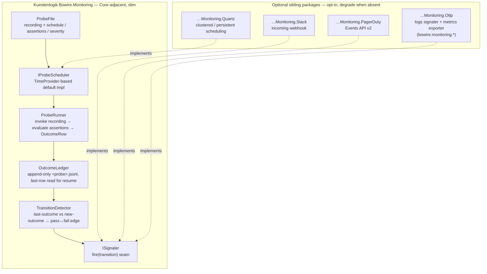

# Monitoring — scheduled probes + alerting

**Status:** design + v1 shipped, minus OTLP + the workbench surface (v2.3,
tracks [#102]). The `Kuestenlogik.Bowire.Monitoring` package implements
the Core engine below — the `TimeProvider` scheduler, the append-only
outcome ledger, the transition detector, the assertion evaluator, the
`ISignaler` seam, the recording-replay `IProbeExecutor`, and the
`bowire monitor run` CLI command. The opt-in **Slack** and **PagerDuty**
signaler packages ship (`--signal slack:<webhook>` / `pagerduty:<key>`),
discovered by assembly scan and degrading to a clear "install …" message
when absent. Still to land: the **OTLP** signaler + metrics package, and
the read-only workbench surface. This doc resolves the three open
questions the issue left for the concept tier — scheduling backend, state
recovery after restart, multi-tenant probe ownership — and draws the v1
scope line. It does not re-argue *why* the passive-monitoring shape
belongs in Bowire; the issue covers that.

## The shape in one sentence

A probe is a saved invocation (a recording / collection entry) with
three extra fields — `schedule`, `assertions`, `severity` — and
Monitoring is the process that runs those invocations on their
schedule, appends each outcome to a ledger, and fires a signal when a
probe crosses the pass↔fail line.

Everything below is in service of keeping that sentence true: no
separate authoring tool, no new execution engine, no protocol coupling.

## What already exists that Monitoring reuses

Monitoring is deliberately not a greenfield service. It composes seams
Bowire already ships:

| Need | Existing seam | Reused as-is? |
|---|---|---|
| Execute a saved invocation | `BowireRecording` + the recording replay path | yes |
| Assert on the response | the assertion DSL Ferry uses (status / shape / header / latency) | yes |
| Read-only workbench surface | `Kuestenlogik.Bowire` UI in read-only mode | yes, new panel |
| OTLP metrics namespace | `bowire.*` OpenTelemetry namespace from self-telemetry (#29) | extends |
| Outbound is opt-in | every signaler is an explicit `--signal` flag | by construction |

The only genuinely new code is: the **scheduler loop**, the **outcome
ledger**, the **signaler abstraction + its transitions**, and the
**probe file format** (recording + three fields).

## Decision 1 — Scheduling backend

**Decision: a hand-rolled `TimeProvider`-based scheduler in Core. No
Quartz.NET. No third-party scheduler dependency in v1.**

Rationale:

- **Core stays slim.** Quartz pulls a persistence/clustering machinery
  Monitoring v1 does not need, and Bowire's convention is that heavy
  third-party libraries live in *optional sibling packages*, not in the
  Core that embedded hosts carry. A cron-tick loop is ~a screen of code.
- **`TimeProvider` is the testability seam.** Building on
  `TimeProvider.CreateTimer` (not `Task.Delay` per probe, not
  `DateTime.UtcNow`) means the whole scheduler is drivable from a
  `FakeTimeProvider` in tests — cadence, drift, catch-up, and the
  pass↔fail transition logic all become deterministic unit tests with
  no wall-clock waits.
- **`Task.Delay`-per-probe is rejected** because it re-anchors to
  wall-clock on every restart (see Decision 2) and gives no clean seam
  for "how many ticks did we miss while the process was down."

Schedule spec, v1: interval (`every 60s`, `every 5m`) and a bounded
cron-lite window (`every 5m, 09:00–17:00 UTC, Mon–Fri`). Full cron
expressions are a follow-up; the parser returns "unsupported schedule —
probe not scheduled" (visible, non-silent) for anything it can't model,
rather than silently approximating.

If a deployment genuinely needs Quartz-grade scheduling (clustered,
persistent misfire policies), that arrives as an **optional
`Kuestenlogik.Bowire.Monitoring.Quartz` package** contributing an
`IProbeScheduler` implementation — the same pattern YARP / MapLibre /
k8s SDK follow. Core ships the `TimeProvider` scheduler; the rail
degrades to it when the package is absent.

## Decision 2 — State recovery after restart

**Decision: lazy-start resume, anchored to each probe's last recorded
run in the ledger — not re-anchored to the new wall-clock.**

The outcome ledger (`~/.bowire/monitoring/<probe>.jsonl`) is the source
of truth for "when did this probe last run." On boot, for each probe:

1. Read the last ledger row's timestamp `t_last` (absent → treat as
   "never run", schedule immediately).
2. Next run is `t_last + interval`. If that is already in the past
   (the process was down across one or more ticks), run **once now** to
   re-establish liveness, then resume the cadence from that run.
3. Missed intervals are **not** back-filled into N catch-up runs — a
   probe that missed six ticks overnight fires once on restart, not six
   times. The ledger records the gap (a row's timestamp delta > interval
   is itself the "we were down" signal); dashboards read the gap, we do
   not manufacture synthetic history.

Why not re-anchor to wall-clock: re-anchoring makes restart-time the new
phase reference, so a service that restarts often drifts its probe
schedule unpredictably and two probes authored to run "on the minute"
diverge. Anchoring to the ledger keeps cadence stable across restarts
and makes the schedule a property of the probe, not of the process
lifetime.

**Transition state also survives restart.** A signal fires on
pass→fail or fail→pass. The "current state" per probe is *derived* from
the last ledger row, not held only in memory — so a restart mid-outage
does not re-fire the "went critical" signal that already fired before
the restart, and does not miss the "recovered" signal if recovery
happened while down (the first post-restart run that passes, following a
last-row that failed, is a fail→pass transition and signals normally).

## Decision 3 — Probe ownership under multi-tenant hosting

**Decision: probes are workspace-scoped, not per-user. On a
single-tenant Monitoring (CLI / container, the v1 target) that
collapses to "one implicit workspace." Per-user ownership is explicitly
out of scope for v1.**

- A probe is an operational asset ("is the payments API healthy?"), not
  a personal draft. Operationally, on-call for a workspace must see the
  same probe set regardless of who authored it — per-user probes would
  fragment exactly the view that needs to be shared.
- v1 ships the **CLI / container** deployment: `bowire monitor run
  <file>` owns one probe file, which *is* the workspace. No
  `IBowireUserStore` interaction, no auth, no per-user filtering. This
  keeps v1 shippable without waiting on the multi-tenant user story.
- When Monitoring later runs *inside* a Cruise-ship-deployed Bowire
  (multi-user), probes bind to the workspace via the existing workspace
  seam, and `IBowireUserStore` gates *who may edit the probe set*, not
  *whose probes run*. That is a v2.4+ design and gets its own note; v1
  deliberately does not encode assumptions that would block it.

## Component boundaries

Every outbound integration (Slack, PagerDuty, OTLP) is an **optional
package + explicit `--signal` flag**. Core Monitoring with zero signal
flags is fully functional — it runs probes and writes the ledger; the
workbench surface reads that ledger. Nothing leaves the host unless the
operator opts in per channel. This is the same "outbound is opt-in"
rule the rest of Bowire follows, expressed as: no default signalers, and
the network-touching signalers are not even in the Core assembly.

## Metrics

Two instruments, in the shared `bowire.*` OTel namespace so #29's
Grafana dashboards gain a Monitoring section rather than a parallel one:

- `bowire.monitoring.probe.duration` — histogram, tags: probe name.
- `bowire.monitoring.probe.outcome` — counter, tags: probe name,
  outcome (`pass` / `fail` / `error`).

Metrics export is the OTLP *sibling package*; without it the instruments
still record in-process (readable via the workbench surface), they just
do not export. In-process recording is not an outbound call.

## v1 acceptance (unchanged from the issue, now scoped)

- [ ] `bowire monitor run <file>` boots a `TimeProvider`-driven probe
      loop against the configured target.
- [ ] Outcomes append to `~/.bowire/monitoring/<probe>.jsonl`; restart
      resumes cadence via lazy-start from the last ledger row.
- [ ] `ISignaler` transitions fire on pass↔fail; Slack + PagerDuty +
      OTLP-logs signalers ship as opt-in sibling packages.
- [ ] OTLP metrics (`bowire.monitoring.*`) export against
      `otel/opentelemetry-collector-contrib` when the OTLP package is present.
- [ ] Workbench surface shows live + historical outcomes with a
      per-probe sparkline, read-only.

## Explicitly deferred

- Full cron expressions (v1 = interval + bounded window).
- Catch-up / back-fill of missed ticks (v1 = single liveness run on
  restart).
- Per-user probe ownership + `IBowireUserStore` gating (v1 =
  workspace-scoped, single implicit workspace on the CLI deployment).
- Quartz-backed clustered scheduling (optional package, post-v1).
