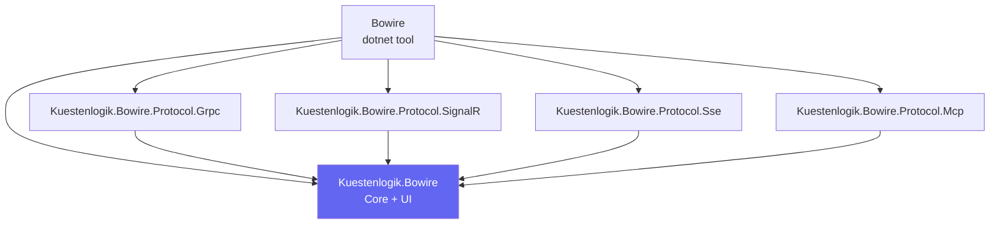

# Packages

Bowire is distributed as a set of NuGet packages with clear dependency relationships.

## Package Diagram



## Package Details

### Kuestenlogik.Bowire

The core package. Contains:

- Browser UI (HTML, CSS, JS embedded as static web assets)
- `IBowireProtocol` and `IBowireChannel` interfaces
- `BowireProtocolRegistry` for plugin discovery
- `BowireOptions` for configuration
- `MapBowire()` extension method
- API endpoint handlers
- Model types (`BowireServiceInfo`, `InvokeResult`, etc.)

This is the only required package. Install protocol plugins separately based on which protocols you need.

### Kuestenlogik.Bowire.Protocol.Grpc

gRPC protocol plugin. Depends on `Kuestenlogik.Bowire` and `Grpc.Reflection`. Provides:

- `BowireGrpcProtocol` -- service discovery via gRPC Server Reflection
- Protobuf schema parsing for auto-generated request templates
- All four gRPC call types (unary, server streaming, client streaming, duplex)
- `IBowireChannel` implementation for duplex/client-streaming

### Kuestenlogik.Bowire.Protocol.SignalR

SignalR protocol plugin. Depends on `Kuestenlogik.Bowire` and `Microsoft.AspNetCore.SignalR.Client`. Provides:

- `BowireSignalRProtocol` -- hub discovery via endpoint metadata scanning
- CLR type reflection for parameter and return type detection
- Streaming direction inference from `IAsyncEnumerable<T>` and `ChannelReader<T>`
- `IBowireChannel` implementation for duplex hubs

### Kuestenlogik.Bowire.Protocol.Sse

SSE protocol plugin. Depends on `Kuestenlogik.Bowire`. Provides:

- `BowireSseProtocol` -- endpoint discovery via attributes and metadata
- `SseEndpointAttribute` for marking SSE endpoints
- `AddBowireSseEndpoint()` for fluent registration
- `SseSubscriber` for connecting to SSE endpoints and parsing events

### Kuestenlogik.Bowire.Protocol.Mcp

MCP protocol plugin. Depends on `Kuestenlogik.Bowire`. Provides:

- `BowireMcpProtocol` -- protocol marker for MCP support
- `McpServer` -- JSON-RPC 2.0 server implementing `initialize`, `tools/list`, `tools/call`, `ping`
- SSE transport endpoint for AI agent connections
- Auto-conversion of discovered unary methods to MCP tools with JSON Schema

### Bowire (dotnet tool)

The standalone CLI tool. Packages all protocol plugins into a single global tool:

```bash
dotnet tool install -g Kuestenlogik.Bowire.Tool
```

Provides both browser UI mode (`bowire --url`) and CLI mode (`bowire list/describe/call`).

## Versioning

All packages share the same version number and are released together. The version follows [SemVer 2.0](https://semver.org/).

See also: [Architecture Overview](index.md), [Plugin Architecture](plugin-architecture.md)
