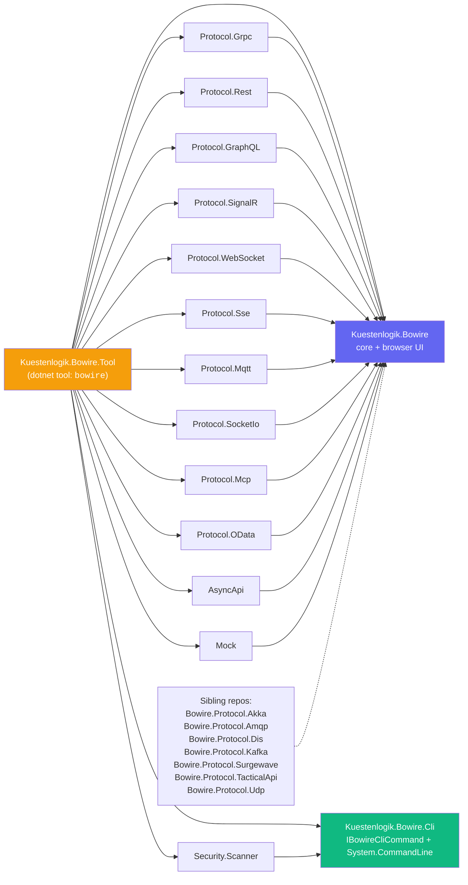

# Packages

Bowire is distributed as a set of focused NuGet packages. The split is deliberate: an app embedding Bowire should not have to pull `System.CommandLine` (the CLI surface), `Grpc.Reflection` (only protobuf calls need it), or `Microsoft.AspNetCore.SignalR.Client` (only SignalR hubs need it). Each capability lives in its own package; you install what you use.

## Package map



Solid arrows are hard `PackageReference` edges. The dashed arrow from the sibling-plugins box means the sibling repos pin a minimum Bowire version (see [Plugin Compatibility](compatibility.md)) but they're not consumed by the Tool package — users install them separately when they need them.

## Why Bowire and the CLI sit in different packages

`Kuestenlogik.Bowire` carries the browser-UI host + the protocol-plugin registry + the model types. Nothing in there needs `System.CommandLine`, the CLI argument parser. So an ASP.NET host that embeds Bowire with `app.MapBowire()` doesn't have to pull a CLI parser it never invokes.

`Kuestenlogik.Bowire.Cli` adds the CLI surface:

- `IBowireCliCommand` — the plugin contract for adding a subcommand (`bowire scan` is the pilot consumer, contributed by `Security.Scanner`).
- `BowireCliCommandRegistry` — assembly-scan discovery of `IBowireCliCommand` implementations.
- The `System.CommandLine` dependency that backs both.

`Kuestenlogik.Bowire.Tool` consumes both, plus every in-tree protocol plugin, and ships the result as a single `dotnet tool install -g`-able executable.

For consumers, the practical rule:

- **Embedded mode** (Bowire mounted into your ASP.NET app): `Kuestenlogik.Bowire` + whichever protocol plugins you need. No `Cli` package.
- **CLI tool** (you typed `bowire` at a shell): `Kuestenlogik.Bowire.Tool`. Everything else rides along.
- **Building a custom CLI subcommand** (your library wants to contribute a `bowire mycmd` verb that's picked up by the auto-discovery): take a `PackageReference` on `Kuestenlogik.Bowire.Cli` and implement `IBowireCliCommand`. Your assembly lands as a plugin under `~/.bowire/plugins/` and the registry picks the command up at startup.

## Package details

### `Kuestenlogik.Bowire` — core + browser UI

The minimum to embed Bowire into an ASP.NET app. Contains:

- The browser UI (HTML/CSS/JS as static web assets), mounted via `app.MapBowire()`.
- `IBowireProtocol` — the protocol-plugin contract.
- `IBowireChannel` — the duplex-channel contract for streaming protocols.
- `BowireProtocolRegistry` — assembly-scan discovery of `IBowireProtocol` implementations.
- `IBowireUiExtension` — the UI-widget-plugin contract.
- `BowireExtensionRegistry` — same shape for UI extensions.
- `IBowireMockEmitter` — extension point for protocols that produce traffic in the mock server (DIS, Kafka, AMQP-0.9.1, TacticalAPI all implement it).
- `BowireOptions`, model types (`BowireServiceInfo`, `BowireMethodInfo`, `InvokeResult`, `BowirePluginSetting`, …), API endpoint handlers, plugin-load context (`BowirePluginLoadContext`).
- The `Kuestenlogik.Bowire.Auth` namespace — shared mTLS marker (`MtlsConfig`) every TLS-capable plugin reads.

Direct dependencies: ASP.NET Core (Microsoft.AspNetCore.App framework reference). Nothing protocol-specific.

### `Kuestenlogik.Bowire.Cli` — CLI command extension point

Separate package so embedded hosts don't pull `System.CommandLine`. Contains:

- `IBowireCliCommand` — plugin contract: id + `Command Build()`.
- `BowireCliCommandRegistry.Discover()` — walks loaded `Kuestenlogik.Bowire*` assemblies, instantiates every `IBowireCliCommand`, honours an opt-out list from the operator (`--disable-cli-command`).
- `System.CommandLine` PackageReference (the actual argument parser).

Plugins that contribute CLI subcommands (currently `Kuestenlogik.Bowire.Security.Scanner` with `ScanCliCommand`) reference this package. The Tool host references it too.

### `Kuestenlogik.Bowire.AsyncApi`

AsyncAPI 2.x / 3.0 document → discovery + invoke. Channels map to services, operations to methods; the per-binding wire plugin (MQTT / Kafka / AMQP / WebSocket / HTTP / Solace / Pulsar) is resolved at invoke time through `BowireProtocolRegistry`. Stays separate from the protocol-plugin packages so an embedded host that doesn't care about AsyncAPI omits it.

### `Kuestenlogik.Bowire.Mock`

Recording-replay engine — the engine behind `bowire mock`. Reads recordings tagged with a protocol id, finds the matching `IBowireMockEmitter` (DIS / Kafka / AMQP / TacticalAPI / future emitters), schedules the replay at the original cadence with `MockEmitterOptions.ReplaySpeed` + `Loop`. Hosts the HTTP / WS reading endpoints that serve replayed bodies. Decoupled so an embedded app that only wants live discovery + invoke leaves it out.

### `Kuestenlogik.Bowire.Mcp`

MCP-server adapter — exposes Bowire's discovered protocol methods as MCP tools so an AI agent can call them via JSON-RPC. Separate from `Kuestenlogik.Bowire.Protocol.Mcp` (which is a wire plugin for *talking to* MCP servers).

### `Kuestenlogik.Bowire.Security.Scanner`

Vulnerability scanner — the engine behind `bowire scan`. Reads JSON templates (built-in passive checks + the `Bowire.VulnDb` baseline + Nuclei templates via `--nuclei`), runs them against a target URL through the discovered protocol plugins, emits SARIF 2.1.0. References `Kuestenlogik.Bowire.Cli` so its `ScanCliCommand` lands in the auto-discovery loop. Optional — embedded hosts that don't need scanning leave it out.

### `Kuestenlogik.Bowire.Map`

UI extension — adds the live-map widget to the workbench. Implements `IBowireUiExtension`. Ships separately because the MapLibre runtime (~870 KB of JS + CSS) doesn't belong in every install.

### Protocol plugins — in-tree

Each is a `Kuestenlogik.Bowire.Protocol.*` package implementing `IBowireProtocol`, discovered by `BowireProtocolRegistry` via assembly scan:

| Package | Wire | Notes |
|---|---|---|
| `Protocol.Grpc` | gRPC, gRPC-Web | Reflection-driven, all four streaming types |
| `Protocol.Rest` | HTTP/REST + OpenAPI | Swagger import, AWS Sig v4 |
| `Protocol.GraphQL` | GraphQL | Introspection, query / mutation / subscription |
| `Protocol.SignalR` | SignalR | Hub discovery, all streaming directions |
| `Protocol.WebSocket` | WebSocket | Generic frame stream + endpoint discovery |
| `Protocol.Sse` | Server-Sent Events | Attribute-driven endpoint discovery |
| `Protocol.Mqtt` | MQTT 3.1.1 / 5.0 | Topics → services, pub/sub → unary/streaming |
| `Protocol.SocketIo` | Socket.IO | Namespace selection, event-based streaming |
| `Protocol.Mcp` | MCP / JSON-RPC | Tool/resource/prompt browsing |
| `Protocol.OData` | OData v4 | Entity-set discovery |

All depend on `Kuestenlogik.Bowire`. Versioned in lockstep with the Tool — bundled releases share a version number.

### Protocol plugins — sibling repos

Each lives in its own repo with its own release cadence; pulled into Bowire as a regular `dotnet add package` install:

| Package | Wire | Repo |
|---|---|---|
| `Protocol.Akka` | Akka.NET actor systems | [`Bowire.Protocol.Akka`](https://github.com/Kuestenlogik/Bowire.Protocol.Akka) |
| `Protocol.Amqp` | AMQP 0.9.1 + 1.0 | [`Bowire.Protocol.Amqp`](https://github.com/Kuestenlogik/Bowire.Protocol.Amqp) |
| `Protocol.Dis` | IEEE 1278.1 DIS | [`Bowire.Protocol.Dis`](https://github.com/Kuestenlogik/Bowire.Protocol.Dis) |
| `Protocol.Kafka` | Apache Kafka + Schema Registry | [`Bowire.Protocol.Kafka`](https://github.com/Kuestenlogik/Bowire.Protocol.Kafka) |
| `Protocol.Surgewave` | Surgewave tap streams | [`Bowire.Protocol.Surgewave`](https://github.com/Kuestenlogik/Bowire.Protocol.Surgewave) |
| `Protocol.TacticalApi` | Rheinmetall TacticalAPI (gRPC) | [`Bowire.Protocol.TacticalApi`](https://github.com/Kuestenlogik/Bowire.Protocol.TacticalApi) |
| `Protocol.Udp` | Generic UDP listener | [`Bowire.Protocol.Udp`](https://github.com/Kuestenlogik/Bowire.Protocol.Udp) |

Sibling plugins follow their own SemVer track — see [Plugin Compatibility](compatibility.md) for which plugin version works with which Bowire host. The release cadence is decoupled by design (Kafka 1.0.3 is stable; AMQP 1.0-rc.1 is still settling); pinning all of them to a fleet-wide version would either lie about Plugin-API maturity or force release-spam on every Bowire patch.

### `Kuestenlogik.Bowire.Tool` — the dotnet tool

```bash
dotnet tool install -g Kuestenlogik.Bowire.Tool
```

The standalone CLI. Bundles every in-tree protocol plugin so `bowire --url tacticalapi@…` works without a separate plugin install. Sibling plugins (Kafka, AMQP, …) are installed via `bowire plugin install <id>` on top of the Tool baseline.

Provides both:

- **Browser-UI mode**: `bowire --url <serverUrl>` mounts the workbench at `http://localhost:5080/` and opens it in a browser.
- **CLI mode**: `bowire list / describe / call / mock / scan / fuzz / jwt / proxy / mcp / plugin / test / import`. The `plugin` subcommand manages `~/.bowire/plugins/`.

## Versioning

Packages **inside the Bowire repo** (`Kuestenlogik.Bowire`, `.Cli`, `.Tool`, `.Ai`, `.AsyncApi`, `.Auth.Oidc`, `.Help`, `.Map`, `.Mock`, `.Mcp`, `.Security.Scanner`, `.Telemetry`, `.Testing`, all in-tree `Protocol.*` plugins) share the same version number and release together. The version follows [SemVer 2.0](https://semver.org/).

Packages **in sibling repos** carry their own version number — each plugin matures on its own schedule. The compatibility contract (which sibling-version × Bowire-host pair works together) is documented in [Plugin Compatibility](compatibility.md); the short version is "plugin built against `Kuestenlogik.Bowire X.Y.Z` runs in any Bowire host within the same major".

See also: [Architecture Overview](index.md), [Plugin Architecture](plugin-architecture.md), [Plugin Compatibility](compatibility.md)
