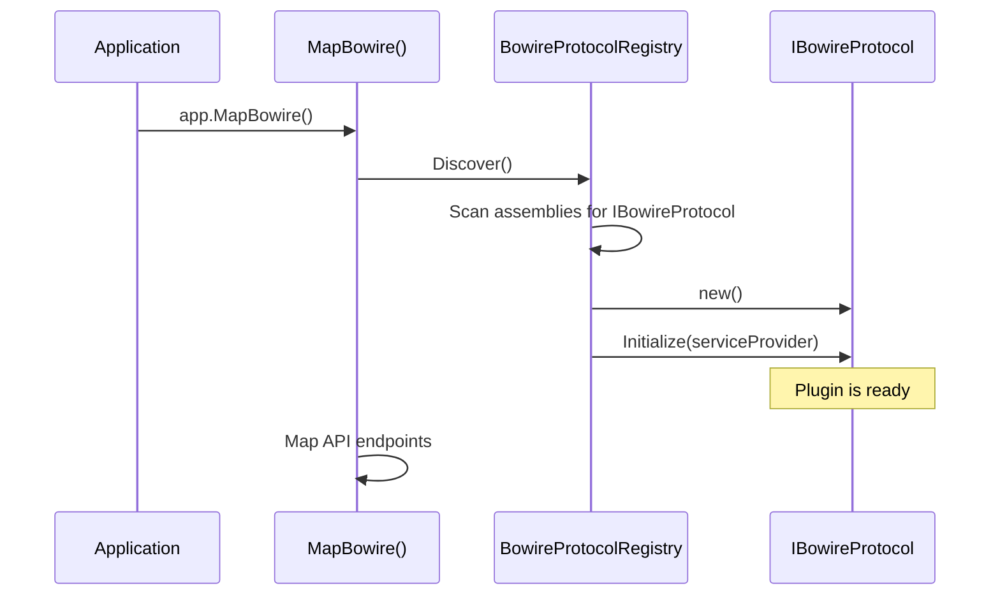

# Plugin Architecture

Bowire's protocol support is entirely plugin-based. The core library defines the `IBowireProtocol` interface and the `BowireProtocolRegistry` that discovers and manages plugins.

## IBowireProtocol

Every protocol plugin implements this interface:

```csharp
public interface IBowireProtocol
{
    string Name { get; }
    string Id { get; }
    string IconSvg { get; }

    void Initialize(IServiceProvider? serviceProvider) { }

    Task<List<BowireServiceInfo>> DiscoverAsync(
        string serverUrl, bool showInternalServices, CancellationToken ct);

    Task<InvokeResult> InvokeAsync(
        string serverUrl, string service, string method,
        List<string> jsonMessages, bool showInternalServices,
        Dictionary<string, string>? metadata, CancellationToken ct);

    IAsyncEnumerable<string> InvokeStreamAsync(
        string serverUrl, string service, string method,
        List<string> jsonMessages, bool showInternalServices,
        Dictionary<string, string>? metadata, CancellationToken ct);

    Task<IBowireChannel?> OpenChannelAsync(
        string serverUrl, string service, string method,
        bool showInternalServices, CancellationToken ct);
}
```

## Plugin Lifecycle



1. **Discovery** -- `BowireProtocolRegistry.Discover()` scans all loaded assemblies for types implementing `IBowireProtocol`
2. **Instantiation** -- each plugin is instantiated via its parameterless constructor
3. **Initialization** -- `Initialize(IServiceProvider?)` is called with the application's service provider (null in standalone mode)
4. **Registration** -- the plugin is added to the registry and available to all API endpoints

## BowireProtocolRegistry

The registry manages all discovered plugins:

- `Discover()` -- scans assemblies and registers plugins
- `GetProtocol(id)` -- retrieves a plugin by its short identifier
- `GetAll()` -- returns all registered plugins
- Services discovered by any plugin are available through the unified `/bowire/api/services` endpoint

## IBowireChannel

For duplex and client-streaming support, plugins optionally return an `IBowireChannel` from `OpenChannelAsync`:

```csharp
public interface IBowireChannel : IAsyncDisposable
{
    string Id { get; }
    bool IsClientStreaming { get; }
    bool IsServerStreaming { get; }
    int SentCount { get; }
    bool IsClosed { get; }
    long ElapsedMs { get; }

    Task<bool> SendAsync(string jsonMessage, CancellationToken ct);
    Task CloseAsync(CancellationToken ct);
    IAsyncEnumerable<string> ReadResponsesAsync(CancellationToken ct);
}
```

Channels are managed by the API layer. Each channel gets a unique ID, and clients interact with it via dedicated endpoints for sending, closing, and streaming responses.

## Assembly Scanning

The registry scans the following assembly sources:

1. **AppDomain assemblies** -- all assemblies loaded in the current `AppDomain`
2. **Plugin directory** -- assemblies loaded from `~/.bowire/plugins/` (standalone mode)

This means that for embedded mode, simply referencing a NuGet package like `Kuestenlogik.Bowire.Protocol.SignalR` is enough -- no manual registration is needed. For standalone mode, plugins installed via `bowire plugin install` are loaded from the plugin directory.

See also: [Custom Protocols](../protocols/custom.md), [Plugin System](../features/plugin-system.md)
