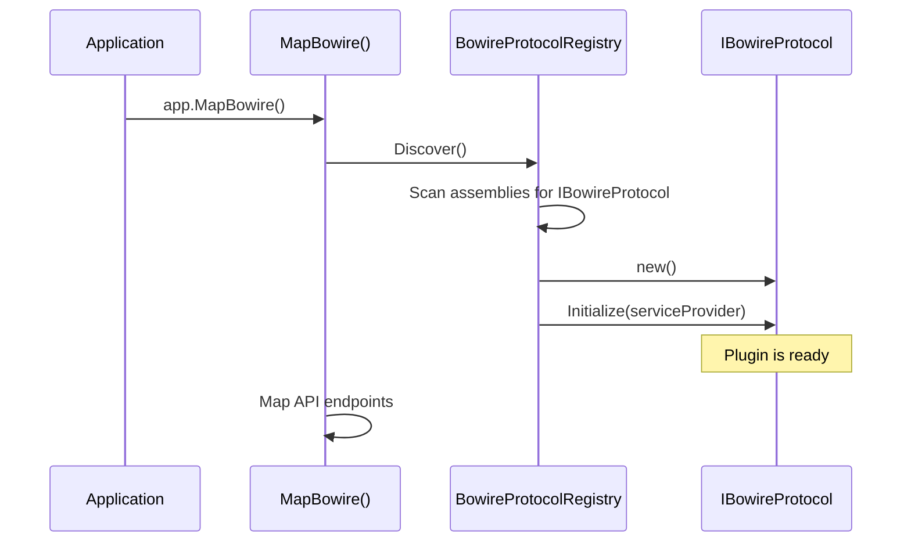

# Plugin Architecture

Bowire ships four extension contracts. Each is its own interface in the core / CLI package, each is discovered by an assembly-scan registry at startup, and each can be contributed by either an in-tree plugin (Protocol.Grpc, &c) or a sibling-repo plugin installed under `~/.bowire/plugins/`:

| Contract | Lives in | Registry | What it adds |
|---|---|---|---|
| `IBowireProtocol` | `Kuestenlogik.Bowire` | `BowireProtocolRegistry` | A wire plugin — discover + invoke against a protocol |
| `IBowireCliCommand` | `Kuestenlogik.Bowire.Cli` | `BowireCliCommandRegistry` | A `bowire <verb>` subcommand |
| `IBowireMockEmitter` | `Kuestenlogik.Bowire` (under `.Mocking`) | The mock-server host | A replay backend for `bowire mock` recordings |
| `IBowireUiExtension` | `Kuestenlogik.Bowire` (under `.Semantics.Extensions`) | `BowireExtensionRegistry` | A workbench UI widget |

The four are independent — a plugin can implement one, several, or all of them. The AMQP plugin implements `IBowireProtocol` and `IBowireMockEmitter` (replay 0.9.1 recordings); the Security.Scanner plugin implements only `IBowireCliCommand` (`bowire scan`); the MapLibre plugin implements only `IBowireUiExtension` (the map widget).

## IBowireProtocol

The wire-protocol plugin contract. Every protocol — gRPC, REST, MQTT, AMQP, TacticalAPI, … — implements this interface:

```csharp
public interface IBowireProtocol
{
    string Name { get; }
    string Id { get; }
    string IconSvg { get; }

    void Initialize(IServiceProvider? serviceProvider) { }
    IReadOnlyList<BowirePluginSetting> Settings => [];

    Task<List<BowireServiceInfo>> DiscoverAsync(
        string serverUrl, bool showInternalServices, CancellationToken ct = default);

    Task<InvokeResult> InvokeAsync(
        string serverUrl, string service, string method,
        List<string> jsonMessages, bool showInternalServices,
        Dictionary<string, string>? metadata = null, CancellationToken ct = default);

    IAsyncEnumerable<string> InvokeStreamAsync(
        string serverUrl, string service, string method,
        List<string> jsonMessages, bool showInternalServices,
        Dictionary<string, string>? metadata = null, CancellationToken ct = default);

    Task<IBowireChannel?> OpenChannelAsync(
        string serverUrl, string service, string method,
        bool showInternalServices, Dictionary<string, string>? metadata = null,
        CancellationToken ct = default);
}
```

The `Settings` property is opt-in (default returns an empty list) — protocol plugins that expose tunable knobs return a `BowirePluginSetting` list that the workbench renders as form fields under Settings → Plugins.

## Plugin Lifecycle



1. **Discovery** -- `BowireProtocolRegistry.Discover()` scans all loaded assemblies for types implementing `IBowireProtocol`
2. **Instantiation** -- each plugin is instantiated via its parameterless constructor
3. **Initialization** -- `Initialize(IServiceProvider?)` is called with the application's service provider (null in standalone mode)
4. **Registration** -- the plugin is added to the registry and available to all API endpoints

## BowireProtocolRegistry

The registry manages all discovered plugins:

- `Discover()` -- scans assemblies and registers plugins
- `GetProtocol(id)` -- retrieves a plugin by its short identifier
- `GetAll()` -- returns all registered plugins
- Services discovered by any plugin are available through the unified `/bowire/api/services` endpoint

## IBowireChannel

For duplex and client-streaming support, plugins optionally return an `IBowireChannel` from `OpenChannelAsync`:

```csharp
public interface IBowireChannel : IAsyncDisposable
{
    string Id { get; }
    bool IsClientStreaming { get; }
    bool IsServerStreaming { get; }
    int SentCount { get; }
    bool IsClosed { get; }
    long ElapsedMs { get; }

    Task<bool> SendAsync(string jsonMessage, CancellationToken ct);
    Task CloseAsync(CancellationToken ct);
    IAsyncEnumerable<string> ReadResponsesAsync(CancellationToken ct);
}
```

Channels are managed by the API layer. Each channel gets a unique ID, and clients interact with it via dedicated endpoints for sending, closing, and streaming responses.

## Assembly Scanning

Each registry scans the same set of assembly sources:

1. **AppDomain assemblies** — every assembly loaded in the current `AppDomain` whose name matches `Kuestenlogik.Bowire*` (the prefix filter keeps the scan cheap; third-party plugins are picked up as soon as their assembly loads).
2. **Plugin directory** — assemblies under `~/.bowire/plugins/<package-id>/`, loaded through `BowirePluginLoadContext`. Standalone-CLI installs land here via `bowire plugin install`; embedded hosts can point at the same directory via `BowireOptions`.

For **embedded mode**, a regular `PackageReference` on a plugin package is enough — the assembly is loaded by the host process before `MapBowire()` runs and the scan finds it. For **standalone mode**, plugins installed via `bowire plugin install` land under the plugin directory and are loaded through the isolated load-context.

The `BowirePluginLoadContext` returns `null` for assemblies whose name starts with `Kuestenlogik.Bowire*`, which delegates resolution to the default ALC. That keeps the host's copy of `IBowireProtocol` (and the rest of the contract types) as a single shared identity across every plugin, which is what makes the assembly-scan-then-instantiate pattern work in the first place. See [Plugin Compatibility](compatibility.md) for the SemVer contract on top of that mechanism.

## IBowireCliCommand

Lives in `Kuestenlogik.Bowire.Cli` — separate from the core so embedded hosts that don't run a CLI don't pull `System.CommandLine`. Implementations contribute a single subcommand to the `bowire` root:

```csharp
public interface IBowireCliCommand
{
    string Id { get; }
    System.CommandLine.Command Build();
}
```

`BowireCliCommandRegistry.Discover(disabledCommandIds)` walks loaded `Kuestenlogik.Bowire*` assemblies for `IBowireCliCommand` implementations, instantiates each via parameterless constructor, honours `--disable-cli-command <id>` to skip a noisy / heavy command without rebuilding.

Today's only first-party `IBowireCliCommand` is `ScanCliCommand` from `Kuestenlogik.Bowire.Security.Scanner` — it lands as the `bowire scan` verb. The Tool's `BowireCli.BuildRoot()` does an eager `Activator.CreateInstance<ScanCliCommand>()` reference so the Scanner assembly loads before `Discover()` walks the AppDomain (a `typeof()` reference alone is sometimes optimised out of Release builds).

Plugin authors who want their own `bowire mycmd` verb add a `PackageReference` on `Kuestenlogik.Bowire.Cli`, implement `IBowireCliCommand`, and ship the plugin via NuGet — `bowire plugin install <id>` lands it under `~/.bowire/plugins/`, and the next `bowire --help` shows the verb.

## IBowireMockEmitter

Recording-replay extension point — lives under `Kuestenlogik.Bowire.Mocking` in the core package, consumed by `Kuestenlogik.Bowire.Mock` (the mock-server engine). Implementations are wire plugins that produce traffic against a target the same way a captured recording did:

```csharp
public interface IBowireMockEmitter : IAsyncDisposable
{
    string Id { get; }
    bool CanEmit(BowireRecording recording);
    Task StartAsync(
        BowireRecording recording,
        MockEmitterOptions options,
        ILogger logger,
        CancellationToken ct);
}
```

The mock host calls `CanEmit` on every registered emitter when a recording loads, gives the recording to the one that claims it, and `StartAsync` runs for the lifetime of the mock server. `MockEmitterOptions.ReplaySpeed` (multiplier on the original timing) and `MockEmitterOptions.Loop` (re-emit after the last step) are the two operator-visible knobs.

First-party implementations: `KafkaMockEmitter` (Confluent producer against a configured bootstrap CSV), `DisMockEmitter` (UDP multicast PDUs), `UdpMockEmitter` (raw UDP datagrams), `AmqpMockEmitter` (RabbitMQ.Client publisher for 0.9.1 recordings), `TacticalApiMockEmitter` (gRPC client replay for Rheinmetall TacticalAPI). Payload-decoding precedence is shared across all of them: `BowireRecordingStep.ResponseBinary` (base64) wins so binary payloads round-trip byte-for-byte; `Body` (JSON / text) is the fallback.

## IBowireUiExtension

UI-widget extension point — adds new visualisers / editors to the workbench. Lives under `Kuestenlogik.Bowire.Semantics.Extensions` in the core; `BowireExtensionRegistry.Discover()` mirrors the same assembly-scan shape as the protocol registry. The MapLibre extension (`Kuestenlogik.Bowire.Extension.MapLibre`) is the reference implementation: it claims any frame whose semantics include a WGS84 coordinate pair and renders it on a live MapLibre map alongside the streaming-frames pane.

See [Frame Semantics Framework](frame-semantics-framework.md) for the annotation seam UI extensions hook into.

See also: [Custom Protocols](../protocols/custom.md), [Plugin Compatibility](compatibility.md), [Plugin System](../features/plugin-system.md)
