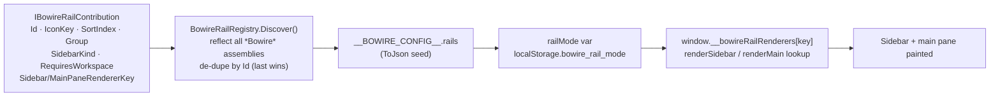
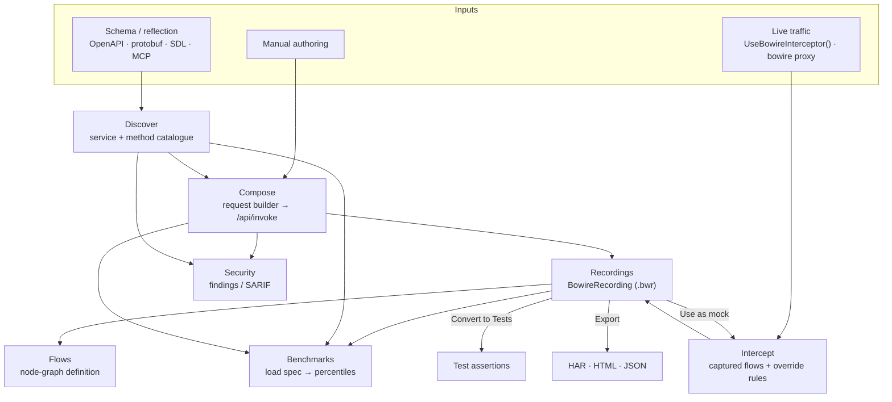
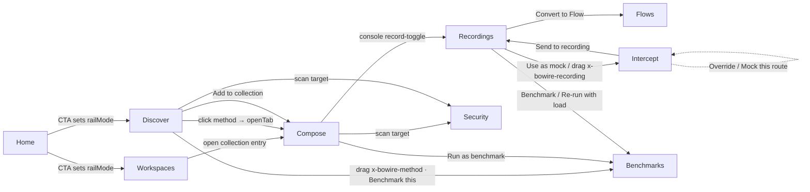

# Rail pipelines & hand-offs

The [rail strip](../features/rail-strip.md) explains *what* rails are and how
operators enable / deep-link them. This page is the **data-flow** companion:
for each rail it states the pipeline — what flows in, what the rail does to
it, what comes out — and then draws the **transition graph**: which rail hands
an artefact to which other rail, over what mechanism, carrying what type.

Everything here is derived from the shipped contributions
(`IBowireRailContribution`) and the workbench JS, not from intent. Ten rail
contributions ship in v2.x; there is **no standalone Mock rail** — mock
servers are a sub-tab of Intercept.

## How a rail comes to exist

A rail is a contribution type, discovered by reflection at boot, seeded into
the JS config, and rendered through a renderer-key lookup rather than a
hard-coded branch.

Boot also runs a **legacy-id migration** (`prologue.js`): `sources` /
`environments` → `workspaces`, `collections` → `compose`, and `mocks` /
`traffic` / `intercepted` / `proxy` → `intercept`. Old `?rail=` deep links and
persisted preferences keep working across the v2.0 → v2.1 rail consolidation.

## The rail set

| Rail | Id | Package | Group | Sort | Needs workspace | Sidebar |
|---|---|---|---|---:|:---:|---|
| Home | `home` | Core | home | 100 | — (always on) | none |
| Discover | `discover` | Core | work | 200 | — (always on) | services |
| Compose | `compose` | `…Bowire.Compose` | work | 300 | ✔ | library |
| Recordings | `recordings` | `…Bowire.Recordings` | scenarios | 600 | ✔ | recordings |
| Flows | `flows` | `…Bowire.Flows` | scenarios | 800 | ✔ | flows |
| Intercept | `intercept` | `…Bowire.Interceptor` | quality | 950 | — | intercept |
| Benchmarks | `benchmarks` | `…Bowire.Benchmarking` | quality | 1000 | ✔ | benchmarks |
| Security | `security` | `…Bowire.Security.Scanner` | hardening | 1100 | — | security |
| Workspaces | `workspaces` | Core | admin | 1200 | — (always on) | workspaces |
| Help | `help` | `…Bowire.Help` | help | 9500 | — | help |

## The artefact data-flow

Three sources feed the workbench — a **schema** (discovered services), **live
traffic** (intercepted flows), and **manual** authoring (Compose). Each rail
turns its input into a durable artefact; the arrows are where one rail's
artefact becomes another's input.

## Per-rail pipelines

### Home (`home`)

- **Role**: landing surface + the redirect target when a `RequiresWorkspace`
  rail is opened with no active workspace.
- **Pipeline**: descriptor-only — no `wwwroot` fragment, no `/api/home/*`.
  Rendered by `landing.js`. *In:* workspace list + recent activity. *Out:*
  navigation CTAs.
- **Hand-offs (out)**: the "Create your first workspace" / "Start exploring"
  CTAs set `railMode` to `workspaces` / `discover` (`landing.js`).

### Discover (`discover`)

- **Role**: the schema-driven catalogue of services and methods — the entry
  point for everything invocable.
- **Pipeline**: *In:* a schema (reflection, or an uploaded OpenAPI / proto /
  SDL, or an MCP listing). *Processing:* `GET /api/protocols`,
  `GET /api/services`, uploads via `/api/proto` · `/api/openapi`, semantics via
  `/api/semantics` · `/api/catalogue`. *Out:* a services/methods tree in the
  sidebar; each method row carries `{service, method, protocol, methodType,
  body, serverUrl}`.
- **Hand-offs (out)** — Discover is the largest hand-off *source*:
  - **click** a method row → `openTab()` opens it as a **Compose** request tab;
  - **context menu** → "Add to collection…" (feeds Compose / Collections),
    "Benchmark this method" (`createBenchmarkSpec` → **Benchmarks**);
  - **drag** the `application/x-bowire-method` payload onto the **Benchmarks**
    rail icon.

### Compose (`compose`)

- **Role**: the ad-hoc request builder (the v2.1 Hoppscotch-style surface).
- **Pipeline**: *In:* a method + request config, from Discover or authored by
  hand; the Library sidebar holds Collections + Presets. *Processing:*
  execution through `POST /api/invoke` and `POST /api/parallel`. *Out:*
  request/response envelopes, saved collection entries, history.
- **Hand-offs (in)**: accepts drops of `application/x-bowire-method` (a Discover
  method) and `application/x-bowire-compose` (intra-Compose reorder) as request
  tabs.
- **Hand-offs (out)**: "Run as benchmark…" sets `railMode='benchmarks'`; "Save
  to collection"; the console record-toggle (shift / right-click) flips into
  **Recordings**; a request's scan target feeds **Security**.

### Recordings (`recordings`)

- **Role**: capture a call sequence once, replay it many ways. The richest
  hand-off hub in the workbench.
- **Pipeline**: *In:* a session capture (`/api/recording/*`) or a HAR import.
  *Processing:* CRUD via `GET/POST/DELETE /api/recordings`; `replayRecording()`
  drives one `/api/invoke` per unary step (streaming / channel steps are
  flagged and skipped), emitting a coverage entry per step. *Out:* a
  **BowireRecording** (`.bwr`, versioned) — request + response per step, with a
  frame-semantics sidecar for widget-faithful replay.
- **Hand-offs (out)** — the detail toolbar splits into Run / Build / Export:
  - **Use as mock** → `POST /api/mocks` boots a mock server (→ **Intercept ›
    Mock servers**); **Run as mock** opens it directly;
  - **Benchmark** / **Re-run with load** → `createBenchmarkSpec` → **Benchmarks**;
  - **Convert to Flow** → `convertRecordingToFlow` sets `railMode='flows'` and
    selects the new flow (→ **Flows**);
  - **Convert to Tests** → append-only status + equality assertions;
  - **Export** → HAR / HTML report / JSON;
  - **drag** the `application/x-bowire-recording` payload onto the
    **Benchmarks** or **Intercept** rail icon.
- **Hand-offs (in)**: a captured flow arrives from **Intercept** via
  `POST /api/intercepted/flows/{id}/recording`.

### Flows (`flows`)

- **Role**: the visual node-graph editor — a designed, branchable sequence
  (Request / Delay / Condition / Variable nodes).
- **Pipeline**: *In:* nodes authored in the canvas, or a whole flow converted
  from a recording. *Processing:* no dedicated `/api/flows` surface — flow specs
  persist per-workspace, node execution reuses `/api/invoke`. *Out:* a flow
  definition run top-to-bottom with per-node PASS / FAIL.
- **Hand-offs (in)**: `convertRecordingToFlow` from **Recordings**; drops onto
  the canvas.

### Intercept (`intercept`)

- **Role**: live traffic capture + mocking. Consolidates the retired v2.0
  Proxy / Intercepted / Traffic / Mocks rails into one, with sub-tabs
  **Captured | Live overrides | Mock servers | Settings** (locked order).
- **Pipeline**: *In:* inbound traffic from `UseBowireInterceptor()` middleware
  or `bowire proxy`. *Processing:* flows stream in over SSE
  (`GET /api/intercepted/stream`, dual-mounted under `/api/traffic/*`); list /
  inspect / clear via `/flows`; override rules via `/mocks`; standalone mock
  servers via `/api/mocks/*` behind the `window.__bowireMocks` shim. *Out:*
  captured flows, override (mock) rules, running mock servers.
- **Hand-offs (out → Recordings)**: "Send to recording" / "Save as recording"
  → `POST /api/intercepted/flows/{id}/recording`.
- **Hand-offs (internal)**: "Override this route" / "Mock this route" →
  `POST /api/intercepted/flows/{id}/mock` seeds a live-override rule from a
  captured response.
- **Hand-offs (in)**: drop an `application/x-bowire-recording` onto the rail
  icon → `useRecordingAsMock` boots a mock server from that recording.

### Benchmarks (`benchmarks`)

- **Role**: repeat a call under load and report latency percentiles
  (P50 / P90 / P99 / P99.9) + status distribution.
- **Pipeline**: *In:* one of three spec shapes — single method, collection
  replay, or recording replay (or an Artillery / Postman / Bowire-envelope
  import). *Processing:* `N runs × K concurrency` via `/api/invoke` +
  `/api/parallel`; prev-run delta via `perf-diff.js`. Specs persist
  per-workspace (no `/api/benchmarks` route). *Out:* a benchmark spec + result
  series.
- **Hand-offs (in)**: `createBenchmarkSpec` from **Discover** (method),
  **Compose** (request), **Recordings** (recording), plus rail-icon drops of
  both cross-rail MIME types.

### Security (`security`)

- **Role**: the shift-left scanner surface — OWASP API Top-10 suite, fuzz,
  spider, and the AI-assisted panels.
- **Pipeline**: *In:* a target endpoint / service (often the current Compose /
  Discover context). *Processing:* `POST /api/security/fuzz`,
  `GET /api/security/owasp-catalog`, `POST /api/security/owasp-scan`,
  `POST /api/security/spider`, and the AI paths (`/api/ai/owasp-panel`,
  `/api/ai/security-scan`, `/api/ai/threat-model`). *Out:* findings / SARIF /
  an AI report — terminal artefacts (no onward rail hand-off).
- See [`bowire scan`](../features/scan.md) and the
  [security-testing ADR](security-testing.md) for the engine behind it.

### Workspaces (`workspaces`)

- **Role**: the navigation hub / closest thing to a project file tree; its
  detail pane dispatches into Collections / Environments / Recordings / Sources
  / Settings sub-views (which are no longer separate rail icons).
- **Pipeline**: *In:* the workspace set (`/api/workspace/*`, git-backed events
  on `/api/workspace/events`). *Processing:* sub-views hit `/api/collections`,
  `/api/environments`, `/api/presets`. *Out:* the active-workspace binding every
  `RequiresWorkspace` rail reads.
- **Hand-offs (out)**: opening a collection entry sets `railMode='compose'`.

### Help (`help`)

- **Role**: in-workbench documentation (search + topic tree + rendered
  Markdown). Replaced the v2.0 drawer.
- **Pipeline**: *In:* a topic query. *Processing:* `GET /api/help/*` backed by
  `MarkdownHelpProvider` / `IBowireHelpProvider`. *Out:* the rendered page.
  `Escape` returns to the previous rail. Terminal — no artefact hand-off.

## The transition graph

Every arrow below is a real control the operator can click / drag, with the
datatype it carries.

## Hand-off primitives

Three primitives in `wwwroot/js/render-sidebar.js` implement every transition
above, so a new rail joins the graph without touching Core:

- **`_switchRail(railId)`** — the canonical rail switch: sets `railMode`,
  persists it, and calls `setSidebarView`. Every "open in / send to" button
  ends here.
- **`_RAIL_DROP_ACCEPTS` + `_handleRailDrop`** — the rail-strip drop router.
  A rail icon declares which cross-rail MIME payloads it accepts; a matching
  drop routes the payload into that rail.
- **`makeCrossRailDraggable`** — tags a row with a cross-rail MIME payload.

Two cross-rail drag types exist: `application/x-bowire-method`
(Discover → Benchmarks) and `application/x-bowire-recording`
(Recordings → Benchmarks / Intercept). `application/x-bowire-compose` is
intra-Compose only.

> The standalone Tool ships every rail via `Bundle.Workbench`; embedded hosts
> that drop the bundle see only the rails they reference — a rail absent from
> the build is absent from the graph, and its would-be hand-off controls do not
> render on the source rail. See [rail strip](../features/rail-strip.md#how-rail-packages-are-loaded).

## See also

- [Rail strip](../features/rail-strip.md) — enabling, ordering, deep-linking rails
- [Plugin architecture](plugin-architecture.md) — the contribution contracts
- [Recording](../features/recording.md) · [Flows](../features/flows.md) ·
  [Interceptor](../features/interceptor.md) · [Scan](../features/scan.md) — per-rail feature pages
