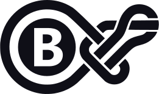
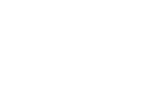
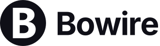
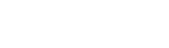
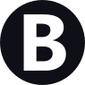
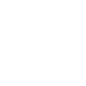

# Brand guide

This is the **detailed** brand reference for Bowire: exact clear space, minimum
sizes, the full colour token set, co-branding spacing, file-format guidance,
accessibility minimums, and usage rights.

Just need the files and the gist? The [**Brand & logos**](https://bowire.io/brand.html)
page on bowire.io is the overview + download hub (logo SVGs, the ZIP kit, and a
one-page brand sheet). This page is the manual behind it.

> [!NOTE]
> The Bowire **software** is open source under Apache-2.0. The Bowire **name and
> logos** are trademarks of Küstenlogik — the licence covers the code, not the
> brand. Use the marks per this guide; when in doubt, ask: info@kuestenlogik.com.

## The logo system

Bowire has three forms. Reach for the **full logo** by default; use the **mark**
when space is tight or the surrounding context already says "Bowire"; use the
**lockup** when you want the name spelled out beside the mark.

### Full logo

The bowline loop tied around the Circle-B — the primary, most expressive form.

  

  

### Lockup — mark + wordmark

The Circle-B with the "Bowire" wordmark set in Inter (outlined, so no font is
required to render it). Use horizontally where the name should read alongside
the mark — headers, signatures, "powered by" strips.

  

  

### Mark

The Circle-B alone. Use as an app icon, avatar, favicon, or any square slot.

  

  

Each form ships in two colourways: a dark (ink `#0F0F17`) version for light
backgrounds and a light (white `#FFFFFF`) version for dark ones. Always pick the
version that gives the most contrast — see [Accessibility](#accessibility).

## Clear space

Keep a protected margin around the logo so nothing crowds it. The measurement
unit is **X = the height of the Circle-B mark** (the circular badge).

- **Minimum clear space: ½ X on every side** — top, bottom, left, right.
- For the **lockup** and **full logo**, X is the height of the Circle-B portion,
  not the whole artwork.
- Nothing — text, photo edges, page margins, or another logo — may enter that
  margin. When in doubt, give it more.

<figure style="margin:18px 0;background:#fafaff;border:1px solid #e1e1ee;border-radius:10px;padding:18px;display:flex;justify-content:center">
<svg width="340" height="190" viewBox="0 0 340 190" xmlns="http://www.w3.org/2000/svg" role="img" aria-label="Clear-space diagram: keep half the Circle-B mark height of free space around the logo on every side" font-family="Inter, system-ui, -apple-system, 'Segoe UI', sans-serif">
  <!-- logo bounding box -->
  <rect x="142" y="40" width="56" height="56" fill="none" stroke="#d0d0dc" stroke-width="1"/>
  <!-- the Circle-B mark -->
  <image href="images/brand/bowire-mark-dark.svg" x="142" y="40" width="56" height="56"/>
  <!-- clear-space boundary: 28 = half of the 56 mark height (½ X) on every side -->
  <rect x="114" y="12" width="112" height="112" rx="3" fill="none" stroke="#6366f1" stroke-width="1.6" stroke-dasharray="6 4"/>
  <!-- X = mark height (left dimension) -->
  <g stroke="#5a5a72" stroke-width="1">
    <line x1="128" y1="40" x2="128" y2="96"/>
    <line x1="124" y1="40" x2="132" y2="40"/>
    <line x1="124" y1="96" x2="132" y2="96"/>
  </g>
  <text x="120" y="72" text-anchor="end" font-size="13" font-weight="600" fill="#1a1a2e">X</text>
  <!-- ½ X = clear space (top gap dimension) -->
  <g stroke="#5a5a72" stroke-width="1">
    <line x1="170" y1="12" x2="170" y2="40"/>
    <line x1="166" y1="12" x2="174" y2="12"/>
    <line x1="166" y1="40" x2="174" y2="40"/>
  </g>
  <text x="178" y="30" text-anchor="start" font-size="13" font-weight="600" fill="#1a1a2e">½ X</text>
  <!-- captions -->
  <text x="170" y="150" text-anchor="middle" font-size="12.5" fill="#5a5a72">Dashed margin = ½ X on every side</text>
  <text x="170" y="168" text-anchor="middle" font-size="12.5" fill="#5a5a72">X = the height of the Circle-B mark</text>
</svg>
</figure>

## Minimum size

Below these sizes the bowline strands and the B's counter start to fill in and
the mark loses legibility.

| Form | Screen (min) | Print (min) |
| --- | --- | --- |
| Mark (Circle-B) | 24 px tall | 8 mm tall |
| Full logo | 20 px tall (≈ 34 px wide) | 10 mm tall |
| Lockup | 24 px tall (≈ 130 px wide) | 10 mm tall |

Prefer the **mark** over a shrunk full logo whenever the full logo would fall
below its minimum.

## Colour

You barely need colour to reference Bowire: the logo is monochrome — **ink**
(`#0F0F17`) on light backgrounds, **white** (`#FFFFFF`) on dark. The one brand
colour is **Bowire Indigo** — use it for an accent *around* the logo (a "works
with Bowire" badge, a button, a link), never to recolour the logo itself.

| Colour | Hex | Use |
| --- | --- | --- |
| **Bowire Indigo** | `#6366F1` | The signature brand accent |
| Indigo · on light | `#4F46E5` | The same accent where `#6366F1` would miss WCAG AA contrast on a white background |
| **Ink** | `#0F0F17` | The dark logo; dark backgrounds |
| **White** | `#FFFFFF` | The light logo |
| Off-white | `#FAFAFF` | Light backgrounds |

The product's wider UI palette (surfaces, borders, state colours) isn't part of
the logo, so it isn't needed to reference Bowire.

## Typography

| Typeface | Use | Weights | Notes |
| --- | --- | --- | --- |
| **Inter** | Headings, UI, the wordmark | 400 / 500 / 600 / 700 / 800 | The "Bowire" wordmark is Inter **Bold 700–ExtraBold 800**, tracking **−0.03em**. It's outlined in the lockup, so the font is never required to render the logo. |
| **JetBrains Mono** | Code, terminals, payloads | 400 / 500 | Anything monospaced. |

Both are open-source: [Inter](https://rsms.me/inter/) ·
[JetBrains Mono](https://www.jetbrains.com/lp/mono/).

## Co-branding

When the Bowire logo sits next to another logo (Küstenlogik, a partner, a
conference badge):

- **Separation: at least 2 X** between the logos (X = the Circle-B height). This
  is wider than the clear-space margin so neither mark crowds the other.
- Optionally place a **thin vertical divider** (1 px / 0.5 pt, in the border
  grey) centred in the gap.
- **Optically balance the sizes**: match the Circle-B height (or the wordmark
  cap-height) to the neighbouring logo's dominant element — not the bounding
  boxes, which read unevenly.
- Keep both logos in the same colourway family (all dark on light, or all light
  on dark).

## Backgrounds

Use the version that contrasts with the surface — the dark logo on light, the
light logo on dark. Indigo is the brand colour; on it, use the white logo.

  <figure style="margin:0;flex:1;min-width:180px;border:1px solid #e1e1ee;border-radius:10px;overflow:hidden">
    

    <figcaption style="padding:9px 12px;font-size:13px;color:#5a5a72;border-top:1px solid #e1e1ee">Light <code>#FAFAFF</code> &rarr; dark logo</figcaption>
  </figure>
  <figure style="margin:0;flex:1;min-width:180px;border:1px solid #e1e1ee;border-radius:10px;overflow:hidden">
    

    <figcaption style="padding:9px 12px;font-size:13px;color:#5a5a72;border-top:1px solid #e1e1ee">Dark <code>#0F0F17</code> &rarr; light logo</figcaption>
  </figure>
  <figure style="margin:0;flex:1;min-width:180px;border:1px solid #e1e1ee;border-radius:10px;overflow:hidden">
    

    <figcaption style="padding:9px 12px;font-size:13px;color:#5a5a72;border-top:1px solid #e1e1ee">Indigo <code>#6366F1</code> &rarr; light logo</figcaption>
  </figure>

- On a photo or gradient, set the logo on a **solid or scrimmed panel** so it
  keeps its clear space and contrast — don't float it directly over busy imagery.
- Never place the dark logo on a dark field, or the light logo on a light field.

## File formats

| Format | When | Notes |
| --- | --- | --- |
| **SVG** | Default, everywhere it's supported | Scales losslessly; the files on the [download page](https://bowire.io/brand.html) are SVG. |
| **PNG** | Raster-only contexts (slides, raster email, app stores) | Export from the SVG at **2× or 3×** the display size, on a transparent background. Don't upscale. |
| **ICO** | Browser-tab favicons | Use the supplied favicon. |

Never re-trace the logo from a screenshot or a raster export — always start from
the SVG.

## Accessibility

- **Contrast:** a logo is graphical content, so aim for at least **3:1** between
  the logo and its background (WCAG 1.4.11). The Ink-on-Off-white and
  White-on-Ink pairings clear this comfortably; pick whichever variant maximises
  contrast on your surface.
- **Alt text:** use `alt="Bowire"` for the logo/lockup, or `alt="Bowire logo"`.
  Decorative repeats can use empty `alt=""`. Don't stuff the tagline into alt.
- **Don't rely on colour alone** to convey the brand — the mark's silhouette
  carries it in monochrome.

## Do & don't

**Do**

- Use the supplied SVGs at their native proportions.
- Pick the colourway that maximises contrast on your background.
- Keep the clear space and minimum sizes above.
- Drop to the mark alone when the full logo won't fit.

**Don't**

- Recolour the logo, or add gradients, shadows, or outlines.
- Stretch, squash, rotate, skew, or otherwise distort it.
- Re-set the "Bowire" wordmark in a different typeface.
- Crop the mark, untie the bowline, or rebuild the artwork.
- Place it on a busy or low-contrast background.

## Writing "Bowire"

- **Bowire** — one word, capital B, lowercase rest. Always. Never *BoWire*,
  *bowire* (in prose), *BOWIRE*, or *Bow Wire*.
- The descriptor is "**the multi-protocol API workbench**."
- Built by **Küstenlogik**. Bowire is part of the Küstenlogik family.

A ready one-liner for articles, talks, or READMEs:

> Bowire is the multi-protocol API workbench by Küstenlogik — auto-discover,
> invoke, stream, mock, record, and replay gRPC, REST, GraphQL, MQTT, SignalR,
> WebSocket, SSE, MCP, OData and more from one UI, embedded in your app or as a
> standalone CLI. Open source, Apache-2.0. https://bowire.io

## Usage rights & permissions

The Bowire **software** is open source under Apache-2.0. The Bowire **name and
logos** are trademarks of Küstenlogik; the licence covers the code, not the
brand. These guidelines grant the everyday uses below — anything that implies
endorsement needs a quick email first.

**Fine without asking**

- Referring to Bowire in articles, talks, tutorials, and comparisons.
- Linking to bowire.io with the logo.
- Stating that your project "works with Bowire" or "supports Bowire."
- Unmodified use of the supplied assets.

**Ask first**

- Using the marks in your own product name, logo, domain, or app icon.
- Anything suggesting an official partnership, sponsorship, or endorsement.
- Merchandise.
- Modified or redrawn versions of the logo.

Questions or sign-off: info@kuestenlogik.com. For the parent identity, see the
[Küstenlogik brand](https://kuestenlogik.com).
