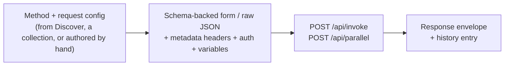

# Compose

**Compose** is the request builder — the surface where you actually invoke a
method and read its response. It's the workbench's centre of gravity: Discover
finds the methods, Compose runs them. v2.1 rebuilt it as a Hoppscotch-style
per-protocol builder and packaged it as `Kuestenlogik.Bowire.Compose` (renamed
from `Rail.Compose` in Welle 2).

For where Compose sits in the whole data-flow — what feeds it and what it hands
off to — see [rail pipelines & hand-offs](../architecture/rail-pipelines.md#compose-compose).

## What the rail is

| Property | Value |
|---|---|
| Rail id | `compose` (verbatim — deep-link `?rail=compose`) |
| Package | `Kuestenlogik.Bowire.Compose` |
| Sidebar | **Library** — Collections + Presets |
| Needs a workspace | Yes (`RequiresWorkspace`) — Compose reads the active workspace's URLs, env, and collections |
| Always on | Yes — it's a core surface, not an optional tool |

The rail has two regions: the **Library** sidebar on the left (saved requests
grouped into collections, plus per-method presets) and the **request builder**
on the right (one tab per open request).

## The pipeline

- **In** — a method arrives three ways: click a method row in [Discover](auto-discovery.md)
  (opens a builder tab), open a saved entry from a [collection](collections.md),
  or author a [freeform request](freeform-requests.md) against a raw URL.
- **Build** — the request pane renders a [schema-backed form or a raw JSON
  editor](form-json-input.md); you set metadata headers, [authentication](authentication.md),
  and `{{variable}}` substitutions. Per-protocol layouts adapt the pane (a REST
  path+verb+query row, a gRPC service/method selector, a GraphQL query editor, …).
- **Invoke** — the call goes out over `POST /api/invoke` (single) or
  `POST /api/parallel` (N-at-once). Variable substitution runs on the body first.
- **Out** — the response lands in the response pane (syntax-highlighted, with
  the streaming log for streaming methods) and a history entry is recorded.

## The Library sidebar

The left sidebar is the **Library** (`SidebarKind = library`): it lists the
active workspace's [Collections](collections.md) and the per-method
[Presets](favorites-history.md) (saved request configurations). Collections are
managed entirely from here — create, rename, reorder, and drag entries between
groups. Opening a collection entry loads it into a builder tab.

## Making a request

1. Open a method — click it in Discover, or open a saved entry in the Library,
   or start a freeform request.
2. Fill the request — toggle between the [form and raw JSON](form-json-input.md),
   set headers + auth, reference `{{env.var}}` / `{{secret.NAME}}` / `{{response.path}}`
   placeholders.
3. **Invoke**. Read the response in the response pane; click any value to paste
   a `{{response.path}}` reference into the next request ([response chaining](response-chaining.md)).

## Hand-offs — where a Compose request goes next

Compose is a hand-off *source*: a built request can be promoted onto other rails
without re-authoring it.

| Action | Goes to | Carries |
|---|---|---|
| Drag a [Discover](auto-discovery.md) method in (`application/x-bowire-method`) | *(into Compose)* | method → new builder tab |
| **Save to collection** | Library / [Collections](collections.md) | request config → collection entry |
| **Run as benchmark…** | [Benchmarks](performance.md) | request → single-method load spec |
| Console **record toggle** (shift / right-click) | [Recordings](recording.md) | the live call → recording step |
| Scan target | [Security](scan.md) | the request context → scan target |

## Persistence

Open tabs, history, and the Library live in the active workspace — browser
`localStorage` by default, or the [Git-backed / `.bww`](workspace.md) storage
when a disk-backed workspace is active. Switching workspaces swaps the whole
Library and history set at once.

## See also

- [Auto-discovery](auto-discovery.md) — how the methods Compose invokes are found
- [Form & JSON input](form-json-input.md) · [Authentication](authentication.md) · [Response chaining](response-chaining.md)
- [Collections](collections.md) — the Library's saved-request groups
- [Freeform requests](freeform-requests.md) — Compose against a raw URL with no schema
- [Rail strip](rail-strip.md) · [Rail pipelines & hand-offs](../architecture/rail-pipelines.md)
