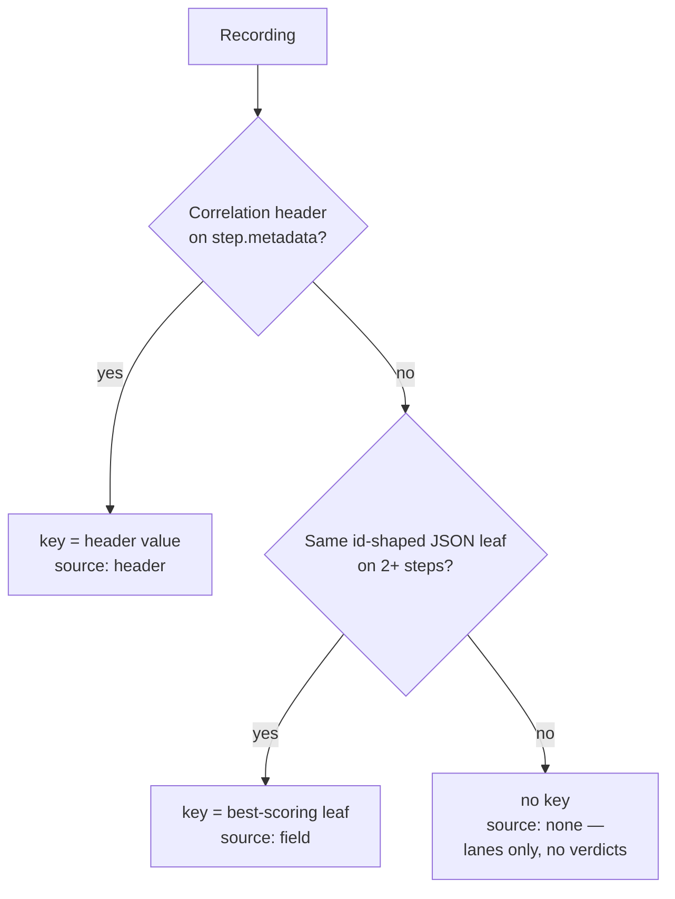
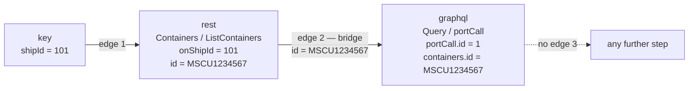

# Correlated Timeline

A recording that walks one business transaction across gRPC, OData,
REST, GraphQL, WebSocket, SignalR, SSE and MQTT looks, in the step list,
like eight unrelated rows. The **Correlated timeline** tab in the
Recordings detail pane reads the same recording as one transaction:
one lane per protocol, one bar per step, per-frame ticks for streaming
steps, all on a shared time axis — and each step marked as belonging to
the transaction or not.

Open it from **Recordings → pick a recording → Correlated timeline**, or
from the recording's right-click menu in the sidebar. The same analysis
is available in the terminal as
[`bowire recording correlate`](#cli).

## Where the signal comes from

Bowire recordings carry no trace id. Nothing in the
[`.bwr` format](../recordings/bwr-format.md) has ever had one, and no
capture path writes one. So the timeline resolves a signal in three
tiers, and says which one it used:



1. **A correlation header.** `traceparent`, `x-correlation-id`,
   `correlation-id`, `x-request-id`, `request-id`, `x-trace-id`,
   `trace-id` — matched case- and separator-insensitively on
   `step.metadata`. For `traceparent` the **trace-id** (field 2 of
   `00-<32 hex>-<16 hex>-<flags>`) is used, not the whole header: the
   span-id changes per hop and would never correlate. A header always
   outranks an inferred field, because it is an explicit statement by
   the producer.
2. **A shared id-shaped payload field.** Every scalar JSON leaf whose
   name ends in `id` is grouped by (name, value). Groups spanning fewer
   than two steps are dropped, and the bare name `id` is never
   *suggested* (it collides across every entity in a multi-service
   capture) — though you can still pick it by hand. Candidates are
   scored `protocols × 1000 + steps`, so a value that spans five
   services beats one repeated five times inside a single response.
3. **Nothing.** The whole recording is treated as one transaction. You
   still get the lanes, the axis and the frame ticks — you just get no
   per-step verdict, and the view says so instead of pretending.

The chosen key is shown as a chip at the top of the tab. Click it to
pick a different one from the ranked candidate list, or to go back to
**Auto — best guess**.

## Strong, weak, derived, and unmatched

| Tier | Rendered as | Rule |
|---|---|---|
| **strong** | Solid accent bar | Some leaf's normalised name *ends with* the key's normalised name **and** carries the key's value. `shipId` therefore matches `onShipId` and `OccupiedByShipId`. |
| **weak** | Dashed outline | The value turned up on some *other* id-shaped leaf. |
| **derived** | Dotted outline with an inner ring | The key is absent, but this step shares a distinctive id-shaped value with a step the key *did* match — see [Joining a renamed identifier](#joining-a-renamed-identifier). |
| **unmatched** | Faded bar | The key does not appear in this step at all. |

The weak tier exists because low-cardinality ids collide. In the harbor
sample, `portCallId = 1`, `craneId = 1` and dock number `1` are three
different things wearing the same number — a value-only match would fuse
them. Requiring the *name* to match for the strong tier keeps that
honest, and the weak tier keeps a genuine hit (the gRPC step's bare
`"id": 101`) visible without claiming more than it should.

A header key has no weak tier: a header either carries the id or it does
not.

Streaming steps also get one tick per received frame, verdicted the same
way and placed at *step offset + frame timestamp*. Click any bar or tick
to pin a detail strip with the step's offset, duration, status and
match; click it again to unpin. On a derived step only the frames that
carry the bridge value light up, so a lit bar never sits over dead ticks.

## Joining a renamed identifier

A business transaction that changes its identifier as it crosses services
lights only the lanes that speak the chosen key. On the harbor recording,
keyed on `shipId = 101`, the GraphQL lane stays dark — not for want of a
correlation key, but because it calls the same transaction
`portCall.id = 1`.

So a step the key left unmatched gets one more chance: it is joined to
the transaction when it shares a value with a step the key *did* match.
GraphQL and REST share the container manifest, and that is enough.



**Which shared values count as evidence** is the whole problem, and the
rule is deliberately strict. A value may bridge two steps only when all
of these hold:

1. **Id-shaped on both ends.** The value sits on a leaf whose normalised
   name ends in `id` on the unmatched step *and* on the matched one. The
   bare name `id` is allowed here, unlike in candidate suggestion: the
   seed edge has already fixed *which* transaction is being read, so this
   hop only asks whether the step touches something that transaction
   touched.
2. **Distinctive on its own — at least six characters.** `1`, `42`,
   `true` and `OK` are not evidence: there are too few of them for a
   collision to be surprising.
3. **The two names are one identifier under two spellings.** Judged on
   the pair actually being joined: identical, or the shorter a suffix of
   the longer. `id`/`onShipId` cohere; `craneId`/`portCallId` do not.
   Deliberately not judged across the whole recording — a value that
   appears on a bare `id` field somewhere would make any id-suffixed name
   "cohere", and the verdict would then change when an unrelated step was
   appended.
4. **Never carried by a non-id field.** If the same value also sits on a
   field like `status`, it is a label the capture shares, not an
   identifier: `"Loading"` on both `statusId` and `status` is an enum.
5. **On a minority of the steps.** A value smeared across most of a
   recording describes the capture, not a transaction inside it. This is
   what stops a session, tenant or customer id from fusing unrelated
   work into one "transaction" — and length alone would never catch it,
   because a GUID session id is long, high-entropy and wears the same
   field name at both ends, which is exactly the profile the strength
   score likes most. Two carriers is the floor, since a bridge needs one
   step at each end.
6. **Two edges, and no more.** Only a step the key matched *strongly*
   may act as a bridge source — a weak match is this analyzer's own name
   for a coincidence, and anchoring an inference to one leaves the far
   end resting on nothing. A step reached through a bridge never bridges
   onward. An unbounded walk over an id-rich recording relates everything
   to everything, which is worse than no join at all.

The bar is higher for a bridge than for the seed key on purpose. A seed
is corroborated by two steps agreeing on the field *name*; a bridge gets
no such corroboration, so the value has to carry its own weight. A short
id can still be promoted to the seed by hand from the key picker.

When several values would serve equally well — the harbor recording
shares three container ids between REST and GraphQL — the winner is the
one whose field names agree most closely, then the longest, then the
first in scan order, and the model reports how many runners-up there
were so the UI does not present one arbitrary container as special.

**Every derived lane names the value that linked it.** An unexplained
match is worse than no match, because an operator cannot tell a real
correlation from a coincidence. The tab renders an always-visible strip
under the lanes, one row per derived step, and the pinned inspect strip
gains a `linked via` field.

A lane that stays dark **because** its only shared value was turned down
says so as a note, naming the value it was offered. On the harbor
recording that is `mqtt (craneId = 1)`.

Derived edges are computed on read. Nothing about them is persisted: the
recording's `correlation` field still holds exactly one seed key, and the
format version does not move.

## Timebase

Recordings come in two flavours and the view will not mix them up:

- **absolute** — `capturedAt` is wall-clock epoch milliseconds, as a
  live workbench capture writes it. The stats line shows the origin as a
  clock time.
- **relative** — `capturedAt` is an offset from an arbitrary zero, which
  is what authored sample recordings use (`0, 150, 300, …`). No
  wall-clock is printed, because there is none.

Either way, offsets are normalised to `capturedAt − min(capturedAt)`. A
recording where *every* step has `capturedAt = 0` falls back to
cumulative durations, so the lanes still read as a sequence, and the
view raises a note saying the axis shows elapsed work rather than real
spacing.

## What it looks like on the harbor sample

The flagship `port-call-1` recording resolves `shipId = 101` and reports
**7 of 8 steps across 7 protocols**:

| Protocol | Verdict | Why |
|---|---|---|
| `odata`, `rest`, `websocket`, `signalr`, `sse` | strong | Carry `OccupiedByShipId` / `onShipId` / `ShipId` / `shipId` = 101 |
| `grpc` | weak | Carries `"id": 101` — right value, generic name |
| `graphql` | derived | Calls the same transaction `portCall.id = 1`, and shares `id = MSCU1234567` with the REST step |
| `mqtt` | unmatched | Crane telemetry shares only the number `1`, on `craneId` |

That is the honest number, and it is what the tab shows. The eighth lane
is not a ranking failure: the crane telemetry carries no business
linkage at all beyond `craneId = 1`, and that same `1` is also a dock
`Number`, an SSE `Seq` and the `portCallId`. Accepting it would fuse four
unrelated entities — exactly the coincidence the bridge rule exists to
reject. Lighting it honestly needs the *sample* to say which container
the crane is lifting, not a looser rule.

## Persisting the key

Picking a key writes it onto the recording as an optional `correlation`
field:

```json
{
  "id": "rec_...",
  "name": "Port call 1",
  "correlation": { "name": "shipId", "value": "101" },
  "steps": [ ... ]
}
```

The field is additive and diagnostic-only — nothing in the replay, mock
or matcher path reads it, and writing it does **not** bump
`recordingFormatVersion`. Its only job is to make the workbench, the CLI
and a colleague who opens the file next week agree on the same key
without re-picking it. See
[`.bwr` format → Recording root](../recordings/bwr-format.md).

## CLI

```bash
bowire recording correlate ./port-call-1.bwr
bowire recording correlate ./port-call-1.bwr --key shipId=101
bowire recording correlate ./port-call-1.bwr --json | jq '.matchedStepCount'
```

| Flag | Meaning |
|---|---|
| `<path>` | The `.bwr` to read. Both envelope shapes are accepted. |
| `--name` | Disambiguate a store-wrapped file carrying several recordings. |
| `--key name=value` | Correlate on this key instead of the auto-detected one. Overrides any persisted `correlation` field. |
| `--json` | Emit the full model instead of the table — byte-comparable with what `POST /api/recordings/correlate` returns. |

Exit codes are the same sysexits set `bowire recording validate` uses:
`0` ok, `64` bad args, `65` malformed file, `66` file not found, `70`
I/O error.

Default output is a table — offset, protocol, service / method, duration
(with the frame count for streaming steps), status, match and **via** —
followed by the derived links, the runner-up candidate keys and any
notes. No ASCII bar art: a terminal table is the honest CLI form of this
view.

`MATCH` and `VIA` together tell all four states apart without a fifth
column: a directly matched step names its tier and shows `–` for `VIA`, a
joined step reads `derived` plus the value that joined it, and an
unjoined step is `–` in both.

```text
    OFFSET  PROTOCOL    SERVICE / METHOD                           DUR  STATUS  MATCH    VIA
    +300ms  rest        Containers / ListContainers                5ms  200     strong   –
    +500ms  graphql     Query / portCall                          38ms  OK      derived  id = MSCU1234567 (rest)
   +1300ms  mqtt        harbor/crane/1/status / receive      3000ms x3  OK      –        –

derived links (depth 2 — a step the key matched directly bridges one hop further, and no further):
  graphql Query / portCall
    linked by id = MSCU1234567, shared with rest step 3 (Containers / ListContainers); 2 other shared value(s) would have served equally well
```

## Importing a recording

The Recordings rail could always import HAR but never its own format,
which meant a `.bwr` from a colleague, from `bowire import har`, or
from this workbench's own **Export → JSON** was openable everywhere
except the workbench that writes it. **Import .bwr** now sits next to
**Import HAR** in the recording toolbar and accepts both envelope
shapes.

## How it is wired

The analysis lives once, in C#, as
`RecordingCorrelationAnalyzer` in the
`Kuestenlogik.Bowire.Recordings` package. It is pure and stateless: the
same inputs always produce the same model, which is what lets the
terminal and the browser make identical claims.

The workbench reaches it over a stateless
`POST {prefix}/api/recordings/correlate`, mounted through the
`IBowireEndpointContribution` seam — so it lands at
`/api/recordings/correlate` standalone and
`/bowire/api/recordings/correlate` under an embedded
`MapBowire("/bowire")`, and inherits the host's auth gate either way.
The request carries the recording document rather than an id, which also
covers an in-progress capture that has not been flushed to disk yet.

A host that does not reference the Recordings package has no Recordings
rail at all and never sees any of this; core carries only the optional
`correlation` field on the recording model.

## Not yet

Deliberately out of scope for this stage, so nobody has to re-litigate
it:

- **Joins deeper than two edges.** Fixed and documented rather than
  configurable — see
  [Joining a renamed identifier](#joining-a-renamed-identifier).
- **GraphQL query parsing.** The id inside `{ portCall(id: 1) { … } }`
  sits in a string, not a JSON leaf, so the *request* side of that one
  sample query contributes nothing. This is a property of the query, not
  of GraphQL: the **response** is ordinary JSON (`data.portCall.id`) and
  has always been walked, and a query written with variables —
  `{"query":"query($id:Int!){…}","variables":{"id":1}}` — puts the id in
  a plain JSON leaf that the scanner finds with no change at all. Write
  your queries with variables and there is nothing to parse.
- **A bridge that corroborates by name rather than by length.** Two steps
  that both call a four-character value `customerId` are arguably
  evidence, but admitting that reopens the door to low-cardinality enums
  stored under an id-shaped name. The length floor stays until there is a
  rule that separates the two.
- **Causality.** No parent/child span arrows — the format carries no
  parent link to draw them from.
- **A real `traceId` field in the format**, and OTLP trace ingestion.
  The `Monitoring.Otlp` and `Protocol.Otlp` packages exist, but neither
  carries trace data into recordings today.
- **Live correlation of the Console**, rather than a saved recording.
- Zoom / pan on the axis, cross-recording correlation, exporting the
  timeline as an image, and any Map-rail linkage.

## Implementation references

- `src/Kuestenlogik.Bowire.Recordings/Correlation/RecordingCorrelationAnalyzer.cs` — the analysis
- `src/Kuestenlogik.Bowire.Recordings/Correlation/RecordingCorrelationScanner.cs` — leaf walking + header lookup
- `src/Kuestenlogik.Bowire.Recordings/Correlation/RecordingCorrelationEndpoints.cs` — `POST /api/recordings/correlate`
- `src/Kuestenlogik.Bowire.Recordings/wwwroot/js/recording-correlation.js` — the tab
- `src/Kuestenlogik.Bowire.Tool/Cli/RecordingCommand.cs` — `bowire recording correlate`
