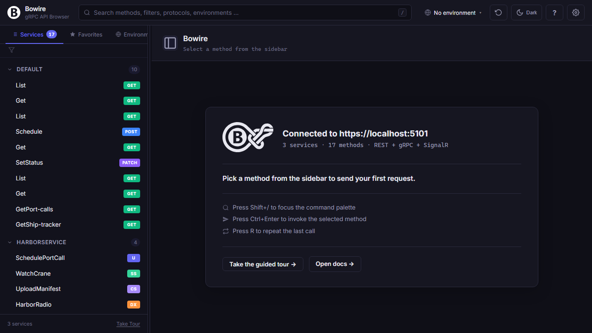
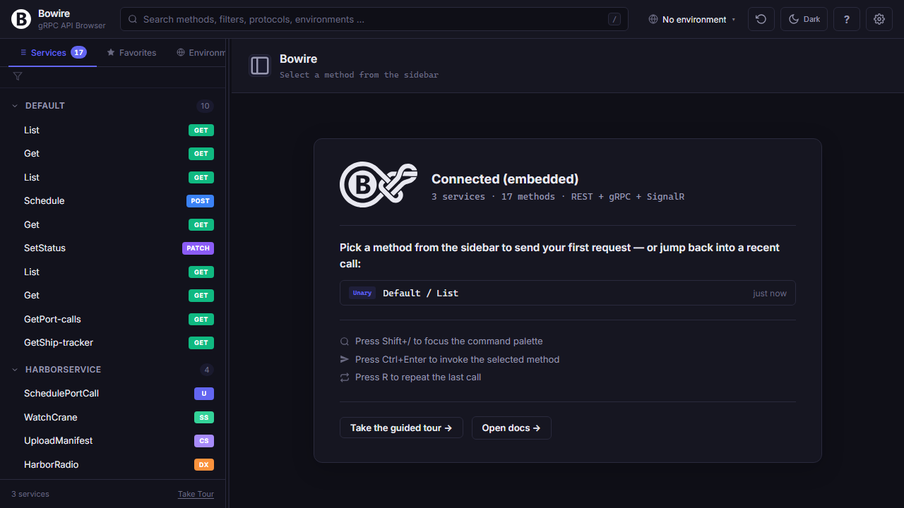
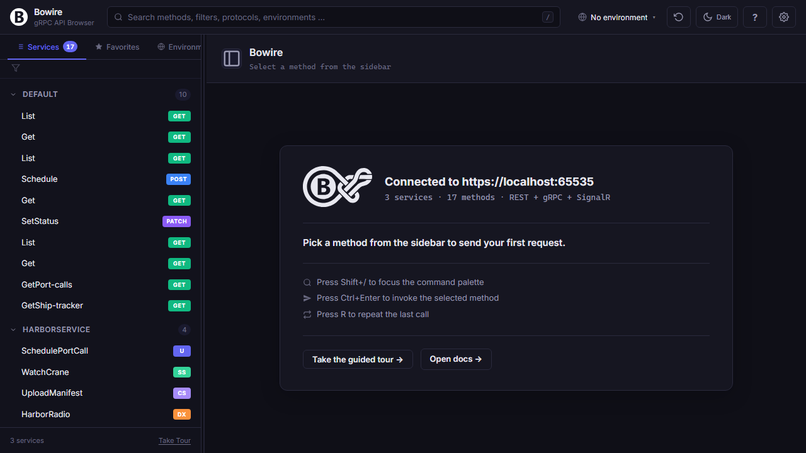
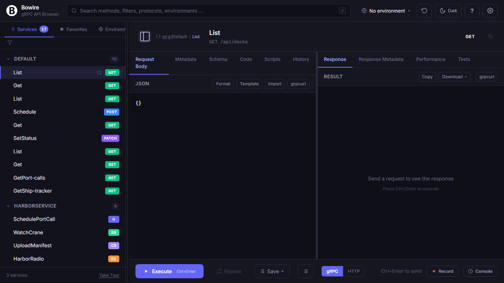

# Empty-state landing

When no method is selected in the sidebar, Bowire renders a context-sensitive landing page. It detects one of seven distinct states and shows the guidance relevant to that situation &mdash; the first-run welcome, a multi-URL status table, a discovery-failed error, or the "ready" summary once a service is connected.

## State 7 — `ready` (the most common)

You've connected to a server, services have been discovered, and you
just need to pick a method.

The ready landing shows:

- **Bowire mark + headline**: "Connected to https://localhost:5001"
- **Service summary**: "1 service · 4 methods · gRPC" (computed from
  the live `services` array, supports multi-URL setups)
- **Recent history quick-recall**: when there are previous calls in
  the history that match the currently discovered services, they're
  rendered as one-click recall rows. Click any to jump back into that
  method with the last-used request body
- **Keyboard shortcut tips**: `/` to focus the search, `Ctrl+Enter` to
  invoke, `R` to repeat
- **Footer**: Take the guided tour, Open docs

## State 6 — `first-run`

Bowire started without a `--url` flag and there's no proto upload
yet. Two onboarding cards: connect to a server, or upload a schema.

- **Welcome to Bowire** hero with the full Bowire rope-loop logo
- **Connect to a server** card → opens the URL input flow
- **Upload a schema** card → switches to proto / OpenAPI / GraphQL
  upload mode
- Footer with guided tour + docs

## State 4 — `discovery-failed`

Locked-mode startup against a server that didn't respond with
discoverable services. Surfaces the actual error and four
troubleshoot bullets so the user knows what to check.

- Red disconnect icon
- Title with the failed URL
- Error box with the actual `discoveryErrors[url]` message
  (HTTP status, exception message, or server-returned error envelope)
- Four troubleshoot bullets covering the most common causes
- Footer with docs link

## State 2 — `multi-url-partial`

Multi-URL setup where some discovery URLs succeeded and others
didn't. Shows the per-URL status table with retry buttons for the
failed ones, plus a hint that the user can still pick a method
because services from the working URLs are available.

- "X of Y discovery URLs connected" headline
- Status table with green / red dots, the URL, and a Retry button
  per failed entry
- "Pick a method from the sidebar" hint at the bottom

## State 5 — `editable-no-services`

Editable-mode (no `--url` flag) with at least one URL configured but
nothing discovered. Per-URL connect list plus an upload-schema
fallback card.

- "No services discovered yet" title with help text
- Per-URL connection status row
- Divider, then the upload-schema fallback button

## State 1 — `wrong-protocol-tab`

> **Legacy name.** Bowire no longer shows one tab per protocol — all
> protocols live in a single sidebar with a dropdown filter. The state
> ID is kept for backwards compatibility; the trigger is now "the
> active protocol filter excludes every discovered service".

Services exist but the active protocol filter drops them all (e.g. the
user narrowed the sidebar to MCP on a server that only exposes gRPC).
Shows one-click buttons to switch the filter to a protocol that has hits.

- "No `<protocol>` services found" title
- One-click switch buttons to the protocols that do have hits (with their
  method counts)
- Hint about server-side reflection / introspection requirements

## State 3 — `loading`

Discovery is in flight. Animated spinner + the URL being probed +
hint about expected first-connection time.

(Captured incidentally during the editable-mode test — happens any
time `fetchServices()` is mid-call.)

## How state detection works

The detection is a small JavaScript state machine in
`wwwroot/js/landing.js` (`detectLandingState`) that reads global
state and returns one of the seven state strings. Detection runs on
every `render()` call, so the landing reacts in real time to
discovery results, connection status changes, retry button clicks,
and tab switches.

States are ordered by precedence — more specific states are checked
first so they win over fallback states. For example, `wrong-protocol-tab`
is checked before `ready` so a user who narrowed the protocol filter to an
empty set sees the switch hint instead of the generic "select a method" prompt.

## Implementation references

- JS state detection + render: `wwwroot/js/landing.js`
- Render hook: `wwwroot/js/render-main.js` calls
  `renderLandingPage(main)` whenever `selectedMethod` is null
- State variables: `serverUrls`, `services`, `selectedProtocol`,
  `connectionStatuses`, `discoveryErrors`, `isLoadingServices`,
  `config.lockServerUrl` — all declared in `wwwroot/js/prologue.js`
- Discovery hooks: `wwwroot/js/api.js` `fetchServices` /
  `fetchServicesForUrl` set `isLoadingServices` and write per-URL
  errors into `discoveryErrors` so the landing can render them
