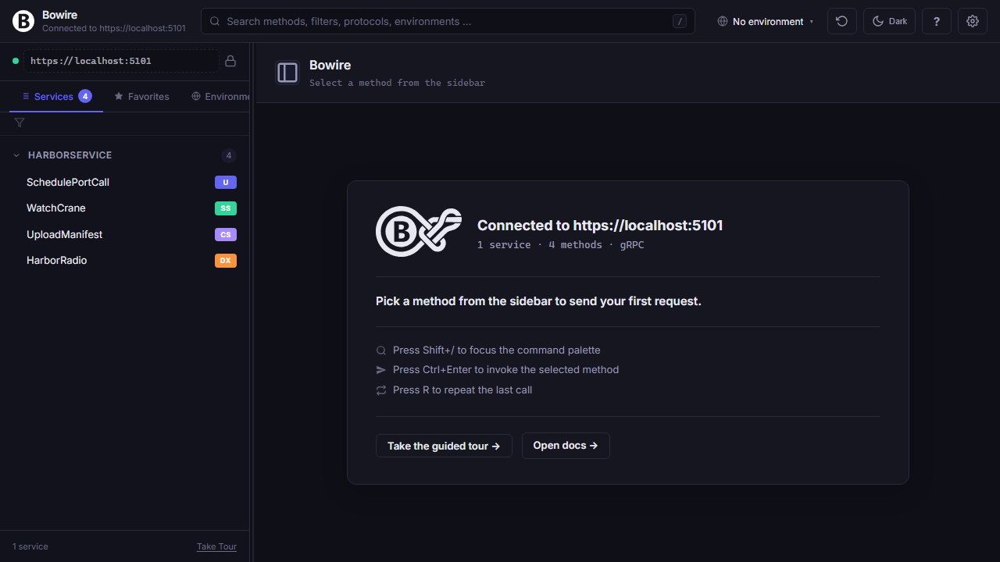
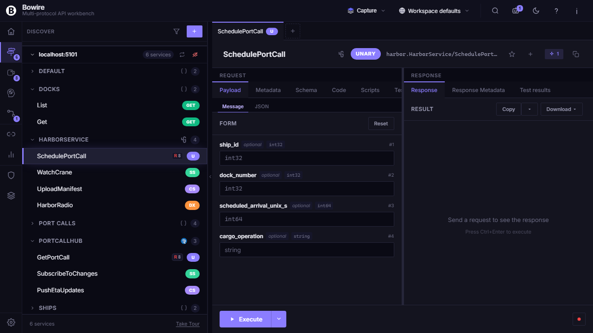
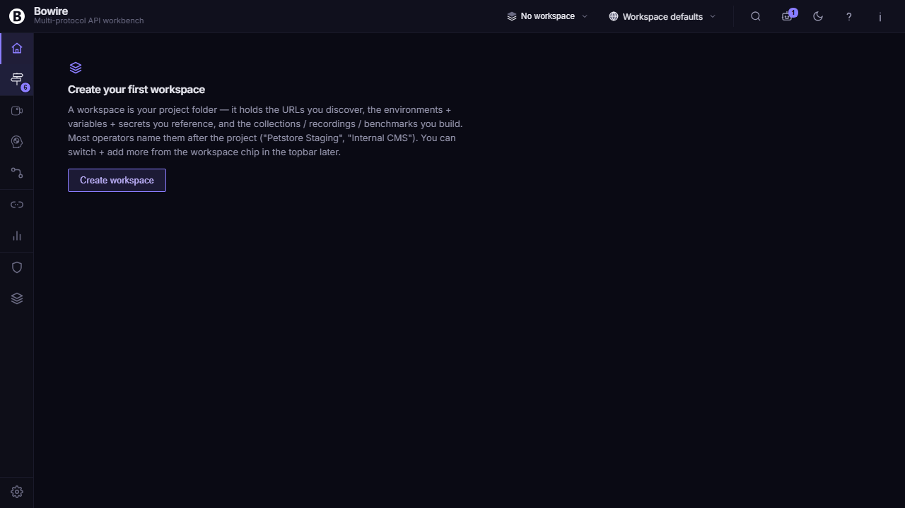
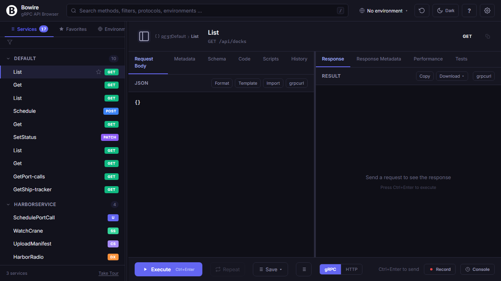

# Empty-state landing

When no method is selected in the sidebar, Bowire renders a context-sensitive landing page. It detects one of eight distinct states (seven in v2.0, plus the v2.1 workspace-required state) and shows the guidance relevant to that situation &mdash; the first-run welcome, a workspace-required prompt, a multi-URL status table, a discovery-failed error, or the "ready" summary once a service is connected.

## State 8 — `workspace-required` (new in v2.1)

The workbench booted without an active workspace and the install isn't configured to seed a default. Bowire surfaces a friendly prompt asking the operator to create a workspace before any other state can resolve.

- **Headline**: "Pick a workspace to continue"
- **Primary CTA**: **+ Create workspace** — opens the create dialog (name, color picker, optional URL seed)
- **Secondary CTA**: **Import .bww file** — drops the import flow
- **Tertiary**: link to the [Workspaces](workspaces.md) topic in the Help rail

The state appears the first time Bowire is launched on a fresh machine (or after a workspace delete leaves the list empty). Standalone Tool installs seed a default workspace on first boot so the state is rare; embedded hosts that mount `MapBowire()` without seeding hit it on every fresh visitor.

## State 7 — `ready` (the most common)

You've connected to a server, services have been discovered, and you
just need to pick a method.

The ready landing shows:

- **Bowire mark + headline**: "Connected to https://localhost:5001"
- **Service summary**: "1 service · 4 methods · gRPC" (computed from
  the live `services` array, supports multi-URL setups)
- **Recent history quick-recall**: when there are previous calls in
  the history that match the currently discovered services, they're
  rendered as one-click recall rows. Click any to jump back into that
  method with the last-used request body
- **Keyboard shortcut tips**: `/` to focus the search, `Ctrl+Enter` to
  invoke, `R` to repeat
- **Footer**: Take the guided tour, Open docs

## State 6 — `first-run`

Bowire started without a `--url` flag and there's no proto upload
yet. Two onboarding cards: connect to a server, or upload a schema.

- **Welcome to Bowire** hero with the full Bowire rope-loop logo
- **Connect to a server** card → opens the URL input flow
- **Upload a schema** card → switches to proto / OpenAPI / GraphQL
  upload mode
- Footer with guided tour + docs

## State 4 — `discovery-failed`

A server that didn't respond with discoverable services. Reached from a
locked-mode startup, and — since v2.3 — also from an embedded host whose
own `/api/services` probe failed. That second case used to fall through to
the first-run welcome hero, which hid the failure entirely: an embedded
host has no `serverUrls` and usually no `lockServerUrl`, so no earlier
check matched it.

- Red disconnect icon
- Title with the failed URL (or "this host" for the embedded probe)
- Error box with the actual `discoveryErrors[key]` message
  (HTTP status, exception message, or server-returned error envelope)
- **Per-plugin diagnostics** (v2.3): a disclosure chip reading
  `12 plugins probed · 3 failed`. Expanded it lists one row per plugin —
  outcome dot, plugin name, message, probe duration — sorted failures
  first, followed by the `protocol@` pinning hint and a **Copy
  diagnostics** button. See
  [Auto-discovery → When discovery finds nothing](auto-discovery.md#when-discovery-finds-nothing).
- Four generic troubleshoot bullets — shown **only** when no per-plugin
  attempts came back. A concrete list of who tried what strictly dominates
  generic advice, so the two never appear together.
- Footer with docs link

## State 2 — `multi-url-partial`

Multi-URL setup where some discovery URLs succeeded and others
didn't. Shows the per-URL status table with retry buttons for the
failed ones, plus a hint that the user can still pick a method
because services from the working URLs are available.

- "X of Y discovery URLs connected" headline
- Status table with green / red dots, the URL, and a Retry button
  per failed entry
- A collapsed per-plugin diagnostics chip under each failed row (v2.3)
- "Pick a method from the sidebar" hint at the bottom

## State 5 — `editable-no-services`

Editable-mode (no `--url` flag) with at least one URL configured but
nothing discovered. Per-URL connect list plus an upload-schema
fallback card.

- "No services discovered yet" title with help text
- Per-URL connection status row, each with its own collapsed per-plugin
  diagnostics chip when that URL produced a failed probe (v2.3)
- Divider, then the upload-schema fallback button

## State 1 — `wrong-protocol-tab`

> **Legacy name.** Bowire no longer shows one tab per protocol — all
> protocols live in a single sidebar with a dropdown filter. The state
> ID is kept for backwards compatibility; the trigger is now "the
> active protocol filter excludes every discovered service".

Services exist but the active protocol filter drops them all (e.g. the
user narrowed the sidebar to MCP on a server that only exposes gRPC).
Shows one-click buttons to switch the filter to a protocol that has hits.

- "No `<protocol>` services found" title
- One-click switch buttons to the protocols that do have hits (with their
  method counts)
- Hint about server-side reflection / introspection requirements

## State 3 — `loading`

Discovery is in flight. Animated spinner + the URL being probed +
hint about expected first-connection time.

(Captured incidentally during the editable-mode test — happens any
time `fetchServices()` is mid-call.)

## How state detection works

The detection is a small JavaScript state machine in
`wwwroot/js/landing.js` (`detectLandingState`) that reads global
state and returns one of the seven state strings. Detection runs on
every `render()` call, so the landing reacts in real time to
discovery results, connection status changes, retry button clicks,
and tab switches.

States are ordered by precedence — more specific states are checked
first so they win over fallback states. For example, `wrong-protocol-tab`
is checked before `ready` so a user who narrowed the protocol filter to an
empty set sees the switch hint instead of the generic "select a method" prompt.

## Implementation references

- JS state detection + render: `wwwroot/js/landing.js`
- Render hook: `wwwroot/js/render-main.js` calls
  `renderLandingPage(main)` whenever `selectedMethod` is null
- State variables: `serverUrls`, `services`, `selectedProtocol`,
  `connectionStatuses`, `discoveryErrors`, `discoveryAttempts`,
  `discoveryHints`, `discoveryDiagnosticsOpen`, `isLoadingServices`,
  `config.lockServerUrl` — all declared in `wwwroot/js/prologue.js`
- Discovery hooks: `wwwroot/js/api.js` `fetchServices` /
  `fetchServicesForUrl` set `isLoadingServices` and write per-URL
  errors into `discoveryErrors` so the landing can render them.
  `_recordDiscoveryProblem` parses the problem+json body into
  `discoveryAttempts` / `discoveryHints`; it accepts both the object
  array current hosts emit and the legacy string array, so a newer
  workbench pointed at an older embedded host still renders something
- Diagnostics renderer: `renderDiscoveryDiagnostics(key, opts)` and
  `serializeDiscoveryDiagnostics(key)` in `wwwroot/js/landing.js`. Both
  return early when the key has no attempts — `render()` has no
  try/catch, so every caller must tolerate `null`
