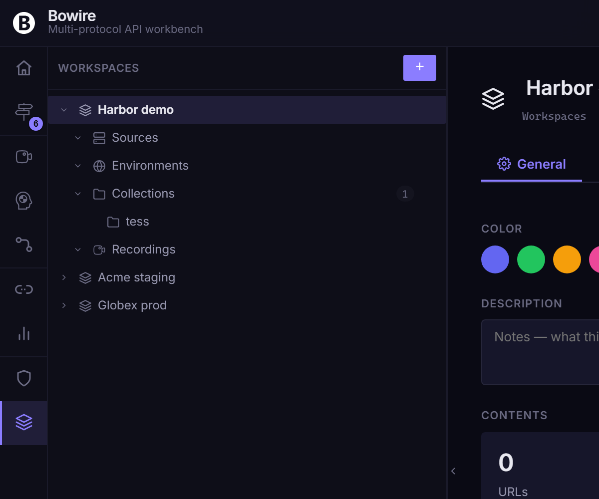

# Workspaces

A **workspace** is Bowire's project-folder abstraction. Every URL you discover, every collection, every recording, every benchmark, every flow, every `{{var}}` you reference lives inside one. The workbench always has exactly one active workspace; switching workspaces switches every list, every URL binding, and the variable resolution table all at once.

Workspaces replace the v1.x **Environments** concept. Where v1.x had a separate Environments rail and a separate Workspaces rail, v2.1 folds both into one: env vars are now **workspace-scoped** and ship in the same `Kuestenlogik.Bowire.Workspaces` package as the rail itself ([release notes — Welle 2](../release-notes/v2.1.0.md#welle-2--rail-prefix-dropped-interceptor-consolidated-325)). The `Kuestenlogik.Bowire.Rail.Environments` package was retired in v2.1.

> **ASP.NET environments are unchanged.** This page is about Bowire workspaces. ASP.NET's `Development` / `Staging` / `Production` environments (`appsettings.Development.json`, `IHostEnvironment`, etc.) are a separate concept and are not affected by anything described here.

## The Workspace switcher

The topbar's left cluster shows the active workspace's name, color chip, and a chevron. Click the chevron to open the switcher dropdown.

The dropdown lists every workspace with:

- A color chip (the same swatch shown in the topbar)
- The workspace name
- A last-used timestamp
- Hover-revealed `…` menu — Rename, Duplicate, Export to `.bww`, Delete

Below the list:

- **+ New workspace** — opens the create dialog (name, color picker, optional URL seed)
- **Import workspace…** — accepts a `.bww` file
- **Manage workspaces…** — opens the Workspaces rail full-pane editor

Pick a workspace and the workbench swaps every sidebar list in-place: URLs, collections, recordings, benchmarks, flows, env vars. The change is animation-free so the operator never loses orientation.

## Color picker

Each workspace carries a color from Bowire's tasteful palette (sky / emerald / amber / violet / rose / slate). The color shows up in:

- The topbar workspace chip
- The switcher dropdown
- The browser favicon while the workspace is active (the Bowire mark is tinted with the workspace color)
- Recording / collection / flow row decorations when surfacing cross-workspace lists

Pick a color when creating the workspace; change it later via **Rename… → Color**. Color is purely visual — no behaviour hangs off it.

## URL bindings are per workspace

When you add a source URL in the Discover rail, the binding is stored against the **active workspace**, not against the Bowire install. Switch to another workspace and the URL list switches with it.

This is the v2.1 fix for the v1.x complaint "I added `http://localhost:5001` in my Petstore project and now it shows up in my Acme project too". URLs live in `bowire_ws_<id>_server_urls` in localStorage (or in the workspace's on-disk directory if you're using `Workspace.Git`); the legacy install-wide `bowire_server_urls` key migrates into the first workspace on first boot of v2.1.

## Machine scope vs. workspace scope

Bowire stores two kinds of state:

| Scope | Lives in | Examples |
|---|---|---|
| **Workspace** | `bowire_ws_<id>_*` keys + the workspace's `.bww` / directory | URLs, collections, recordings, benchmarks, flows, env vars, secrets, presets |
| **Machine** | Bowire's app storage (`~/.bowire/app.json`) | The list of workspaces itself, the active workspace id, theme preference, plugin install state, rail enable/disable, settings.json |

The line is deliberately drawn around "things that should travel with a `.bww`" vs. "things that describe this Bowire install". The Workspaces rail (workspace list itself) lives in machine scope — the operator's list of projects describes the operator's machine, not any one project.

## Environment variables (`{{var}}`)

Variable substitution is per-workspace. Anywhere a request needs a value — body JSON, metadata, the URL field — you can use `{{name}}` placeholders. Before the request fires, Bowire substitutes them from the workspace's env-var table.

```json
{
  "userId": "{{userId}}",
  "token": "{{apiKey}}",
  "host": "{{baseUrl}}"
}
```

If a placeholder has no matching variable it is left untouched (`{{userId}}` stays as-is) so typos are visible instead of silently producing empty strings.

To emit a literal `{{name}}` without substitution, double the braces: `{{{{name}}}}`.

### Source prefixes

`{{name}}` resolves through workspace variables and globals by default. Prefixes route the lookup to a specific source:

| Prefix | Example | Source |
|--------|---------|--------|
| `env.` | `{{env.baseUrl}}` | Active workspace + globals (same as bare) |
| `prev.` | `{{prev.token}}` | Last response body (JSON path) |
| `step<N>.` | `{{step1.id}}` | Response of step N in the active recording |
| `runtime.` | `{{runtime.now}}`, `{{runtime.uuid}}` | Built-in system values (see below) |
| `secret.` | `{{secret.apiKey}}` | Workspace-scoped secrets (in-memory) |
| `captured.` | `{{captured.token}}` | Values written by a pre/post script |
| `ai.` | `{{ai.subject}}` | Session-cached AI-suggested values |

### System variables (`runtime.*`)

These don't need to be defined anywhere — they resolve at substitution time. Useful for JWT claims (iat/exp), correlation IDs, and any time-bound or random values in test requests.

| Placeholder | Value |
|-------------|-------|
| `{{runtime.now}}` | Current Unix timestamp in seconds |
| `{{runtime.now+N}}` / `{{runtime.now-N}}` | `runtime.now` + / - N seconds (e.g. `{{runtime.now+3600}}`) |
| `{{runtime.nowMs}}` | Current Unix timestamp in milliseconds |
| `{{runtime.timestamp}}` | Current ISO 8601 timestamp |
| `{{runtime.uuid}}` | Random RFC 4122 v4 UUID |
| `{{runtime.random}}` | Random integer in [0, 2^32) |

### Legacy `${name}` syntax

Bowire's original Bash-style placeholders (`${name}`, escape `$${name}`) still resolve through the same dispatch table for backwards compatibility, but they are **deprecated** ([#145](https://github.com/Kuestenlogik/Bowire/issues/145)). Every new surface (autocomplete, AI prompts, empty-state copy, examples in this doc) emits the canonical `{{name}}` form only.

To convert a workspace in one go, open **Settings → Data → Migrate ${name} → {{name}}**. The migration walks every recording, collection, freeform request, flow, env var and global, rewrites in place, and persists the change immediately. It is idempotent: re-running on already-migrated data does nothing.

A one-time toast surfaces on workspace load when legacy placeholders are detected; **Migrate now** runs the same conversion the Settings action does, **Snooze** dismisses it for this workspace.

## Where variables are substituted

Substitution happens client-side, just before the request is sent. It applies to:

| Location | Example |
|----------|---------|
| Request body JSON | `{ "user": "{{userId}}" }` |
| Metadata values | `Authorization: Bearer {{token}}` |
| Server URL field | `https://{{baseUrl}}` |
| Channel send messages (duplex / client streaming) | Same as request body |
| Compose rail URL / body / headers | Same dispatch table |

Metadata **keys** are not substituted — only values.

## The `.bww` file format

A workspace is portable. The Workspaces rail's per-row **Export to `.bww`** action writes a single JSON file containing the full workspace state: URLs, collections, recordings, benchmarks, flows, env vars, globals, presets. Import via the switcher's **Import workspace…** entry or by passing a `.bww` path to the create dialog.

The full schema reference lives at [docs/features/workspace.md](workspace.md) — same canonical v2 envelope produced by both the workbench's Save-as flow and the `bowire workspace export` CLI.

## The Workspaces rail

Open the Workspaces rail from the rail strip for the full-pane editor. It surfaces:

- The workspace list with manual ordering (drag-handle on each row) and a sort dropdown (last-used / created / alphabetical / manual) (#279)
- A workspace detail pane showing URLs, collections, recordings, env vars, secrets
- Per-row trash icon (soft delete; restorable from the topbar's aggregated Trash drawer)

Operator-saved sort preference + manual ordering persist in `bowire_workspaces_sort` and survive a rebuild of the underlying workspace list.

## Persistence

Workspace state is stored in two places, kept in sync:

1. **Browser localStorage** (`bowire_ws_<id>_*`, `bowire_workspaces`, `bowire_active_workspace_id`) — instant updates, no server roundtrip.
2. **Disk** at `~/.bowire/` — survives browser changes, profile switches, and CLI runs. The same folder used for plugins.

On startup, Bowire loads from disk first, so opening Bowire in a fresh browser still shows your workspaces. Every change is debounced (400 ms) and pushed back to disk.

## REST API

The disk store is also exposed as a tiny REST API for tooling and CI scenarios:

| Endpoint | Method | Purpose |
|----------|--------|---------|
| `/bowire/api/workspaces` | `GET` | Returns the workspace list |
| `/bowire/api/workspaces/<id>` | `GET` | Returns one workspace's full document |
| `/bowire/api/workspaces/<id>` | `PUT` | Replaces the document (validates JSON) |
| `/bowire/api/workspaces/<id>` | `DELETE` | Soft-deletes the workspace |

The browser uses these endpoints internally; you can call them yourself to seed workspaces from a script.

The legacy `/bowire/api/environments` endpoints stay mounted for one release window so existing CI scripts keep working — they now route to the active workspace's env-var table.

## Tips

- Use a separate workspace per project / customer. Switching is cheap; the topbar chip + favicon tint give you visual confirmation you're in the right one.
- Pick distinctive colors for your most-active workspaces. The favicon tint is the fastest "am I in Prod?" check.
- Combine with [Collections](collections.md) and [Recordings](recording.md) to ship a smoke-test bundle as a single `.bww` export.

## Screenshot



<!-- TODO: capture topbar workspace-switcher dropdown specifically (color chips, last-used timestamps, + New / Import buttons) — current capture shows the Workspaces rail, which tells a complementary story. -->


## See also

- [Workspace file format](workspace.md) — the `.bww` schema reference + the `Workspace.Git` per-entity directory layout
- [Collections](collections.md) — managed from the Compose rail; ride along in the workspace's `.bww`
- [Export & import](export-import.md) — `.bww` round-trips, HAR / cURL / Postman interchange
- [Settings](settings.md) — the `Workspaces` rail toggle + the `${name}` → `{{name}}` migration action
