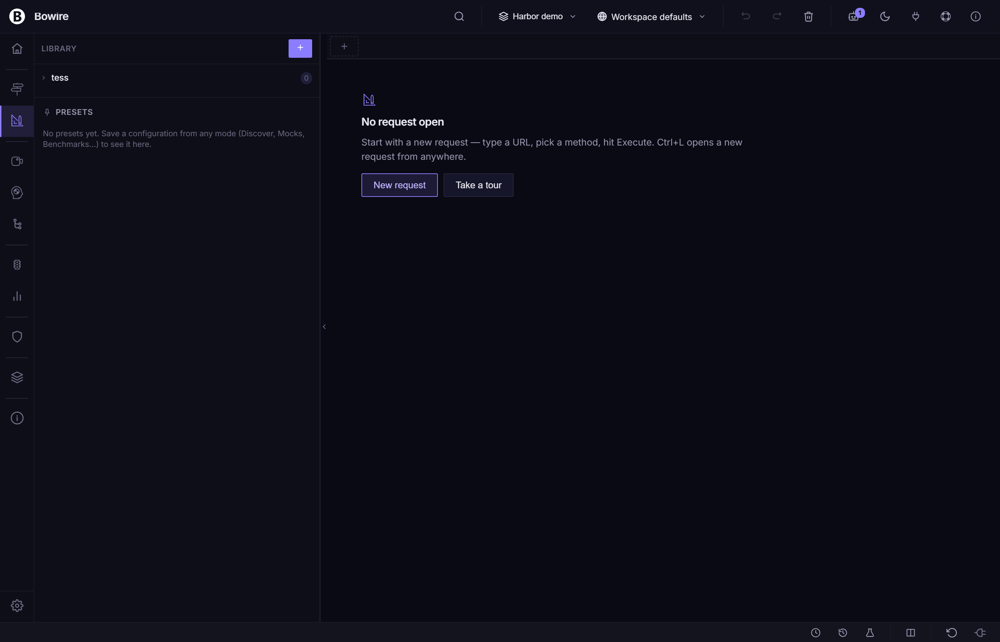

# Compose

**Compose** is v2.1's marquee rail — a Hoppscotch-style request builder for crafting and executing API calls without leaning on service discovery. It is the rebuild of v2.0's Design rail, with a new layout, persistent history, binary uploads, and a Library sidebar that moves to the **left** (a flip from v2.0's right side).

Compose lives in the `Kuestenlogik.Bowire.Compose` package and ships in `Bundle.Workbench` ([release notes — Compose rail #293, #289, #290, #291, #295](../release-notes/v2.1.0.md#compose-rail-293-289-290-291-295)).

## Opening Compose

Three ways:

- Click the **Compose** icon in the rail strip (left edge).
- Press the keyboard shortcut bound to **rail: compose** (see [Keyboard shortcuts](keyboard-shortcuts.md)).
- Deep-link via `?rail=compose` (see [Rail strip](rail-strip.md)).

If you've previously opened Compose in this workspace, the active tab is restored. Otherwise a fresh tab opens with the **REST** protocol pre-selected (the default; configurable in Settings).

## The request bar

The top of the pane is a single-line request bar — protocol picker on the left, URL or service / method in the middle, send button on the right. The bar stays put across protocols; what changes underneath is the per-protocol body / arguments layout.

| Element | Notes |
|---|---|
| **Protocol** | Dropdown of every loaded protocol plugin. Selecting one swaps the body layout in place. |
| **Method-type** (protocol-dependent) | Unary / ServerStreaming / ClientStreaming / Duplex — only shown when the protocol exposes streaming variants. |
| **URL / Service / Topic** | The protocol's primary target field. |
| **Method / Tool / Channel** | The secondary target field where the protocol has one. |
| **Send / Subscribe / Connect** | The action button — adapts to the method-type. |

The protocol picker switches the **layout** in place — REST gets a URL + KV-table chrome, gRPC gets service / method / JSON body, MCP gets tool / arguments, MQTT gets topic / QoS, WebSocket / SSE get connect / subscribe shells. The selection is sticky per tab.

## Per-protocol layouts

| Protocol | Layout below the bar |
|---|---|
| **REST** | URL field + Params / Headers / Body / Auth tabs. Body has Raw (JSON / text), Multipart form-data, x-www-form-urlencoded, Binary upload. |
| **gRPC** | Service name + Method dropdown (Server Reflection populated) + JSON body editor + Metadata KV table. |
| **GraphQL** | Endpoint URL + Query editor + Variables JSON + Headers. |
| **MCP** | Tool dropdown + Arguments JSON. |
| **MQTT** | Topic + QoS / Retain / Payload-format selector + Payload editor. |
| **WebSocket** | Connect URL + Send-message editor with frame history. |
| **SSE** | Connect URL + per-event-type filter. |
| **SignalR** | Hub URL + Method + Arguments. |

If a protocol plugin isn't loaded, it doesn't appear in the picker. Install missing protocols via [Settings → Plugins](settings.md).

## Library sidebar — moved to the left

In v2.0 the Library sidebar lived on the **right**. v2.1 moved it to the **left**, matching Hoppscotch's layout and giving the response pane the full right-side real estate it needs for the JSON viewer + map widget + per-extension panels.

The Library has three tabs:

| Tab | What it shows |
|---|---|
| **Collections** | The workspace's collections + their requests. Click a request to load it into a new Compose tab. Right-click for Run, Duplicate, Delete. |
| **Presets** | Per-method saved configurations (header sets, auth, body templates). Apply a preset onto the current tab without leaving the editor. |
| **History** | Every request you've fired in Compose, newest first. Persists across reloads. |

The sidebar has a resize handle on its right edge — drag to widen / narrow. Closed state is a thin gutter handle that re-opens on click. Per-workspace width preference persists in `bowire_compose_library_width`.

## History persists across reloads

Every successful Compose send is written to the workspace's history store. Re-open Bowire after a reload, a process restart, or a machine reboot — your last 200 requests are still there, with the full body / headers / response. Click any history entry to reload it into a fresh Compose tab.

The 200-entry cap is per workspace, configurable via **Settings → Compose → History size**. History entries also surface in:

- The [Command palette](command-palette.md) under the **History** category (Tab to filter).
- The Discover rail's empty state ("Recent calls" section).

## Binary uploads

REST request bodies can carry a binary file. Pick **Body → Binary** and drop a file onto the upload zone — Bowire reads it as a `Uint8Array`, encodes it as base64 in a side-channel that rides alongside the JSON request envelope, and the server-side handler re-decodes before forwarding to the target.

The same path handles `multipart/form-data` parts when a form-data row's value is set to a file.

History captures the file's name, size, and SHA-256, but not the bytes — re-running a historical binary request prompts you to re-attach the file.

## Multiple tabs + Duplicate

Compose is multi-tab. Click the **+** on the tab strip to open a new tab; right-click a tab for:

- **Duplicate tab** — copies the full request (URL, headers, body, auth, protocol) into a new tab. Use this to fan out a request without losing the original.
- **Rename tab** — give a tab a meaningful name; persists in the workspace.
- **Pin tab** — pinned tabs survive workspace switches.
- **Close tab** / **Close others** / **Close to the right**.

The tab strip persists across reloads. Closed tabs land in the topbar's [Trash drawer](../release-notes/v2.1.0.md#topbar--undo--redo--aggregated-trash-296-responsive-overflow-297) for one-click restore.

## Saving to a collection

The action bar beneath the request body has a **Save** button with a split arrow:

- **Save** — overwrites the original collection item (only enabled when the current tab was loaded from a collection).
- **Save as…** — picks a target collection from a dropdown, or creates one with **+ New collection**.

Saving captures the full request — protocol, URL / service / method, body, headers, auth, method-type — into the workspace's collections store. The new item appears immediately in the Library sidebar's Collections tab.

## Executing the request

Click **Send** (or press `Ctrl+Enter`) to execute. Compose routes through the same `/api/invoke` endpoint the Discover rail uses, so all protocol-specific handling, `{{var}}` substitution, auth helpers, and response rendering work identically.

The response appears in the right-side response pane — the same JSON viewer with line numbers, gutter chevrons, and the Hoppscotch-parity toolbar (Expand all / Collapse all / Wrap / Search / Copy / Download) the Discover rail uses. For streaming method-types the action button adapts to **Subscribe** / **Connect** / **Stop** and the response pane shows the live state badge (`● Subscribed — 0 msgs` → `● Receiving — 42 msgs` → `○ Closed`).

If a [UI extension](extensions.md) like the [Map widget](map-widget.md) matches the response's semantic kind, it surfaces as a tab alongside the JSON viewer.

## Variable substitution

Compose runs requests through the same `{{var}}` substitution table as Discover. URL, body, header values, auth fields all resolve against the active workspace's variable table — see [Workspaces — Environment variables](workspaces.md#environment-variables-var).

```
Protocol:    REST
Method:      POST
URL:         {{baseUrl}}/api/users
Headers:     Authorization: Bearer {{token}}
Body:
{
  "name":  "{{username}}",
  "email": "{{email}}",
  "ts":    "{{runtime.timestamp}}"
}
```

## Example — ad-hoc gRPC without Server Reflection

```
Protocol:    gRPC
Method-type: Unary
Service:     weather.WeatherService
Method:      GetCurrentWeather
URL:         https://grpc.example.com:443
Body:
{
  "city": "Berlin"
}
```

Click Send. The request goes through even if the server doesn't expose Server Reflection — Bowire serialises the JSON body via dynamic descriptors against the protobuf well-known types.

## Example — quick REST one-shot

```
Protocol:    REST
Method:      GET
URL:         https://api.example.com/users
Headers:     Authorization: Bearer {{token}}
```

No body, no service discovery — Compose dispatches the call straight away, response renders below.

## Screenshot



## Tips

- Use Compose for **one-off calls** when you don't want to wait for discovery — or when the target doesn't expose reflection / OpenAPI / SDL.
- **Duplicate tab** is the fastest way to compare a working request against a broken one — change one field at a time across the duplicates.
- Save anything you'll re-run to a collection. The Library sidebar is right there — drag-and-drop ordering, run all in sequence.
- Combine with [CLI mode](cli-mode.md) for scripted ad-hoc calls from the terminal. The Compose tab's `Copy as cURL` action gives you a shell-ready command.

## See also

- [Collections](collections.md) — managed from Compose's Library sidebar
- [Workspaces](workspaces.md) — `{{var}}` substitution table Compose uses
- [Map widget](map-widget.md) — auto-mounts on responses with `coordinate.wgs84` payloads
- [Rail strip](rail-strip.md) — how Compose sits alongside Discover / Recordings / Flows / Interceptor / Help
- [Form & JSON input](form-json-input.md) — the body-editor reference
- [Auto-discovery](auto-discovery.md) — the Discover rail Compose complements
