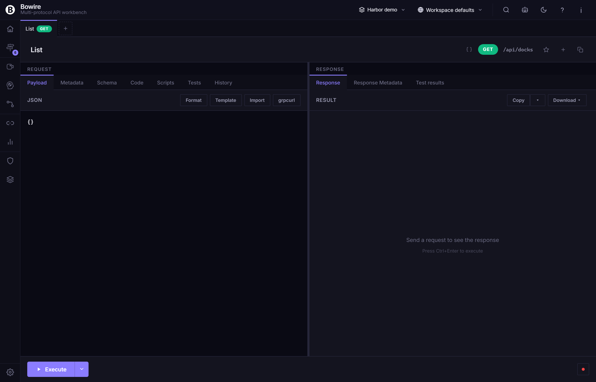

# Help rail

The **Help rail** is Bowire's in-workbench documentation surface. It mounts a topic tree on the left and renders a topic body on the right, both backed by the operator's installed `IBowireHelpProvider` implementations. New in v2.1 — Help used to live in a drawer in v2.0 ([#324](https://github.com/Kuestenlogik/Bowire/issues/324)).

Help ships as the `Kuestenlogik.Bowire.Help` package and is referenced transitively by `Bundle.Workbench`, so the standalone Tool always has it. Embedded hosts that drop the bundle and pick per-package references need to add `Kuestenlogik.Bowire.Help` explicitly if they want the rail.

## Why Help moved out of the drawer

The v2.0 drawer was a side-panel that overlapped the workbench. v2.1 promoted Help to a rail for three reasons:

1. **Drawers don't survive a rail switch.** Closing the drawer on top of the Discover rail and then switching to Compose lost the operator's reading context. The rail surfaces persist their state across rail switches like any other.
2. **Larger reading surface.** A drawer is cramped; a rail gets the full main pane plus a configurable splitter to widen the topic tree.
3. **Deep-linkable.** `?rail=help&topic=workspaces` lands directly on the Workspaces topic — useful for chat links and onboarding tours.

The v2.0 `help drawer` API is gone; no migration shim ships because the contract was internal-only.

## Opening Help

Three ways:

- Click the **Help** icon in the rail strip (typically the bottom group).
- Press the keyboard shortcut bound to `rail: help` (default unbound — see [Keyboard shortcuts](keyboard-shortcuts.md)).
- Deep-link via `?rail=help` (optionally `&topic=<topic-id>`).

The first time Help is opened in a workspace, the operator lands on the **Home** topic — a short index that points at the high-traffic surfaces (Discover, Compose, Workspaces, Recordings, Help itself).

## The topic tree

The left pane is a collapsible tree of topics. The tree is assembled from every loaded `IBowireHelpProvider` — the Tool ships one provider that surfaces every page under `docs/`; embedded hosts can register additional providers for in-house docs.

| Element | Notes |
|---|---|
| Provider sections | One top-level group per provider. The Tool's provider is labelled "Bowire docs". |
| Topic rows | A topic's title + an optional badge (e.g. `NEW`, `v2.1`). |
| Section expanders | Click a section to expand / collapse its children. Per-operator expansion state persists. |
| Search input | Filters the tree by title. Matches highlight in-place; non-matching topics dim. |

The tree has a resize handle on its right edge — drag to widen / narrow. Closed state is a thin gutter handle that re-opens on click.

## The topic body

The right pane renders the selected topic's body as server-rendered Markdown. The renderer matches DocFX's Markdown flavour (CommonMark + the GFM extensions) so the same source produces the same output in the rail and on bowire.io/docs.

Features in the rendered body:

- **Inline code** + **fenced code blocks** with Rouge syntax highlighting.
- **Cross-references** — `[Workspaces](workspaces.md)` resolves to another rail topic if a provider claims it; otherwise it falls through to bowire.io/docs in a new tab.
- **Headings + TOC sidebar** — long topics surface an inline TOC at the top of the body.
- **Inline images** — relative paths resolve against the topic's source directory.

## `Open in new tab`

The topic body header has an **Open in new tab** action. It opens the same topic as a standalone HTML page on a dedicated route:

```
/api/help/topic/<topic-id>.html
```

The standalone route renders the topic body in a clean, no-chrome layout — useful for:

- Sharing a link to a topic in a chat without forcing the recipient to open the workbench.
- Printing a topic for an offline review.
- Embedding a topic in an external dashboard (the route emits a permissive CSP).

The standalone route is fully cacheable; `IBowireHelpProvider` implementations can declare per-topic `Cache-Control` headers via the provider contract.

## `IBowireHelpProvider`

The provider contract lets a package contribute topics into the tree:

```csharp
public interface IBowireHelpProvider
{
    string Id { get; }
    string Name { get; }
    IReadOnlyList<HelpTopic> Topics { get; }
    Task<string> RenderAsync(string topicId, CancellationToken ct);
}

public sealed record HelpTopic(
    string Id,
    string Title,
    string ParentId,
    string IconKey,
    string Badge,
    int SortIndex);
```

The Tool's first-party provider walks `docs/**/*.md` at build time, snapshots every page's frontmatter into `HelpTopic`s, and ships the rendered Markdown bytes as embedded resources. An in-house provider can pull topics from a database, a wiki, an S3 bucket, anywhere — `RenderAsync` returns rendered HTML.

### Registering a provider

```csharp
services.AddSingleton<IBowireHelpProvider, MyTeamHelpProvider>();
```

Core picks up the registration via `IBowireServiceContribution`; the rail re-fetches the topic tree on next open.

## Workspace-scoped help

A workspace can ship its own help (project-specific runbooks, internal API conventions) by including a `.bww` with a `help/` directory of Markdown files. Bowire's built-in workspace help provider surfaces them as their own provider section in the rail, scoped to the active workspace.

When the workspace switches, the workspace help section swaps; the global Bowire-docs provider stays put.

## Settings

The Help rail surfaces under **Settings → Plugins → Help**:

- Provider list — every loaded `IBowireHelpProvider` with an enable / disable toggle.
- Cache control — TTL for rendered topic bodies (default: 1 h).
- Standalone route enable / disable — turn off the `/api/help/topic/*.html` route for hardened deployments.

## Screenshot



> The capture above falls back to the discover layout because the Combined sample doesn't ship the Help provider package. Re-capture against the standalone Tool to get the actual help tree + topic body. <!-- TODO: capture help-rail screenshot against Tool standalone 5180 -->

## See also

- [Rail strip](rail-strip.md) — how Help sits alongside the other rails
- [Plugin system](plugin-system.md) — the `IBowireHelpProvider` registration path
- [release notes — Help-as-rail #324](../release-notes/v2.1.0.md)
