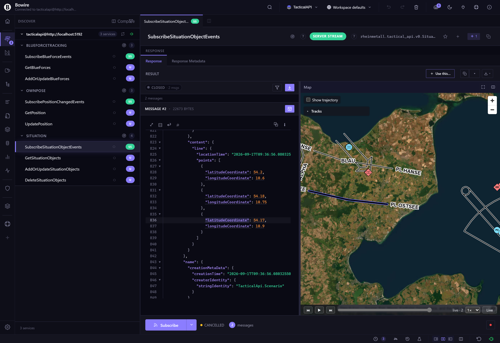

# Map widget

The **Map widget** is a [UI extension](extensions.md) that auto-mounts a MapLibre GL JS viewer whenever a Bowire response carries the `coordinate.wgs84` semantic kind. It ships as the `Kuestenlogik.Bowire.Map` package and is referenced by `Bundle.Workbench`, so the standalone Tool ships it out of the box.

The widget is the canonical demo of Bowire's [extension framework](../architecture/frame-semantics-framework.md) — a UI extension that subscribes to a semantic kind globally, recognises matching payloads at render time, and mounts a domain-specific viewer alongside the JSON tree.

## When it appears

The widget mounts when a response payload contains one or more fields tagged with the `coordinate.wgs84` semantic kind. Tagging happens in two ways:

1. **Auto-detection** at discovery time. The `Wgs84CoordinateDetector` recognises three shape conventions:

   | Shape | Example |
   |---|---|
   | `{lat, lon}` | `{ "lat": 53.55, "lon": 9.99 }` |
   | `{latitude, longitude}` | `{ "latitude": 53.55, "longitude": 9.99 }` |
   | `{latitudeCoordinate, longitudeCoordinate}` | `{ "latitudeCoordinate": 53.55, "longitudeCoordinate": 9.99 }` (Rheinmetall TacticalAPI naming) |

   The detector matches case-insensitively via anchored regex and supports both top-level coordinates and coordinates nested inside arrays of feature objects.

2. **Manual annotation** through the Semantics picker in the sidebar. Right-click any field in a response, pick **Semantics → coordinate.wgs84**, and the widget mounts on the next render. The annotation persists to the workspace.

When the widget is loaded but no coordinates show up in the response, the map tab is hidden — no empty map, no chrome cost.

## Layout — tab or split

Server-streaming and unary response panes get a tab-strip with **JSON** + **Map** + a layout toggle:

- **Tab mode** (default) — JSON and Map share the response pane, switch via the tab strip.
- **Split mode** — the response pane splits in two: JSON on one side, Map on the other. Click the toggle again to flip back to tabs.

Per-method layout preference persists in localStorage so the operator's choice for each method is remembered. The split-layout decision is **extension-driven** — Core asks the framework `preferredSplitExtensionForMethod(svc, method)` rather than hard-coding the `coordinate.wgs84` kind. Layering stays clean: Map-specific code lives in `Kuestenlogik.Bowire.Map`, Core stays generic.

## Bidirectional JSON ↔ map sync

The widget keeps the JSON tree and the map in sync both directions:

| Action | Effect |
|---|---|
| **Hover** a `{lat, lon}` block in the JSON | Highlights the matching pin on the map (no scroll). |
| **Hover** a pin on the map | Highlights the matching JSON block (no scroll). |
| **Click** a pin on the map | Scrolls the JSON to the matching line + auto-expands every collapsed ancestor. |
| **Right-click** a coordinate in JSON | Surfaces `Center on map` + `Copy path` + `Copy ${response.X}`. |
| **Double-click** a pin OR a coordinate field | Copies the field's JSON path to the clipboard. |

A right-side gutter hint surfaces the semantic kind on hover (e.g. `wgs84 coordinate`) so the operator knows which fields the widget is binding to.

## Pin gestures (detail)

| Gesture | Effect |
|---|---|
| Hover | Highlight JSON, no scroll. |
| Single-click | Scroll + expand ancestors. |
| Double-click | Copy JSON path to clipboard. |
| Right-click | Menu — Copy path, Copy `${response.X}`, Center on map. |

The gestures were stabilised after operator review in v2.1 to feel like a real map application, not a JSON viewer that happens to draw pins.

## Tactical symbols (MIL-STD-2525)

A pin whose entity carries a symbol identification code is drawn as that symbol. The widget looks for the SIDC next to the coordinate — walking up from the `{lat, lon}` node to the nearest ancestor whose subtree holds one, so a frame with many entities gives every pin its own code — and hands it to [milsymbol](https://github.com/spatialillusions/milsymbol) (MIT, vendored next to MapLibre and served from the same extension endpoint; no CDN). Both string forms are read:

| Standard | Shape | Example |
|---|---|---|
| MIL-STD-2525C / APP-6B | 15 letters, affiliation at position 2 | `SFSPCLCC-------` (friend, surface, cruiser) |
| MIL-STD-2525D / APP-6D | 20 digits (30 with country code), affiliation at position 4 | `10031000001211000000` (friend, land unit) |

milsymbol tells the two apart from the string alone, so no translation happens in the widget. One sprite is rendered per distinct code and reused by every pin that carries it.

Until the library has loaded — or if it could not be — the pin shows a plain affiliation shape instead: cyan rectangle for friend (incl. assumed friend, exercise friend), red diamond for hostile (incl. suspect), green square for neutral, yellow circle for unknown / pending. The same shapes serve as the fallback for a code milsymbol cannot draw. A pin without any code (GPS trace, AIS without symbol, weather buoy) keeps the yellow circle.

The 2525D code is also read in the form TacticalAPI's `NumericIdentifier` carries it — two ten-digit halves, `firstTenDigits` / `secondTenDigits`, as numbers or as the strings protobuf's JSON mapping writes an int64 as. Each half is padded back to ten digits before the two are joined.

## Tactical graphics (multipoint symbols)

A pin is a point, and a point is the one shape a symbol renderer draws from the code alone. The rest of what the standard calls a tactical graphic — boundaries, phase lines, assembly areas, axes of advance, air corridors, range fans, defended-area ellipses — is drawn from its geometry, and a frame carries that geometry as several coordinates: the vertices of a polygon, the centreline of a corridor, a vertex with ranges and azimuths beside it. The WGS84 detector pairs lat and lon per object, so it hands the widget one coordinate per vertex. The widget puts them back together from the paths they arrived under:

- Coordinates under one array — `…polygon.points[0]`, `…points[1]`, … — are the vertices of one geometry, in array order. With a symbol code on an entity above them, they are a graphic: a line, an area, an axis, a corridor (whose `width` sibling, in metres, becomes the standard's AM modifier). Without a code they stay what they were — pins and a trajectory, the GPS-trace case.
- Three named points under one object, one of them a centre (`…ellipse.centerPoint` and the two conjugate-diameter points), are an ellipse: the radii are the distances to the axis points, the rotation is the bearing of the major axis.
- One named point whose siblings carry a minimum and maximum range, an orientation and a sector size (`…fan.vertexPoint`) is a range fan.
- Anything else — a plain `point`, a `start` and an `end` with no code — is a pin, as before.

The graphic is drawn by [mil-sym-ts](https://github.com/missioncommand/mil-sym-ts) (Apache-2.0, MIL-STD-2525D / 2525E / APP-6D; vendored gzipped next to the other two libraries and served from the same endpoint, inflated for a client that does not take gzip). `scripts/vendor/mil-sym-ts.mjs` builds the copy from the upstream package: the module becomes a plain script, and the single-point icon tables — six megabytes of unit and equipment icons milsymbol already draws — are cut down to the control-measure icons a few multipoint graphics carry (the mines of a mined area, the signs of a contaminated area, a decision line's points), with every control measure rendered in Chromium against the untouched build to prove nothing changed. It is still 4.5 MB inflated and 0.6 MB on the wire, so unlike milsymbol it is not fetched on mount: the first frame that carries a geometry asks for it, and a workbench that only ever sees pins never pays. The entity's `name` (a string, or TacticalAPI's `{ content }` wrapper) is passed as the designation; the renderer prints the graphic's own prefix in front of it — `PL HANSE`, `AA BUCHE` — so the data carries the bare name.

Multipoint symbols cannot be drawn the same at every scale: an arrowhead is so many pixels wide, not so many metres, and a range fan's labels sit where there is room. The renderer therefore takes the current viewport and the widget draws every graphic again when the camera comes to rest. Strokes and fills go into MapLibre line and fill layers under the pins (a light casing under each stroke keeps a black friendly graphic legible on satellite imagery and the dark style); the labels are drawn once each on a canvas and placed as sprites at the point and angle the renderer chose, because the offline lockdown allows no glyph server for text. A hostile graphic comes out red, the way the standard draws it. The renderer's answer for a view is kept while the view holds, so a hover or a selection only repaints. Clicking a graphic scrolls the JSON viewer to its first vertex; hovering one tints the vertex there, and hovering a vertex — or the geometry itself — in the JSON viewer puts the accent under the graphic, the counterpart of the pins' halo. A selected frame's graphic draws heavier and the others step back, as pins do.

A graphic whose code is a fifteen-letter 2525C string is translated first: mil-sym-ts has no tables for that form, so the widget fetches a small crosswalk (`2525c-graphics.json`, built by `scripts/vendor/mil-2525c-graphics.mjs` from Esri's [joint-military-symbology-xml](https://github.com/Esri/joint-military-symbology-xml) legacy table, Apache-2.0) the first time such a graphic arrives, looks the code's category letter and function id up for the 2525D entity, and translates the rest letter by letter — affiliation to context and identity, status to present or planned, the echelon letter to the two-digit amplifier. `GFGPGLP-------X` becomes `10032500001403000000`, and the phase line draws as one. Its affiliation colour still comes from the C code.

Until the library has landed — or if it could not be, or refuses a code (too few points for the draw rule); or, for a 2525C code, until the crosswalk has landed or for a function id it does not list — the graphic is drawn as its bare geometry in the affiliation colour: the vertices as a line, closed for an area. The same kind of fallback the pins have in their four shapes. Graphics are not tracks: they have no trajectory and no row in the Tracks panel — a control measure is planned, not observed. They do answer the playback cursor: a graphic keeps one version per shape it has been sent as (a snapshot feed repeating the same boundary every two seconds adds nothing), and scrubbing back shows the version in force at that frame, or nothing for a graphic the stream had not yet shown.

## Basemap

The widget bundles MapLibre GL JS + a default basemap. The default is OpenStreetMap raster tiles via the `osm` key; the basemap can be swapped:

| Standalone CLI flag | Embedded option | Value |
|---|---|---|
| `--map-basemap=osm` | `options.MapBasemap = "osm"` | OpenStreetMap raster (default). |
| `--map-basemap=satellite` | `"satellite"` | Generic public satellite raster. |
| `--map-basemap=demotiles` | `"demotiles"` | MapLibre demo vector tiles — minimal styling, useful for offline. |
| `--map-basemap=<tile-url>` | `"<tile-url>"` | Raw tile-URL template (e.g. `https://tiles.example.com/{z}/{x}/{y}.png`). |

For air-gapped deployments, supply a tile-server URL on your own network. The widget never phones home — basemap fetches go directly from the browser to the configured tile URL.

## Installing the extension

### Standalone CLI

```bash
bowire plugin install Kuestenlogik.Bowire.Map
```

The package lands in `~/.bowire/plugins/`. On the next workbench load, Bowire registers the extension; the map widget mounts the next time a `coordinate.wgs84`-tagged payload shows up.

### Embedded ASP.NET

```bash
dotnet add package Kuestenlogik.Bowire.Map
```

No host-side wiring beyond `AddBowire()` + `MapBowire()` — the extension assembly is picked up by the plugin scanner and registers on the first workbench request.

### Docker

```bash
docker run --rm -v ~/.bowire:/home/app/.bowire \
    ghcr.io/kuestenlogik/bowire:latest \
    plugin install Kuestenlogik.Bowire.Map
```

`Bundle.Workbench` references the package transitively in v2.1, so the standalone Tool already ships the widget — the explicit install is only needed for embedded hosts that drop the bundle.

## Demo against the TacticalAPI sample

The TacticalAPI plugin repo ships a sample server — thirteen MIL-2525C tracks in five groups (a patrol boat, a destroyer and a cargo ship circling in the Mecklenburg Bight north of Poel, two convoys of APCs and trucks on the roads inland, a UAV orbiting off Poel, two pairs of tanks closing head-on east of Plön — every code with a function id the renderer has an icon for, every track where such a thing can be) under an overlay of eight control measures (a battalion boundary, two phase lines — one of them in the 2525C string form — an assembly area, an axis of advance, an air corridor, a sensor range fan and a hostile defended area; one per `SymbolLocation` case the standard has a graphic for), four blue forces and the host's own pose, broadcast every two seconds. It lives in [`Bowire.Protocol.TacticalApi`](https://github.com/Kuestenlogik/Bowire.Protocol.TacticalApi) under `samples/Kuestenlogik.Bowire.Protocol.TacticalApi.Sample` and reuses the plugin's own generated bindings, so it needs no separate `.proto` fetch. The payload uses the `{latitudeCoordinate, longitudeCoordinate}` shape, which the detector matches out of the box, and every track carries a 2525C SIDC under `symbol.symbolIdentifier`.

Run it from a checkout (`dotnet run --project samples/Kuestenlogik.Bowire.Protocol.TacticalApi.Sample`), point Bowire at `tacticalapi@http://localhost:5192` (the h2c gRPC port; `:5191` serves gRPC-Web and the sample's own embedded workbench), invoke `Situation.GetSituationObjects` — thirteen pins, one per track, each drawn as its symbol, and the eight graphics drawn over them. Subscribe to `Situation.SubscribeSituationObjectEvents` and the tracks move as the server pushes fresh snapshots while the overlay holds still; every snapshot carries all twenty-one in one frame, so set *Group by* to `uuid` in the Tracks panel to tell the tracks apart.

The `Kuestenlogik.Bowire.Protocol.TacticalApi` plugin is not part of `Bundle.Workbench` — install it first (`bowire plugin install Kuestenlogik.Bowire.Protocol.TacticalApi`); it carries the generated bindings, so the method names and descriptors resolve without a proto upload.

## Screenshot

![Map widget maximised over the western Baltic — the TacticalAPI sample's thirteen tracks drawn as MIL-2525C symbols under its overlay of 2525D control measures: the battalion boundary and phase lines HANSE and OSTSEE (the latter sent as a 2525C code) over Holstein, assembly area BUCHE around Convoy Alpha's origin, axis of advance BLAU onto the hostile tanks, air corridor KITE out to the UAV's orbit, the Poel radar's sector range fan over the ships in the bight and the hostile defended area NORD offshore](../images/screenshots/map-widget-pins.png)

Captured by `scripts/screenshots/capture-tacticalapi-screenshot.js` against the TacticalAPI sample (`Bowire.Protocol.TacticalApi/samples`, `Situation.SubscribeSituationObjectEvents`) with the ESRI satellite basemap and the map pane maximised; the same run re-shoots the workbench pair the site's protocol popup uses. Every pin is a milsymbol sprite drawn from its code — the patrol craft, the destroyer, the cargo ship, the APCs, the tanks. Every graphic is mil-sym-ts's output for that viewport, labels included.



The hover-sync from the same run: the viewer is scrolled to the last vertex of phase line OSTSEE — the graphic the sample sends as a 2525C string — and that row is hovered, so the line on the map takes the accent under its stroke while HANSE, BLAU and the corridor keep theirs. A click on a graphic goes the other way and scrolls the viewer to its first vertex.

## Edge cases

- **Map widget disappears on Tab ↔ Split toggle** (fixed in v2.1) — extension bootstrap was fire-and-forget, so `preferredSplitExtensionForMethod` returned null at first render. Chained `render()` onto the load promise; stamped distinct host IDs so morphdom replaces wrapper subtrees wholesale ([`a9d403f`](https://github.com/Kuestenlogik/Bowire/commit/a9d403f), [`a00b534`](https://github.com/Kuestenlogik/Bowire/commit/a00b534)).
- **Out-of-range coordinates** — values outside ±90 / ±180 are silently dropped from the map (still rendered in JSON). The detector treats them as accidental shape matches rather than valid pins.
- **Non-numeric coordinates** — string values like `"53.55"` are accepted via `parseFloat`; `null` and `NaN` are skipped.
- **Mixed shapes in one response** — the detector handles `{lat, lon}` + `{latitude, longitude}` in the same payload by matching each independently.

## Extension contract reference

The widget is a thin example of the `window.BowireExtensions.register({...})` contract:

```js
window.BowireExtensions.register({
    id: 'com.kuestenlogik.bowire.map',
    kind: 'coordinate.wgs84',
    bowireApi: '1.x',
    mount: (host, ctx) => { /* MapLibre setup */ },
    unmount: (host) => { /* teardown */ }
});
```

The .NET side is a thin shell — `PackageType=BowireExtension`, an embedded `wwwroot/js/widgets/map.js` plus the vendored MapLibre GL JS (BSD-3-Clause) and milsymbol (MIT) bundles with their licence files, a discovery descriptor. Bowire serves the bundle from `/api/ui/extensions/map/bundle.js` and the workbench loads it on first use.

See [Extensions](extensions.md) for the full extension-author contract and [frame-semantics-framework](../architecture/frame-semantics-framework.md) for the detector → annotation → viewer pipeline.

## See also

- [Extensions](extensions.md) — the UI extension framework the Map widget instances
- [Compose](compose.md) — Compose responses also surface the Map tab when payloads match
- [Plugin system](plugin-system.md) — the `BowireExtension` package type
- [release notes — MapLibre extension + TacticalApi integration](../release-notes/v2.1.0.md#maplibre-extension--tacticalapi-integration-new)
