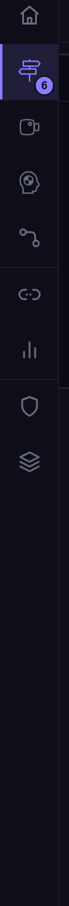

# Rail strip

The **rail strip** is the narrow column at the left edge of the workbench. It's the primary navigation surface introduced in v2.0 and refined in v2.1 — a stack of icon buttons, one per loaded rail, that switches the main pane between Discover, Compose, Recordings, Flows, Workspaces, Interceptor, Mock, Benchmarking, Help, and any custom rails an embedded host ships.

For the visual reference (icon set, hover affordances, splitter behaviour, sub-tab strip) see the [UI guide — Rail strip](../ui-guide/rail-strip.md). This page is the **feature-level** entry: it explains why rails exist, how rail packages are loaded, and how operators turn them on or off.

## Why rails

Bowire's UI used to be one workbench with everything bolted into a single sidebar. v2.0 broke that into rails so that:

1. **Embedded hosts can pick the surface they want.** A team that only needs Discover + Compose doesn't pay the bytes for Flows, Benchmarks, and the security tools.
2. **Operators can hide rails they don't use.** A standalone-tool user who never opens the Interceptor can collapse it out of the strip.
3. **New features ship as separate packages.** A new rail is `dotnet add package Kuestenlogik.Bowire.<NewRail>` — no Core changes.
4. **The strip is a stable, predictable navigation surface.** Operators learn one icon column and the muscle-memory survives across Bowire versions because contribution `Id` strings are kept verbatim (see [release notes — Welle 2 #325](../release-notes/v2.1.0.md#welle-2--rail-prefix-dropped-interceptor-consolidated-325)).

## How rail packages are loaded

Every rail is a `Kuestenlogik.Bowire.<Name>` NuGet package containing:

- A `[BowirePlugin]` / `[BowireRailContribution]` attribute on a contribution type that exposes its `Id`, `IconKey`, `SortIndex`, `Group`, and `SidebarKind`.
- An optional `wwwroot/js/rails/<id>.js` bundle for the rail's per-rail UI logic.
- Server-side endpoints under `/api/<id>/*` registered via `IBowireEndpointContribution`.
- Optional DI registrations via `IBowireServiceContribution`.

Core scans for contributions at startup. Standalone Tool installs pull `Bundle.Workbench`, which references every first-party rail transitively, so the Tool always shows the full set. Embedded hosts that drop `Bundle.Workbench` and pick per-package references see exactly the rails they reference.

Bundle.Minimal carries the Core + Home + Discover only — useful for "tiny embedded probe" deployments where the host wants just discovery + invoke.

### v2.1 rail packages

| Rail | Package | Notes |
|---|---|---|
| Home | (folded into Core in v2.1) | Descriptor-only, no per-rail JS. |
| Discover | (folded into Core in v2.1) | Descriptor-only, no per-rail JS. |
| Workspaces | `Kuestenlogik.Bowire.Workspaces` | Also carries env vars (was a separate package in v2.0). |
| [Compose](compose.md) | `Kuestenlogik.Bowire.Compose` | Renamed from `Rail.Compose` in Welle 2. |
| [Recordings](recording.md) | `Kuestenlogik.Bowire.Recordings` | Renamed from `Rail.Recordings`. |
| [Flows](flows.md) | `Kuestenlogik.Bowire.Flows` | Renamed from `Rail.Flows`. |
| [Interceptor](interceptor.md) | `Kuestenlogik.Bowire.Interceptor` | Consolidates Proxy + Intercepted + Traffic. |
| [Mock](mock-server.md) | `Kuestenlogik.Bowire.Mock` | Carries the mock host runtime + the Mocks rail in one package. |
| [Benchmarking](performance.md) | `Kuestenlogik.Bowire.Benchmarking` | Renamed from `Rail.Benchmarks`. |
| [Help](help-rail.md) | `Kuestenlogik.Bowire.Help` | New in v2.1 — was a drawer in v2.0. |

A given embedded host references a subset of these; the Tool references all of them via Bundle.Workbench.

## Operator: enabling / disabling rails

Operators control which loaded rails appear in the strip via **Settings → Rails** (renamed from "Rail modes" in v2.1).

The page lists every loaded rail with a checkbox:

- Checked → rail icon appears in the strip.
- Unchecked → rail is loaded but hidden from the strip. The rail's deep links + endpoints still work; only the icon-button is suppressed.
- Drag-handle on each row → manual ordering of the icon column. Per-operator preference; persists in `bowire_enabled_rails` + `bowire_rail_order`.

The Settings tree also groups rails by their declared `Group` (e.g. `compose-and-recall`, `automation`, `tools`) so a host shipping a custom group surfaces it as its own section without Core changes.

### Per-workspace overrides

A workspace can override the operator's rail enable/disable per project — useful for "I only want Interceptor visible while I'm working on this specific host". Workspace-level overrides live in the workspace's `.bww` and travel with it.

## Deep-linking — `?rail=<id>`

Every rail responds to a `?rail=<id>` query string parameter on the workbench URL. The workbench parses the parameter on boot and switches to the named rail before the first render.

```
http://localhost:5180/?rail=compose
http://localhost:5180/?rail=interceptor
https://my-host.example/bowire?rail=workspaces
```

Useful for:

- Bookmarking a specific rail as your default landing surface.
- Linking from external documentation or a chat message straight to the right surface.
- CI screenshot scripts that need a deterministic starting state.

The deep-link path uses the rail's `Id` string (verbatim — case-sensitive, no spaces). Renames in Welle 2 ([#325](https://github.com/Kuestenlogik/Bowire/issues/325)) kept `Id` strings unchanged even when the package names changed, so old `?rail=compose` links keep working.

If the requested rail isn't loaded or isn't enabled, the workbench falls back to the operator's default rail (Home, or whatever the operator has pinned).

## The strip itself

| Element | Notes |
|---|---|
| Icon column | 48 px wide. Each rail contributes one icon button. Hover surfaces the rail name in a tooltip. |
| Group separators | Thin dividers between `Group` buckets. |
| Sidebar splitter | Vertical splitter to the right of the strip — drag to widen the sidebar. Hover-Intent (250 ms dwell) avoids accidental highlights. |
| Bottom-aligned cluster | Settings gear + theme toggle pin to the bottom of the strip. |

The active rail's icon is the only one rendered at full opacity; inactive rails dim to 70 %.

## Embedded API

Embedded hosts can register a rail entirely in their own assembly:

```csharp
[BowirePlugin(Id = "my-team-tools", IconKey = "wrench")]
public sealed class MyTeamToolsRail : IBowireRailContribution
{
    public string Id => "my-team-tools";
    public string Name => "Team tools";
    public string Group => "tools";
    public int SortIndex => 800;
    public SidebarKind SidebarKind => SidebarKind.Inline;
}
```

The rail's JS bundle goes in the assembly's `wwwroot/js/rails/my-team-tools.js`; endpoints register through `IBowireEndpointContribution`. No Core changes; the rail appears in the strip on next workbench load.

## Screenshot



## See also

- [Rail pipelines & hand-offs](../architecture/rail-pipelines.md) — per-rail data flow (input → processing → output) + the inter-rail transition graph
- [UI guide — Rail strip](../ui-guide/rail-strip.md) — visual reference, splitter, sub-tab strip
- [Plugin system](plugin-system.md) — the `[BowirePlugin]` / `[BowireRailContribution]` contracts
- [Settings](settings.md) — the rail enable/disable page
- [Workspaces](workspaces.md) — per-workspace rail overrides
- [release notes — Pluggable workbench #294](../release-notes/v2.1.0.md#pluggable-workbench--rails--modules-as-package-contributions-294)
