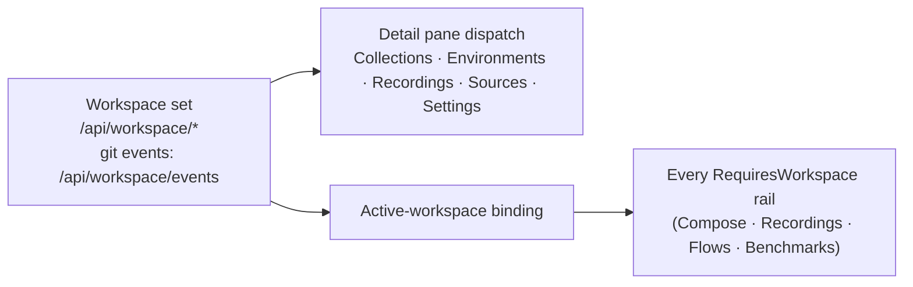

# Workspaces

A **workspace** is Bowire's project folder — the active workspace binds every
discovered URL, environment + variable + secret, collection, recording, flow,
and benchmark. The workbench always has exactly one active workspace; switching
it swaps every list at once.

This page covers the **Workspaces rail** — the in-app UX for creating,
switching, and managing workspaces. For the on-disk `.bww` export format and the
Git-backed per-entity directory layout, see [Workspace files (`.bww`)](workspace.md).
For where the rail sits in the data-flow, see
[rail pipelines & hand-offs](../architecture/rail-pipelines.md#workspaces-workspaces).

## What the rail is

| Property | Value |
|---|---|
| Rail id | `workspaces` (verbatim — deep-link `?rail=workspaces`) |
| Package | Core (`Kuestenlogik.Bowire`) — also carries environment variables (a separate package in v2.0) |
| Sidebar | **Workspaces** — the workspace overview list |
| Always on | Yes — every `RequiresWorkspace` rail depends on the binding this rail owns |

The rail is the closest thing Bowire has to a project file-tree: its detail pane
**dispatches into sub-views** — Collections, Environments, Recordings, Sources,
and Settings — that are no longer separate rail icons (they folded into
Workspaces in v2.1; the boot migration rewrites the old `sources` / `environments`
/ `collections` rail ids to `workspaces` / `compose`).

## The pipeline

- **In** — the workspace set, served from `/api/workspace/*` (git-backed change
  events stream on `/api/workspace/events` when the [Workspace.Git](workspace.md#git-backed-workspace-per-entity-files)
  runtime is active).
- **Dispatch** — the detail pane routes to the selected sub-view, which reads
  `/api/collections`, `/api/environments`, `/api/presets`.
- **Out** — the **active-workspace binding**: the one piece of state every
  `RequiresWorkspace` rail reads to know which project's data to show. This is
  why Compose, Recordings, Flows, and Benchmarks all redirect to
  [Home](rail-strip.md) when opened with no workspace selected.

## Switching workspaces

The **topbar workspace chip** is the always-visible switcher — click it for the
dropdown of workspaces, or open **New workspace…**. Switching is atomic: the
Library, environment selector, recordings, flows, and benchmarks all repoint to
the newly-active workspace in one step.

## Creating a workspace — templates

Creating a workspace (topbar chip → **New workspace…**, or **+ New workspace**
in the rail / the Home tile) opens a template picker so a workspace starts with
realistic seed data. **Start from scratch** gives a blank workspace; the built-in
templates seed a discovery URL, globals, and a starter collection:

| Template | Seeds |
|---|---|
| REST API testing | Petstore discovery URL + `baseUrl` / `apiToken` globals + a two-call starter collection |
| gRPC services | `grpcs@grpcb.in:443` (reflection) + `service` / `method` placeholder globals |
| Mock server build | Petstore seed URL + an empty `Mock targets` collection for capturing mock fixtures |
| Multi-protocol smoke test | Petstore REST + a WebSocket echo + a gRPC target in one workspace |

User-saved templates appear in the same list. The last-picked template becomes
the default for the next create.

### Save as template

Any workspace can be snapshotted as a reusable template — the per-row **Save as
template** action (bookmark icon), or the workspace-detail header's **Save as
template…**. Templates capture the workspace's URLs, env vars, collections,
globals, plugin pins, and presets. They persist per-machine in `localStorage`
(`bowire_user_workspace_templates`) and are not synced across machines.

## Environments & secrets

The Workspaces rail also owns **environments** — named variable sets the
[environment selector](environments.md) switches between at run time — and their
**secret** overlays. Project-level environments travel with the workspace and are
shared with the team; personal environments stay scoped to the user. Secrets are
referenced via `{{secret.NAME}}` and kept out of git (see
[secret separation](workspace.md#secret-separation-151)).

## Storage faces

A workspace has three storage faces, covered in depth in
[Workspace files (`.bww`)](workspace.md):

1. **Browser-backed** — `localStorage` under `bowire_ws_<id>_*` (Tool default).
2. **Disk-backed** — the `Kuestenlogik.Bowire.Workspace.Git` package materialises
   per-entity files for git review.
3. **`.bww` bundle** — a single-file portable export you commit / share.

## Hand-offs

- **Open a collection entry** → loads it into a [Compose](compose.md) builder tab
  (`railMode='compose'`).
- **Export / Save now** in the detail header → flushes autosave and produces a
  `<name>.bww` download ([format](workspace.md#what-a-bww-file-contains)).

## See also

- [Workspace files (`.bww`)](workspace.md) — the on-disk export format + Git-backed layout
- [Environments](environments.md) · [Collections](collections.md) — the rail's sub-views
- [Rail strip](rail-strip.md) · [Rail pipelines & hand-offs](../architecture/rail-pipelines.md)
