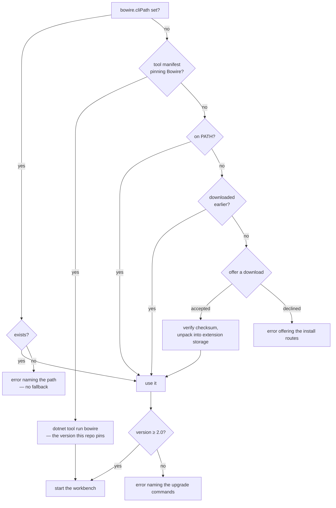
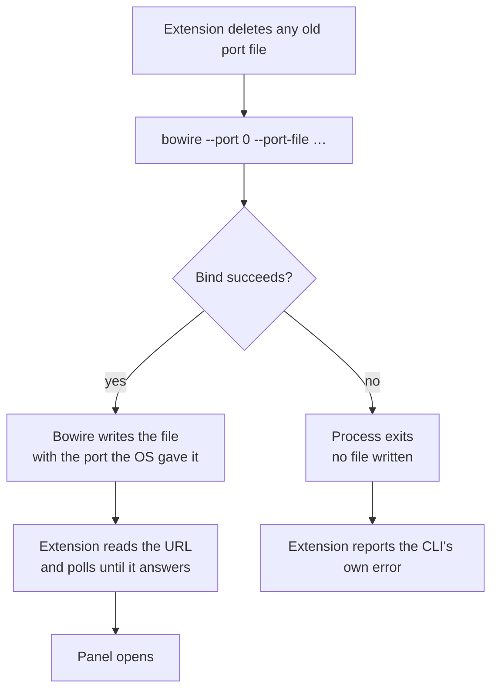

# Bowire in VS Code

The [**Bowire extension**](https://marketplace.visualstudio.com/items?itemName=kuestenlogik.bowire-vscode)
hosts the workbench in a VS Code side panel. It is the same workbench the
standalone tool serves rather than a reimplementation: the extension starts a
real `bowire` process and points a webview at it.

That one decision explains most of what follows. There is no file-system
bridge — the Bowire process reads and writes your files itself, and the webview
only speaks HTTP to it — and the data on disk is the same data the CLI and CI
use.

## Install

```
ext install kuestenlogik.bowire-vscode
```

Or search for **Bowire** in the Extensions view. The extension does not bundle
a CLI; the next section is how it gets one.

## How the extension finds Bowire

Four places are checked, in this order — specific beats shared beats ambient beats fallback:



Each step answers a different question. The setting is *this exact binary, because I said so*. The manifest is *the version this repository is tested with*, pinned in git and shared with everyone who clones it. `PATH` is *whatever this machine has*. The download is *nothing else was here, so we brought our own*.

**`bowire.cliPath`** points at an executable directly. Use it for a build that is not on `PATH` — a local checkout, a portable copy, a second version alongside the installed one. It supports `${workspaceFolder}`, so a project-local build can be committed to `.vscode/settings.json` and shared:

```jsonc
{ "bowire.cliPath": "${workspaceFolder}/tools/bowire" }
```

**A tool manifest** needs nothing from you here — if the repo has one listing Bowire, the extension runs that. Pin it the usual way:

```bash
dotnet new tool-manifest        # once per repo
dotnet tool install Kuestenlogik.Bowire.Tool
```

That needs the .NET **SDK**, not just the runtime. A machine without one falls through to `PATH`, and a tool that is pinned but not fetched yet gets told to run `dotnet tool restore` — not the install instructions, which cannot help there.

**A managed download** is the last resort, and it only ever happens after you say so. When none of the three above find anything, the extension offers to fetch a CLI into its own storage — about 60 MB, outside your workspace and off your `PATH`. Decline and you get the install instructions, exactly as before.

```jsonc
{ "bowire.autoDownload": "prompt" }   // default — "always" or "never" also work
```

`never` removes the offer entirely, which is what a machine with no outbound network wants. Deleting the extension's storage folder puts you back to the not-found state with nothing left behind.

That copy is pinned to the version this extension was tested against, which is the one correctness argument the other three routes cannot make: `PATH` resolves to whatever the machine happens to have. It still ranks *below* `PATH` on purpose — an installed Bowire is the one your terminal and your CI use, and having the editor quietly drive a different version would be its own kind of bug.

Nothing is unpacked before its SHA-256 matches the `checksums.txt` published with the release. The archive is streamed to a `.part` file and hashed on the way past, so the check runs against the bytes that actually landed on disk, and a mismatch is found while the payload is still an inert temporary file — which is then deleted.

Four details are deliberate. A configured path that does not resolve is reported as an error instead of quietly falling back — a typo that silently ran a different binary is harder to diagnose than one that says so. The version is checked before the process starts, because a CLI too old to understand the arguments the extension passes would otherwise just exit, and "Bowire exited before it started serving" names nothing. Both manifest locations are searched: `.config/dotnet-tools.json` is the documented one, but a bare `dotnet-tools.json` also resolves and is what `dotnet new tool-manifest` produced when this was tested against a real SDK. And a platform Bowire publishes no build for is told so rather than offered a download that could only 404.

The **Bowire** output channel records which executable was chosen, where it came from, and what version it reported.

## Where your work is stored

Collections, environments, recordings and presets, as plain JSON. Nothing lives in IDE-proprietary storage, and nothing is locked to VS Code: the same data is what the standalone tool and the CLI use, so a collection you build in the editor replays unchanged in CI.

**Where** depends on the repository, not on the editor:

| | |
|---|---|
| by default | `~/.bowire/` — machine-wide, shared by every workspace |
| with the opt-in below | the repo's own `.bowire/` — travels with the checkout |

To keep a project's data beside its code, add one line to that repo's `.bowire/project.json`:

```jsonc
{ "version": 1, "storage": "project" }
```

The collections then commit, diff and review like any other file, and two repos open in two windows keep separate sets.

It is opt-in on purpose: a manifest that says nothing keeps the machine-wide store, so nobody's existing data moves under them. Switching an existing setup over is a copy, not a migration — Bowire reads whatever is in the store it resolves to, so moving the files is the whole operation:

```bash
mkdir -p .bowire
cp ~/.bowire/collections.json ~/.bowire/environments.json .bowire/   # whichever you want to share
```

Copy rather than move while you are deciding: the machine-wide store is left untouched, so nothing is lost if the repo turns out not to be the right home for it. And because the answer comes from the repository, the same checkout resolves to the same store whether you opened it here, ran `bowire` in a terminal, or replayed it in CI — the editor is not a special case.

No file-system bridge is involved either way: the Bowire process reads and writes those files itself, and the webview only speaks HTTP to it.

## Ports, and how the extension finds the workbench

The extension does not pick a port. It starts Bowire with two flags:

```bash
bowire --port 0 --port-file <path>
```

`--port 0` asks the operating system for a free port. `--port-file` names a file Bowire writes the bound address into — as JSON, once Kestrel is actually listening:

```json
{ "version": 1, "url": "http://127.0.0.1:53411/", "pid": 12345 }
```

The file is deleted again on shutdown, and cleared before each bind, so its existence carries a meaning worth relying on: **the file is there if and only if the workbench is bound**. The extension waits for it to appear, reads the URL, and only then opens the panel.



This replaced scraping the startup banner, which failed in two ways: it is a log line, so it disappears at a quieter log level, and it is printed *before* the bind is known to have worked — a Bowire started on a taken port announces a URL and only then throws `AddressInUseException`.

`--port-file` is a plain CLI flag, so anything that starts Bowire as a child process can use it: CI harnesses, test fixtures, other editor integrations. It is the same shape Chrome uses for `DevToolsActivePort` and Jupyter for its `jpserver-<pid>.json`.

### If a Bowire is already running

Nothing changes. A workbench you started by hand keeps its port, its process and its lifetime; the extension starts its own next to it and the OS makes sure the two do not collide.

The extension deliberately does not adopt a running instance. It would be the wrong process: it has a different working directory, so it reads a different `.bowire/project.json` and stores collections somewhere else, it may have been started with different flags, and closing the panel would stop a process the extension never started.

### Stale files

A hard kill — Task Manager, a crash, a machine that goes down — is the one case no in-process cleanup can cover, and it leaves the file behind. Two things make that harmless: the `pid` in the document lets a reader check whether the owner is still alive, and the extension deletes the path itself before every start rather than trusting what it finds.

## Related

- [Deployment](../setup/) — installing the CLI itself
- [Embed Bowire](../embedding/) — mounting the workbench inside your own host
