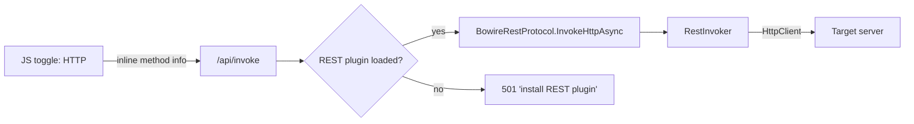
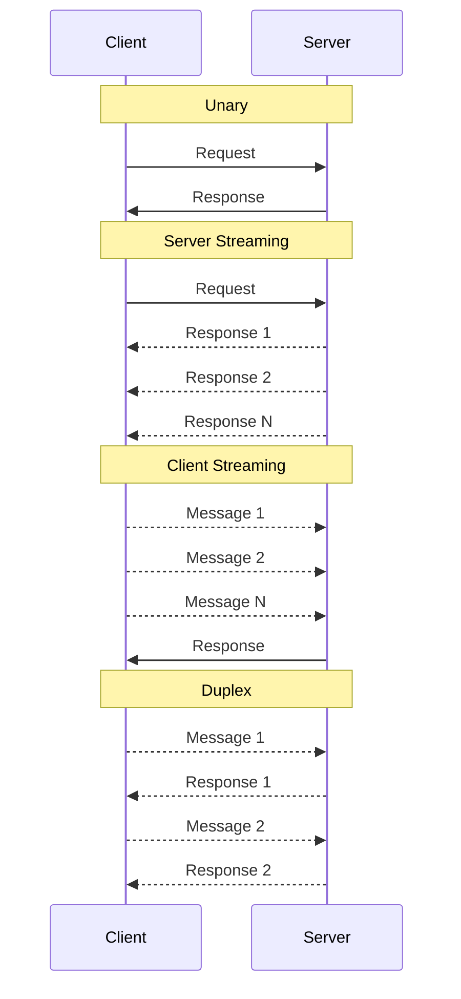

# gRPC Protocol

The gRPC plugin discovers services via gRPC Server Reflection and supports all four gRPC call types.

**Package:** `Kuestenlogik.Bowire.Protocol.Grpc` (included with `Kuestenlogik.Bowire`)

## Setup

```csharp
builder.Services.AddGrpc();
builder.Services.AddGrpcReflection();

var app = builder.Build();

app.MapGrpcService<GreeterService>();
app.MapGrpcReflectionService();       // Required for discovery
app.MapBowire();
```

The target server must have [gRPC Server Reflection](https://learn.microsoft.com/aspnet/core/grpc/reflection) enabled. Without it, Bowire cannot discover services.

## Discovery

The gRPC plugin queries the reflection service to enumerate:

- All registered gRPC services and their fully qualified names
- Each method with its call type (unary, server streaming, client streaming, duplex)
- Protobuf message schemas including field names, types, numbers, and nesting
- Enum definitions with their values
- **HTTP transcoding annotations** (`google.api.http`) when the proto declares them — see below

Internal services (like `grpc.reflection.v1alpha.ServerReflection`) are hidden by default.

## HTTP Transcoding Discovery

When a `.proto` file annotates RPC methods with `google.api.http` rules, Bowire reads those annotations directly from the reflection descriptors and surfaces the HTTP verb + path on the discovered method:

```proto
import "google/api/annotations.proto";

service TodoService {
  rpc GetTodo (GetTodoRequest) returns (TodoItem) {
    option (google.api.http) = {
      get: "/v1/todos/{id}"
    };
  }
}
```

After discovery, `GetTodo` shows up in the Bowire sidebar with **both** the gRPC method type badge **and** an HTTP `GET` badge. The path template `/v1/todos/{id}` is captured in the same `BowireMethodInfo.HttpPath` field that the REST plugin uses, so the existing UI just renders it correctly without any special-casing.

This works regardless of whether the server actually implements HTTP transcoding (via `Microsoft.AspNetCore.Grpc.JsonTranscoding`) — Bowire only reads the annotation, the discovery doesn't depend on the transcoding endpoints being live. The annotation itself is part of the proto descriptor which gRPC reflection always returns.

### Behind the scenes

The `google.api.http` rule is a **proto custom option** with field number `72295728` on `MethodOptions`. Without explicit setup, Google.Protobuf C# stores extension bytes in the message's unknown-field collection and `GetExtension(...)` returns null. Bowire's reflection client configures the descriptor parser with an `ExtensionRegistry` that knows about the typed extension:

```csharp
private static readonly MessageParser<FileDescriptorProto> DescriptorParser =
    FileDescriptorProto.Parser.WithExtensionRegistry(new ExtensionRegistry
    {
        AnnotationsExtensions.Http
    });
```

The extension definition comes from the `Google.Api.CommonProtos` NuGet package, which Bowire pulls in for exactly this reason. With the parser configured, `MethodDescriptorProto.Options.GetExtension(AnnotationsExtensions.Http)` returns the typed `HttpRule` whenever the annotation is present.

## Parallel HTTP invocation

Discovery alone gives you the verb badges in the sidebar, but Bowire goes one step further: when the **REST plugin** is also loaded, transcoded methods get a small **gRPC | HTTP** toggle in the action bar. The user picks how they want to invoke the same call, the choice is remembered per method.

```text
[Execute]   gRPC ◀▶ HTTP    Method: GetBook
                            GET /v1/books/{id}
```

How it works:

1. The gRPC plugin's reflection discovery detects the `google.api.http` annotation and writes the verb + path onto the existing `BowireMethodInfo.HttpMethod` / `HttpPath` fields
2. It also tags each input field with the right HTTP source bucket based on the path template:
   - Field names that match a `{placeholder}` in the path → `Source = "path"`
   - For GET / DELETE / HEAD / OPTIONS, remaining fields → `Source = "query"`
   - For POST / PUT / PATCH, remaining fields → `Source = "body"`
3. When the user clicks "HTTP", the JS sends the inline transcoded method info with the invoke request
4. The `/api/invoke` endpoint resolves an `IInlineHttpInvoker` from the protocol registry — the REST plugin implements that interface and delegates to its existing `RestInvoker`
5. The HTTP request is built and sent the same way OpenAPI-discovered REST methods are invoked

### Plugin boundary

Bowire keeps a clean plugin boundary here: **core has zero HTTP-invocation code**. The `IInlineHttpInvoker` interface lives in core, but every implementation lives in a protocol plugin. The dispatch path looks like:



When the REST plugin **isn't** installed:

- Transcoded methods still discover correctly with verb + path
- The toggle is **replaced by a read-only info badge** showing `GET /v1/books/{id}`
- Clicking the badge shows a tooltip explaining how to enable HTTP invocation
- Users who only want gRPC don't pull in any HTTP invocation infrastructure

This means a minimal `bowire plugin install Kuestenlogik.Bowire.Protocol.Grpc` install gives you full gRPC + transcoding **discovery**, without dragging in `Microsoft.OpenApi.Readers`, `RestInvoker`, or any of the REST plugin's other internals. Add `Kuestenlogik.Bowire.Protocol.Rest` to enable the parallel HTTP invocation path.

### Sample

`Bowire.Samples/SimpleGrpcTranscoding/` is a `LibraryService` that exercises every common verb:

```text
GET    /v1/books/{id}    GetBook
GET    /v1/books         ListBooks
POST   /v1/books         CreateBook   (body: "*")
PUT    /v1/books/{id}    UpdateBook   (body: "*")
PATCH  /v1/books/{id}    PatchBook    (body: "*")
DELETE /v1/books/{id}    DeleteBook
                         CountBooks   (no annotation — gRPC only)
```

The sample uses `Microsoft.AspNetCore.Grpc.JsonTranscoding` server-side so the same method really is reachable both ways. Run it on port 5007 and Bowire at port 5080 with `--url=https://localhost:5007`.

## Call Types



### Unary

The most common pattern. Send one request, receive one response. Bowire auto-generates a JSON template from the protobuf schema.

### Server Streaming

Send one request, receive a stream of responses. Messages appear in real-time in the response viewer via SSE. Click **Stop** to cancel.

### Client Streaming

Queue multiple messages in the UI, then send them all at once. The server responds after all messages are received.

### Duplex (Bidirectional)

Open an interactive channel to send and receive messages simultaneously. Both directions operate independently. See [Duplex Channels](../features/duplex-channels.md).

## Proto File Import

As an alternative to server reflection, you can import `.proto` files directly. This is useful when connecting to services that do not have reflection enabled.

## gRPC-Web transport

The same plugin can speak **gRPC-Web** instead of native HTTP/2 gRPC. Useful for services that only expose gRPC-Web behind an L7 proxy (Envoy, `grpcwebproxy`, browser-fronted backends behind ASP.NET's `UseGrpcWeb()`), or that publish *both* a native and a gRPC-Web endpoint on different ports — Rheinmetall's [TacticalAPI](tacticalapi.md) is the canonical case (`:4267` native, `:4268` gRPC-Web).

Two equivalent opt-in paths, in priority order:

1. **URL hint** — prefix the server URL with `grpcweb@`. Symmetric to the existing `grpc@` hint:

    ```bash
    bowire --url grpcweb@http://tactical.example:4268
    ```

2. **Metadata header** — `X-Bowire-Grpc-Transport: web` on a per-call basis. Exposed as `BowireGrpcProtocol.TransportMetadataKey` for callers that build the metadata dict programmatically. Anything else (or absence) falls back to the default **native HTTP/2** transport.

| Call type             | Native (default) | gRPC-Web |
|-----------------------|:----------------:|:--------:|
| Unary                 | ✓                | ✓        |
| Server streaming      | ✓                | ✓        |
| Client streaming      | ✓                | ✗        |
| Duplex (bidirectional)| ✓                | ✗        |

### Known limitation: client-streaming + duplex over gRPC-Web

`OpenChannelAsync` returns `null` in web mode, and the JS layer hides the "open channel" affordance on `grpcweb@` URLs. The reason is below the plugin: gRPC-Web rides HTTP/1.1, which doesn't carry trailers, and the only variant Bowire enables (`GrpcWebMode.GrpcWebText`) round-trips its frames as length-prefixed base64 inside the request / response bodies — workable for half-duplex but not for the long-lived, simultaneously-flowing streams a duplex call needs. Even the binary `GrpcWebMode.GrpcWeb` variant requires trailers for status reporting, so it can't fall back without an HTTP/2-upgrade or WebSocket layer that the spec doesn't standardise. Unary and server-streaming work cleanly through `InvokeAsync` / `InvokeStreamAsync` either way.

If you need client-streaming or duplex against a TacticalAPI-style server, point Bowire at the native HTTP/2 port (e.g. TacticalAPI's `:4267`) and leave the default transport on. The transport choice is per call, so the same workbench session can mix both.

### How the URL hint resolves

`grpcweb@<url>` is handled by `BowireEndpointHelpers.ResolveHint`, which expands it to `("grpc", X-Bowire-Grpc-Transport=web)` and dispatches into this plugin. Discovery — which has no metadata bag on the public `IBowireProtocol.DiscoverAsync` interface — piggy-backs the choice on a `__bowireGrpcTransport=web` query-string marker that `GrpcChannelBuilder.ExtractTransportFromUrl(...)` strips before opening the channel. The end server never sees the marker; downstream services don't see the `X-Bowire-Grpc-Transport` header either, because `GrpcChannelBuilder.StripTransportMarker(...)` removes it from the forwarded metadata.

### mTLS composes with web mode

When both an mTLS marker and the gRPC-Web hint are present, `MtlsHandlerOwner`'s `SocketsHttpHandler` becomes the inner of the `GrpcWebHandler` — TLS at the bottom, gRPC-Web framing on top. The cert-trust opt-in (`Bowire:TrustLocalhostCert`) covers both transports.

## Metadata

gRPC metadata (headers) can be added to any call via the Headers panel. Common uses:

- `authorization: Bearer <token>` -- authentication
- `x-request-id: <uuid>` -- request tracing
- `grpc-timeout: 30S` -- call deadline
- `X-Bowire-Grpc-Transport: web` -- opt into gRPC-Web for this call (see [gRPC-Web transport](#grpc-web-transport))

## Standalone Mode

The gRPC plugin works in both embedded and standalone modes. In standalone mode, point Bowire at any remote gRPC server:

```bash
bowire --url https://my-grpc-server:443
```

See also: [Quick Start](../setup/index.md), [Streaming](../features/streaming.md)
