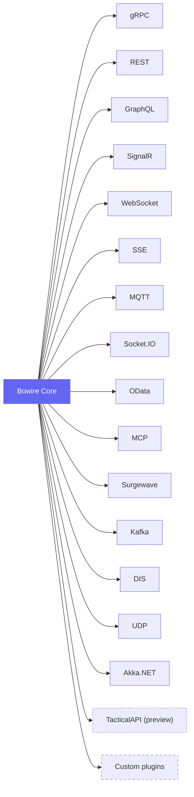

# Protocol Guides

Bowire ships with **ten first-party protocol plugins** plus **six sibling plugins** (Surgewave, Kafka, DIS, UDP, Akka.NET, TacticalAPI) that live in their own NuGet packages and install via `bowire plugin install`. Each implements `IBowireProtocol` and auto-registers at startup. Install only the ones you need.

## First-party protocols

| Protocol | Package | Discovery | Call types |
|----------|---------|-----------|------------|
| [gRPC](grpc.md) | `Kuestenlogik.Bowire.Protocol.Grpc` | Server Reflection · `.proto` upload | Unary, Server / Client / Bidi streaming |
| [REST](rest.md) | `Kuestenlogik.Bowire.Protocol.Rest` | OpenAPI 3 / Swagger 2 · `IApiDescriptionGroupCollectionProvider` | Request / response |
| [GraphQL](graphql.md) | `Kuestenlogik.Bowire.Protocol.GraphQL` | Schema introspection · SDL upload | Query, Mutation, Subscription |
| [SignalR](signalr.md) | `Kuestenlogik.Bowire.Protocol.SignalR` | Endpoint metadata scan | Invoke, Server streaming, Duplex |
| [WebSocket](websocket.md) | `Kuestenlogik.Bowire.Protocol.WebSocket` | Manual (no inherent discovery) | Duplex with text / binary frames |
| [SSE](sse.md) | `Kuestenlogik.Bowire.Protocol.Sse` | Attribute · manual registration | Server streaming |
| [MQTT](mqtt.md) | `Kuestenlogik.Bowire.Protocol.Mqtt` | Topic subscribe / publish (MQTT 3.1.1, 5.0 via MQTTnet) | Pub / Sub, Request / Response |
| [Socket.IO](socketio.md) | `Kuestenlogik.Bowire.Protocol.SocketIo` | Manual (namespace / event) | Duplex with ack |
| [OData](odata.md) | `Kuestenlogik.Bowire.Protocol.OData` | CSDL metadata endpoint | Request / response |
| [MCP](mcp.md) | `Kuestenlogik.Bowire.Protocol.Mcp` | Wraps other protocols as MCP tools | Unary (tool invocation) |

## Sibling plugins

These ship from their own repos / NuGet packages on independent release cadences. Install via the CLI:

| Protocol | Package | Discovery | Call types |
|----------|---------|-----------|------------|
| [Surgewave](surgewave.md) | `Kuestenlogik.Bowire.Protocol.Surgewave` | Cluster service · pending native admin API | Consume (ServerStreaming), Produce (Unary) |
| [Kafka](kafka.md) | `Kuestenlogik.Bowire.Protocol.Kafka` | `IAdminClient.GetMetadata` | Consume (ServerStreaming), Produce (Unary) |
| [DIS](dis.md) | `Kuestenlogik.Bowire.Protocol.Dis` | Mock-emit only (replay path) | UDP-multicast PDU bytes |
| [UDP](udp.md) | `Kuestenlogik.Bowire.Protocol.Udp` | URL-bind any UDP endpoint | Datagram listener (multicast / broadcast / unicast) |
| [Akka.NET](akka.md) | `Kuestenlogik.Bowire.Protocol.Akka` | DI-resolved `ActorSystem` (embedded only) | Mailbox tap (server-streaming `Tap/MonitorMessages`) |
| [TacticalAPI](tacticalapi.md) (preview) | `Kuestenlogik.Bowire.Protocol.TacticalApi` | Bundled `.proto` set (no Server Reflection required) | Descriptor discovery in v0.1.0; typed CRUD + server-streaming pump in v0.2.0 |

Writing your own: see [Custom protocols](custom.md).

## Architecture at a glance

## What every plugin provides

1. **Discovery** &mdash; enumerate services / methods / topics / events from the target
2. **Invocation** &mdash; send a request and return the response (or the stream)
3. **Streaming / channels** &mdash; where the protocol supports it, yield messages as they arrive

The UI stays protocol-agnostic: the same sidebar, request editor, and response viewer renders every plugin's output. Protocol-specific details (e.g. gRPC metadata, SignalR hub methods, MQTT topic wildcards) show up as extra fields in the request form only when the active plugin declares them.

## Multiple protocols in one session

Every installed plugin runs simultaneously. A single Bowire instance against a service that speaks gRPC, REST, and SignalR shows all three in the sidebar with per-protocol badges. Filter to a single protocol via the [command palette](../features/command-palette.md) or the sidebar protocol pills.
