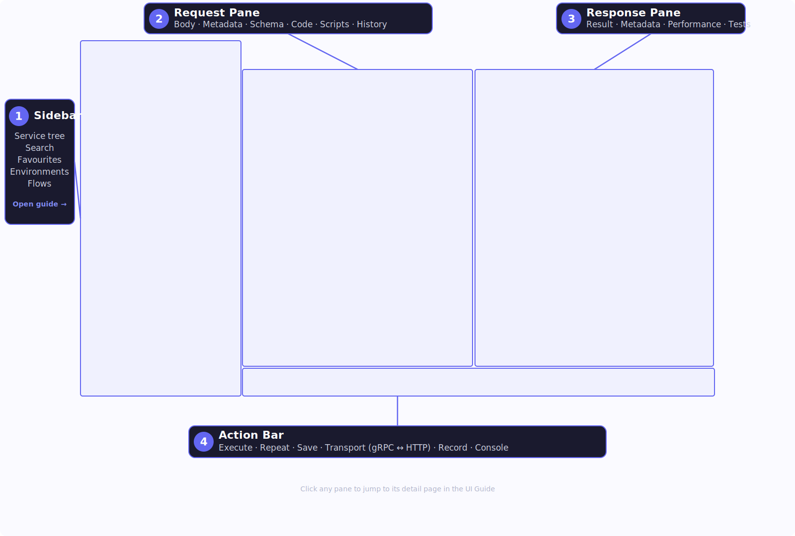

# UI Guide

Bowire's browser UI is a single-page application built with pure HTML, CSS, and JavaScript. It runs in any modern browser with no framework dependencies.

## Layout

The diagram below labels four working regions inside the workbench. Click any one to jump to its detail page:

<picture class="ui-anatomy-picture">
  <source srcset="../images/ui-anatomy-dark.svg" media="(prefers-color-scheme: dark)">
  
</picture>

1. **[Sidebar](sidebar.md)** &mdash; service list, search, favorites, protocol tabs
2. **[Request Pane](request-pane.md)** &mdash; form/JSON editor, metadata headers, import
3. **[Response Pane](response-pane.md)** &mdash; syntax-highlighted response, streaming view, copy/download
4. **[Action Bar](action-bar.md)** &mdash; execute button, repeat, status indicators

Above and beside those four regions run two surfaces that aren't numbered in the diagram:

- **[Topbar](topbar.md)** &mdash; brand, command palette / global search, connection pill, environment selector, theme, AI drawer, About, Settings.
- **[Rail strip](rail-strip.md)** &mdash; the 48 px icon column at the very left edge that switches rails; the sidebar reshapes to whichever rail is active.

On desktop, the topbar runs across the full width; the sidebar sits on the left with the request and response panes stacked or side-by-side on the right; the optional AI drawer slides in from the right edge. On mobile, the sidebar collapses behind a hamburger menu and panels stack vertically.

## Theme

Bowire supports dark, light, and auto (system-preference) themes. The palette is indigo-accent on near-black or near-white, tuned for long reading sessions with high contrast on code blocks. Toggle themes with the `t` keyboard shortcut or the theme button in the header.

The theme preference is saved in localStorage and persists across sessions.

## Configuration

Customize the UI at startup:

```csharp
app.MapBowire(options =>
{
    options.Title = "My API";
    options.Description = "v2.3 -- Staging";
    options.Theme = BowireTheme.Dark;
    options.RoutePrefix = "api-browser";
});
```

| Option | Default | Description |
|--------|---------|-------------|
| `Title` | `"Bowire"` | Browser tab and header title |
| `Description` | `""` | Subtitle shown below the title |
| `Theme` | `Dark` | `BowireTheme.Dark` or `BowireTheme.Light` |
| `RoutePrefix` | `"bowire"` | URL path prefix for all endpoints |
| `ServerUrl` | `null` | Override server URL (for reverse proxies) |
| `LockServerUrl` | `false` | Prevents the server URL from being changed in the UI |
| `ShowInternalServices` | `false` | Show internal services like `grpc.reflection` |

See also: [Keyboard Shortcuts](../features/keyboard-shortcuts.md), [Responsive & Mobile](../features/responsive-mobile.md)
