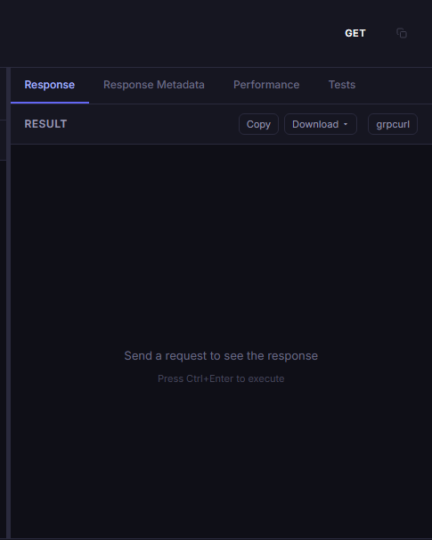
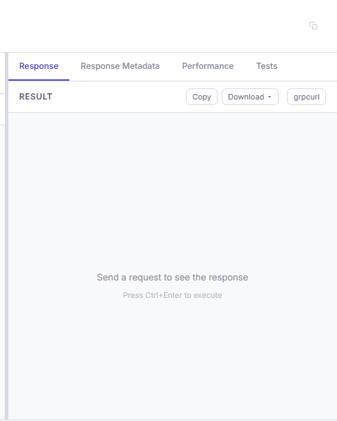

# Response Pane

The response pane displays the result of a method invocation with syntax highlighting, status information, and action buttons.

## Unary Responses

For unary calls, the response pane shows:

- **Status** -- the gRPC status code or HTTP status (e.g., "OK", "NotFound")
- **Duration** -- how long the call took
- **Response headers** -- key-value pairs from the server
- **Response body** -- syntax-highlighted JSON

The response body is formatted with indentation for readability.

## Streaming Responses

For server-streaming calls, messages appear one at a time as they arrive:

- Each message is appended to the response viewer with a timestamp
- A streaming indicator shows the connection is active
- A message counter tracks how many messages have been received
- Click **Stop** to cancel the stream

For duplex channels, the response pane shows received messages while the request pane remains available for sending.

## Syntax Highlighting

JSON responses are syntax-highlighted with colors for strings, numbers, booleans, and null values. The highlighting works in both dark and light themes.

## Actions

### Copy

Click the **Copy** button to copy the response body to your clipboard. For streaming responses, this copies all messages received so far.

### Download

Click the **Download** button to save the response as a JSON file. For streaming responses, all received messages are saved as a JSON array.

### Export as grpcurl

Click the **Export** button to generate a grpcurl-compatible command for the current method and request body.

## Error Display

When a call fails, the response pane shows:

- **Error status** -- the gRPC status code name (e.g., "NotFound", "Internal")
- **Error detail** -- the server's error message
- **Duration** -- how long before the error occurred

See also: [Streaming](../features/streaming.md), [Export & Import](../features/export-import.md)
