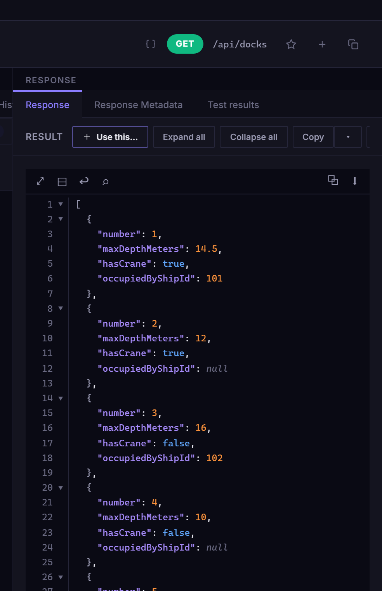
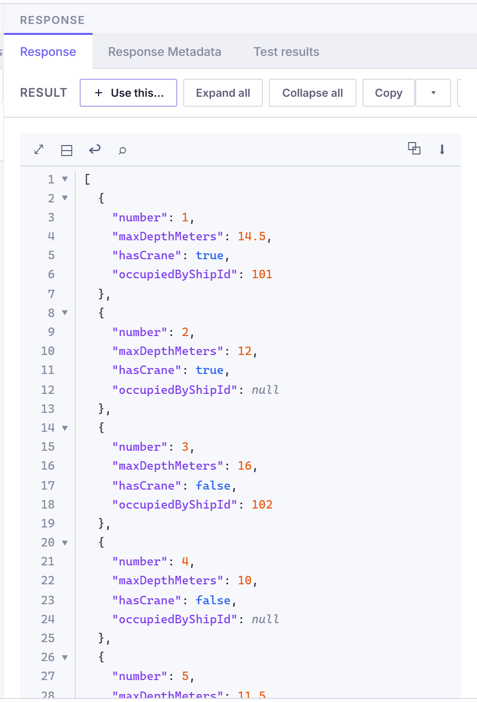

# Response Pane

The response pane displays the result of a method invocation with syntax highlighting, status information, and action buttons.

## Unary Responses

For unary calls, the response pane shows:

- **Status** -- the gRPC status code or HTTP status (e.g., "OK", "NotFound")
- **Duration** -- how long the call took
- **Response headers** -- key-value pairs from the server
- **Response body** -- syntax-highlighted JSON

The response body is formatted with indentation for readability.

## Streaming Responses

For server-streaming calls, messages appear one at a time as they arrive:

- Each message is appended to the response viewer with a timestamp
- A streaming indicator shows the connection is active
- A message counter tracks how many messages have been received
- Click **Stop** to cancel the stream

For duplex channels, the response pane shows received messages while the request pane remains available for sending.

## Syntax Highlighting

JSON responses are syntax-highlighted with colors for strings, numbers, booleans, and null values. The highlighting works in both dark and light themes.

## Actions

Every action in this cluster except **Use this...** is an icon button. The
cluster is the densest row in the workbench, and labels there restated
glyphs that are understood without them -- copy, download, expand and
collapse. The label is not gone, it moved: hover shows it as a tooltip, and
each button carries the same text as its accessible name. **Use this...**
keeps its label because it is the one primary action in the cluster.

### Copy

Click the **copy** icon to copy the response body to your clipboard. For streaming responses, this copies all messages received so far.

### Download

Click the **download** icon to save the response as a JSON file; the caret next to it picks the format. For streaming responses, all received messages are saved as a JSON array.

### Expand / collapse

The two chevron buttons open and close every node of the JSON tree at once. They are hidden while a stream is running -- the streaming pane has its own controls.

### Copy as code

The **copy** button is a split button. The primary half copies the response body; the caret opens a protocol-aware code-export list -- REST offers curl / fetch / Python, gRPC offers grpcurl, WebSocket offers wscat, and so on. The old standalone **Export as grpcurl** button was folded into this dropdown, so the offered commands always match the protocol of the method you are looking at.

Every protocol's list ends with **Copy as Bowire CLI**, which renders the request as a runnable `bowire call ...` line rather than translating it into another tool. It is an entry in this dropdown rather than a button of its own -- the action cluster has exactly one primary button, and that one is **Use this...** below. MQTT, NATS and Socket.IO offer only this entry: they used to fall through to the REST list and be handed a curl command that could never reach a broker.

The command carries a `#` note block for anything the CLI cannot reproduce (runtime-fetched auth tokens, query-string API keys, duplex methods), and never resolves `{{secret.*}}` or `{{keyring.*}}` references into the copied text. The Code tab in the request pane offers the same entry plus a shell-flavour toggle and a **Keep {{variables}}** pill. See [Export & Import](../features/export-import.md#export-as-a-bowire-cli-command) and [CLI mode](../features/cli-mode.md#invoke-a-method).

### Use this...

Once a call has succeeded, a **Use this...** button appears at the front of the action cluster. It answers the question the workbench used to leave hanging -- *and now what?* -- by turning the response you are looking at into the next artefact, without retyping the request anywhere:

| Item | What it does | Needs |
| --- | --- | --- |
| **Save as mock** | Freezes the request + response into a recording step and, when a mock host is available, boots a mock server from it and opens the Mock servers view | `Kuestenlogik.Bowire.Recordings` to capture, `Kuestenlogik.Bowire.Mock` to boot |
| **Add to flow...** | Appends the request as a step in a new or existing flow, carrying a `status == <this status>` assertion | `Kuestenlogik.Bowire.Flows` |
| **Keep as test** | Saves the status (and the response body, when there is one) as assertions for this service and method, then switches to the Test results tab | nothing -- assertions are core |
| **Add to benchmark envelope...** | Adds the request to a new or existing benchmark envelope | `Kuestenlogik.Bowire.Benchmarking` |

Items whose package is not installed stay **visible but disabled**, with a tooltip naming the package they need. A workbench running on `Kuestenlogik.Bowire.Bundle.Minimal` therefore still shows the full menu and tells you what is missing, instead of quietly offering a shorter one.

The button appears on both response surfaces -- the schema-driven Discover response pane and the Compose request builder's response viewer -- and both open the same menu. Two details differ on the Compose side, because that surface has no RPC identity of its own:

- **Keep as test** keys the assertions on the request URL's host and path (or on the discovered method, if the tab was created from one) instead of a service name, and toasts where the results will show up: the Compose viewer's own Tests tab is a pre/post-script placeholder, not an assertion-results surface.
- **Save as mock** derives the mock's HTTP path from the request URL, since the method field there holds a bare verb.

Everything the menu hands off is re-read at click time, so switching methods before choosing an item never hands off the previous method's request.

See also: [Mock server](../features/mock-server.md), [Flows](../features/flows.md), [Test assertions](../features/test-assertions.md), [Performance & benchmarks](../features/performance.md), [Recording & replay](../features/recording.md)

## Error Display

When a call fails, the response pane shows:

- **Error status** -- the gRPC status code name (e.g., "NotFound", "Internal")
- **Error detail** -- the server's error message
- **Duration** -- how long before the error occurred

See also: [Streaming](../features/streaming.md), [Export & Import](../features/export-import.md)
