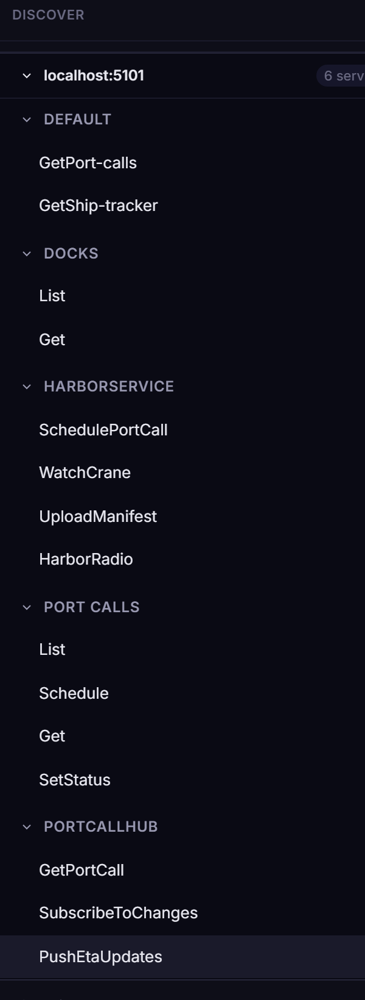
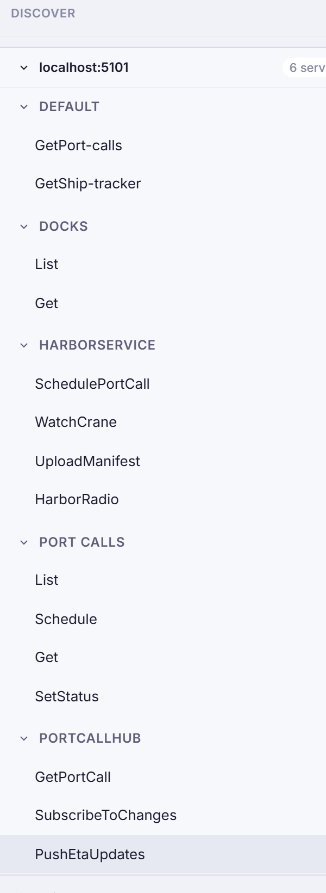

# Sidebar

In v2.0 the left side of the workbench has **two layers** — the thin **rail** on the very left for mode switching, and the **sidebar** next to it for the list of things in the active mode. The sidebar reshapes per rail mode; the rail itself stays put.

## Rail (the left strip)

13 rail-mode icons drive what the sidebar shows. Click an icon to swap modes; the active mode lights up the icon in the accent colour. Order top to bottom:

- **Home** — Continue / Start / Favorites / Recent activity launchpad.
- **Discover** — services / methods tree (this page's main subject).
- **Workspaces** — the named contexts that bundle URLs, environments, collections, AI config (#116).
- **Sources** — discovery URLs + uploaded schema files (#92).
- **Collections** — named bundles of saved requests.
- **Environments** — variable / secret sets the resolver pulls from (#125).
- **Recordings** — captured request/response sessions you can replay or mock (#94, #144).
- **Mocks** — running mock servers (`#94` Phase 2).
- **Benchmarks** — envelope-architecture load tests (#131).
- **Flows** — visual request chains.
- **Proxy** — MITM-captured live traffic (#99 / #153).
- **Security** — threat model + per-endpoint scan templates (#112).
- **Burger / App-Drawer** — secondary actions (Settings, About, Theme, Help — opens from the top left when you click the B-Logo).

## Sidebar (per-rail list)

Every mode renders into a **unified toolbar row** at the top of the sidebar plus a list below. The toolbar carries:

- **Title** — `Discover`, `Workspaces`, `Mocks`, etc. Click-to-overview where it makes sense.
- **Spacer** — pushes the trailing actions to the right.
- **Action buttons** — square 26 px icon buttons specific to the mode (e.g. a filter ⛛ in Discover; replay in Mocks).
- **Primary `+` button** — accent-coloured, opens the create flow for the mode (new request / workspace / collection / recording / mock host / envelope / flow).
- **Overflow `⋮`** — dropdown for less-common actions (delete all, edit settings…).

Each list item follows the **hover-reveal pattern**: name + meta visible at rest, secondary tools (rename pencil, settings gear, danger trash) materialise on row hover. State markers (active checkmark, default-star) occupy a reserved-width slot so the row doesn't reflow.

## Discover sidebar specifics

The Discover sidebar is the only one that walks a tree (services → methods) instead of a flat list, so it grows a few extra controls:

- **Filter button** (`⛛`) in the toolbar opens a popup with three sections — **Favorites only**, **Filter by protocol**, **Filter by type** (Unary / Server-Streaming / Client-Streaming / Duplex), **Filter by URL** (when ≥ 2 discovery URLs are loaded). The favorites toggle lives inside this popup as its first option — there's no separate star button on the strip.
- **Name-filter input** below the toolbar — types narrow the visible tree in real time. `Esc` clears.
- **Chip strip** appears only when at least one filter is active — visualises the current narrowing as removable pills.
- **Service groups** are expandable tree nodes per protocol. Each method row shows its **call-type badge** (Unary, Server-Streaming, Client-Streaming, Duplex), name, and a hover-reveal **star** for favoriting. Drag a method to drop it into a Collection picker (#431).

The protocol-tab strip from v1.x has been retired in favour of the filter-popup-with-multi-select approach — one place to slice the tree by any dimension, not three competing strips.

## Search across the workbench

`Cmd/Ctrl+K` opens the **omnibox** (#124) — a single search line that ranks methods, recordings, collections, settings, and `?`-prefixed AI prompts uniformly across every rail. This replaces the sidebar-local `/` search from v1.x.

## Favorites

Favoriting is a per-method toggle on the Discover tree row (the hover-reveal star). Favorites surface in two places:
- **Home rail** — top section "Favorites", a 3×3 capped grid; click the section title to open a right-side **drawer** with the full list.
- **Discover sidebar** — turn on "Favorites only" inside the filter popup to narrow the tree.

Favorites persist per-workspace in localStorage (browser mode) or in the workspace's `.bww` (git-backed mode).

## Drawer-Modus auf schmalen Viewports

Bei < 1400 px wird die rechte Drawer-Familie (Assistant, Help, Tests, Activity) automatisch zu einem `position: fixed`-Overlay. Die linke Sidebar bleibt im Flex-Flow.

See also: [Action bar](action-bar.md), [Request pane](request-pane.md), [Response pane](response-pane.md), [Favorites & History](../features/favorites-history.md), [Keyboard Shortcuts](../features/keyboard-shortcuts.md)
