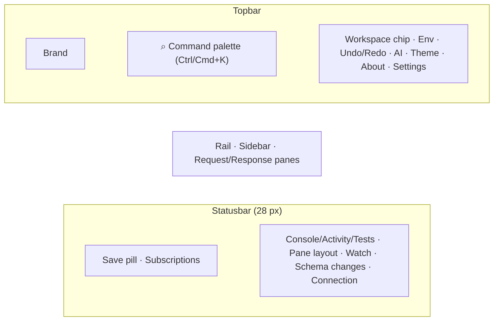

# Topbar & statusbar

The topbar runs across the top of the workbench above the sidebar, request pane, and response pane. It hosts the brand, the command palette / global search, and the right-side cluster of session controls. Since [#138](https://github.com/Kuestenlogik/Bowire/issues/138) the *status*-class items — connection state, schema watch, save state — live in a thin **statusbar** pinned to the bottom instead, IDE-style, so the topbar reads as navigation + identity.

## Layout

### Left — brand

- Small logo (matches the favicon) plus the **Bowire** wordmark.
- In embedded mode, the wordmark is replaced by `options.Title` from the host configuration.
- In locked mode (`--lock-server-url`), a subtitle line shows which URL the workbench is pinned to.

### Center — command palette

- Type-ahead search box that filters the sidebar's service tree **and** opens a suggestions dropdown for quick navigation.
- Live-matches methods, services, recent calls, hints (with the `hint` prefix), and AI queries (with the `@ai` prefix).
- Apply a substring as a name filter chip; press Enter to navigate to the first match.
- Keyboard shortcut: `Ctrl/Cmd+K` focuses the palette from anywhere.

### Right — session controls

The right cluster carries the per-session toggles. (Connection state and schema watch moved to the statusbar in [#138](https://github.com/Kuestenlogik/Bowire/issues/138) — see below.)

| Control | Purpose |
|---|---|
| **Workspace chip** | Active workspace name; click for the switch / create / manage menu. |
| **Environment selector** | Switch active environment; click to manage variables. |
| **Theme toggle** | Cycle auto → dark → light → auto. Keyboard shortcut: `t`. |
| **AI drawer** | Open / close the right-side AI assistant. Badge shows live hint-engine count. Keyboard shortcut: `Ctrl/Cmd+Shift+A`. |
| **About** | Standalone dialog with version, open-source notices, and Küstenlogik credit. |
| **Settings** | Settings dialog (General / Shortcuts / Data / AI / Plugins). |

## Statusbar

The 28 px strip at the bottom of the workbench carries ambient telemetry the operator glances at rather than works in. Left to right:

| Control | Purpose |
|---|---|
| **Save pill** | #127 auto-save state — "Saved to <workspace>" flash, sticky on failure; click opens the workspace folder where the host allows it. |
| **Subscriptions pill** | Active streaming subscriptions with per-state dot; click for the list. |
| **Console / Activity / Tests** | Toggle the bottom console drawer, the activity (undo) drawer, and the tests drawer. |
| **Pane layout** | Request-only / split / response-only switcher plus the split-orientation toggle. |
| **Schema watch** | Toggle the background re-discovery loop. The interval comes from **Settings → General → Schema Watch interval** (15 s by default, per-workspace override in the workspace's General tab); the button tooltip states the value in force. Each poll is diffed against the last and what moved is marked in the Discover sidebar. See [Settings](../features/settings.md#schema-watch-interval). |
| **Schema changes pill** | The workspace's 7-day change log ([#185](https://github.com/Kuestenlogik/Bowire/issues/185)): "3 changes since 14:30" while unread (with a pulsing dot on the Discover rail icon), a quiet "12 changes · 7d" once read. Click for the chronological log; opening marks it read; clicking a change navigates to the affected method. |
| **Connection pill** | Aggregate state of every configured discovery URL — details below. ([#93](https://github.com/Kuestenlogik/Bowire/issues/93)) |

Embedded hosts hide the whole statusbar (`display:none`) — the host owns that chrome.

## Connection pill — at-a-glance health

The pill collapses every configured discovery URL into a single dot + summary:

| Aggregate state | Dot color | Summary text |
|---|---|---|
| Every URL connected, single URL | green | the URL (truncated) |
| Every URL connected, multi-URL | green | "All N connected" |
| At least one connecting | amber, pulsing | "X / N connecting…" |
| Mixed — some connected, others idle | amber | "X / N connected" |
| At least one failed | red | "X / N failed" |
| No URLs configured | grey | "Pick a URL" |

Hover the pill to open a popover that lists every URL with:

- Status dot + status word.
- The URL, middle-truncated for readability; the full URL is in the row's `title` attribute.
- Service + method counts (only when connected, so the operator sees the real surface they get from this URL).
- The discovery error message, when failed.

Embedded mode hides the pill — the host owns the URL and there's no operator-facing knob to turn.

## Behavior in different modes

- **Standalone (`bowire` CLI without `--url`)** — full topbar and statusbar.
- **Standalone locked (`bowire --url …`)** — same layout, but the connection pill shows the locked URL and the editing affordance in the popover is hidden.
- **Embedded (`app.MapBowire(...)` inside the host)** — the statusbar (and with it the connection pill, watch toggle and schema-changes pill) is hidden; topbar controls unchanged apart from the host-titled brand.

## See also

- [Sidebar](sidebar.md) — service list, filter strip, source selector.
- [Request Pane](request-pane.md) — body editor, metadata, schema view.
- [Response Pane](response-pane.md) — response viewer, history, code generation.
- [Action Bar](action-bar.md) — execute button, repeat, status indicators.
- [Keyboard Shortcuts](../features/keyboard-shortcuts.md) — every chord the workbench listens for.
