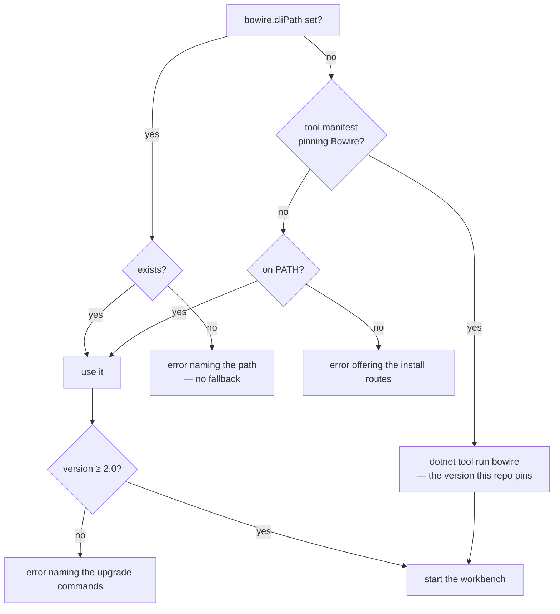

# Bowire for VS Code

The [Bowire](https://bowire.io/) multi-protocol API workbench, hosted in VS Code.

gRPC, REST, GraphQL, SignalR, MQTT, NATS, WebSocket, SSE, SOAP, OData, MCP — the same workbench you get from the standalone tool, in a side panel, with collections and environments stored in your workspace so they travel with the repo.

## Requirements

Bowire itself, version 2.0 or newer:

```bash
winget install Kuestenlogik.Bowire     # Windows
choco install bowire                   # Windows (Chocolatey)
dotnet tool install -g Kuestenlogik.Bowire.Tool
```

The extension does **not** bundle Bowire. A self-contained build is roughly 120 MB per platform, so bundling would mean one marketplace package per platform to keep in step and a new extension release for every Bowire release. It would also be a second, private copy of a CLI you most likely already have — the one your CI and your terminal use. Driving that same CLI keeps the extension small and keeps one Bowire in play instead of two.

## How the extension finds Bowire

Three places are checked, in this order — specific beats shared beats ambient:



Each step answers a different question. The setting is *this exact binary, because I said so*. The manifest is *the version this repository is tested with*, pinned in git and shared with everyone who clones it. `PATH` is *whatever this machine has*.

**`bowire.cliPath`** points at an executable directly. Use it for a build that is not on `PATH` — a local checkout, a portable copy, a second version alongside the installed one. It supports `${workspaceFolder}`, so a project-local build can be committed to `.vscode/settings.json` and shared:

```jsonc
{ "bowire.cliPath": "${workspaceFolder}/tools/bowire" }
```

**A tool manifest** needs nothing from you here — if the repo has one listing Bowire, the extension runs that. Pin it the usual way:

```bash
dotnet new tool-manifest        # once per repo
dotnet tool install Kuestenlogik.Bowire.Tool
```

That needs the .NET **SDK**, not just the runtime. A machine without one falls through to `PATH`, and a tool that is pinned but not fetched yet gets told to run `dotnet tool restore` — not the install instructions, which cannot help there.

Three details are deliberate. A configured path that does not resolve is reported as an error instead of quietly falling back — a typo that silently ran a different binary is harder to diagnose than one that says so. The version is checked before the process starts, because a CLI too old to understand the arguments the extension passes would otherwise just exit, and "Bowire exited before it started serving" names nothing. And both manifest locations are searched: `.config/dotnet-tools.json` is the documented one, but a bare `dotnet-tools.json` also resolves and is what `dotnet new tool-manifest` produced when this was tested against a real SDK.

The **Bowire** output channel records which executable was chosen, where it came from, and what version it reported.

One further step is planned for the same chain, slotting in below the three above: offering to fetch a version-matched CLI into extension storage when nothing is found at all, instead of ending at install instructions ([#590](https://github.com/Kuestenlogik/Bowire/issues/590)).

## Use

Run **Bowire: Open workbench** from the command palette. The extension starts Bowire with your workspace folder as its working directory and opens the workbench beside your editor. Closing the panel stops the process.

## Where your work is stored

Collections, environments, recordings and presets, as plain JSON. Nothing lives in IDE-proprietary storage, and nothing is locked to VS Code: the same data is what the standalone tool and the CLI use, so a collection you build in the editor replays unchanged in CI.

**Where** depends on the repository, not on the editor:

| | |
|---|---|
| by default | `~/.bowire/` — machine-wide, shared by every workspace |
| with the opt-in below | the repo's own `.bowire/` — travels with the checkout |

To keep a project's data beside its code, add one line to that repo's `.bowire/project.json`:

```jsonc
{ "version": 1, "storage": "project" }
```

The collections then commit, diff and review like any other file, and two repos open in two windows keep separate sets.

It is opt-in on purpose: a manifest that says nothing keeps the machine-wide store, so nobody's existing data moves under them. And because the answer comes from the repository, the same checkout resolves to the same store whether you opened it here, ran `bowire` in a terminal, or replayed it in CI — the editor is not a special case.

No file-system bridge is involved either way: the Bowire process reads and writes those files itself, and the webview only speaks HTTP to it.

## Ports

The extension asks for a port derived from the workspace path (5099–6098), so reopening the panel reuses the same one and two windows do not collide. It stays clear of Bowire's own default 5080, so a workbench you started by hand keeps working. If the CLI binds elsewhere, the extension follows the port it reports rather than the one it asked for.

## Related

- [JetBrains plugin](https://github.com/Kuestenlogik/Bowire/issues/588) — the same shape for the IntelliJ platform family, tracked separately.
- [Bowire documentation](https://bowire.io/docs/)
