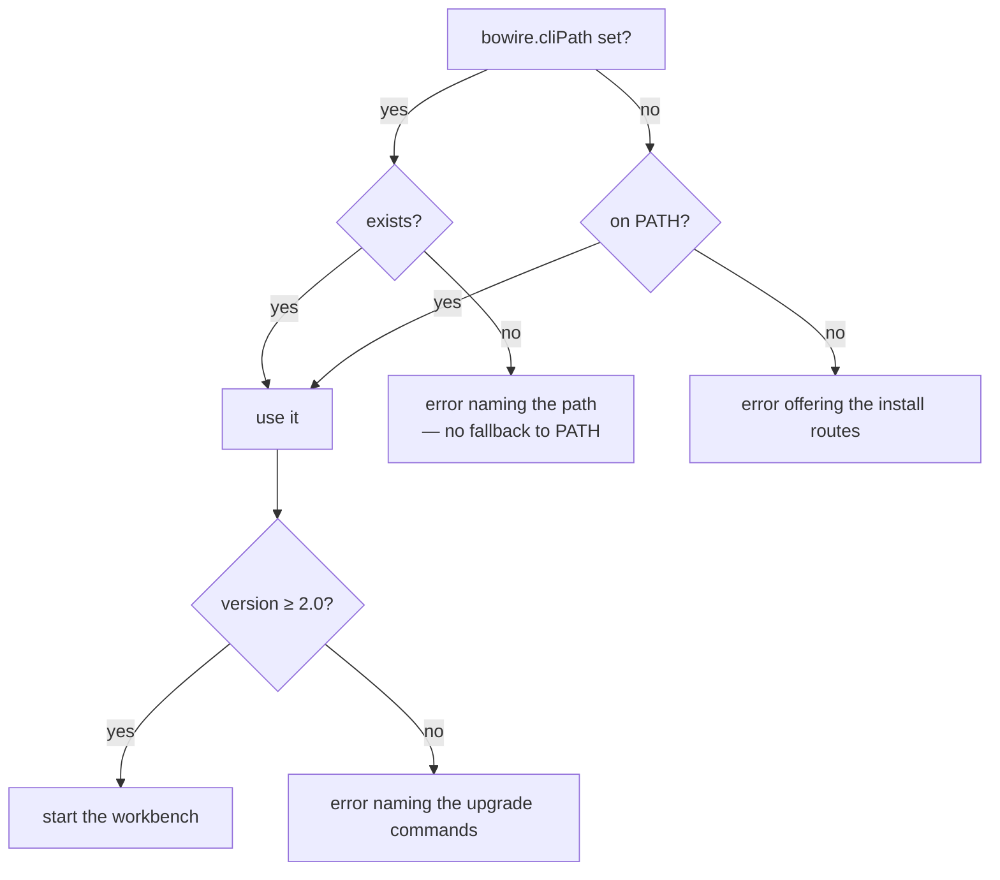

# Bowire for VS Code

The [Bowire](https://bowire.io/) multi-protocol API workbench, hosted in VS Code.

gRPC, REST, GraphQL, SignalR, MQTT, NATS, WebSocket, SSE, SOAP, OData, MCP — the same workbench you get from the standalone tool, in a side panel, with collections and environments stored in your workspace so they travel with the repo.

## Requirements

Bowire itself, version 2.0 or newer:

```bash
winget install Kuestenlogik.Bowire     # Windows
choco install bowire                   # Windows (Chocolatey)
dotnet tool install -g Kuestenlogik.Bowire.Tool
```

The extension does **not** bundle Bowire. A self-contained build is roughly 120 MB per platform, so bundling would mean one marketplace package per platform to keep in step and a new extension release for every Bowire release. It would also be a second, private copy of a CLI you most likely already have — the one your CI and your terminal use. Driving that same CLI keeps the extension small and keeps one Bowire in play instead of two.

## How the extension finds Bowire

Two places are checked, in this order:



**`bowire.cliPath`** points at a `bowire` executable directly. Use it for a build that is not on `PATH` — a local checkout, a portable copy, a second version alongside the installed one. It supports `${workspaceFolder}`, so a project-local build can be committed to `.vscode/settings.json` and shared with the team:

```jsonc
{ "bowire.cliPath": "${workspaceFolder}/tools/bowire" }
```

Two details are deliberate. A configured path that does not resolve is reported as an error instead of quietly falling back to `PATH` — a typo that silently ran a different binary is harder to diagnose than one that says so. And the version is checked before the process starts: a CLI too old to understand the arguments the extension passes would otherwise just exit, and "Bowire exited before it started serving" says nothing about the actual cause.

The **Bowire** output channel records which executable was chosen, where it came from, and what version it reported.

Two further steps are planned for the same chain, each slotting in without changing the two above:

| Step | What it adds | Tracked in |
|---|---|---|
| Workspace tool manifest | `.config/dotnet-tools.json` pins the Bowire version in the repo, so a team shares one version the way it already shares `.bowire/` | [#589](https://github.com/Kuestenlogik/Bowire/issues/589) |
| Managed download | Offer to fetch a version-matched CLI into extension storage when nothing is found, instead of ending at install instructions | [#590](https://github.com/Kuestenlogik/Bowire/issues/590) |

## Use

Run **Bowire: Open workbench** from the command palette. The extension starts Bowire with your workspace folder as its working directory and opens the workbench beside your editor. Closing the panel stops the process.

## Where your work is stored

In `~/.bowire/` — collections, environments, recordings and presets, as plain JSON. Nothing lives in IDE-proprietary storage, and nothing is locked to VS Code: the same data is what the standalone tool and the CLI use, so a collection you build in the editor replays unchanged in CI.

**It is not yet stored per repository.** The storage root is a user-profile path, so two repos open in two windows currently share one set of collections. Making a workspace's data live inside that workspace — the version that would let collections be committed and reviewed — is tracked in [#591](https://github.com/Kuestenlogik/Bowire/issues/591).

No file-system bridge is involved either way: the Bowire process reads and writes those files itself, and the webview only speaks HTTP to it.

## Ports

The extension asks for a port derived from the workspace path (5099–6098), so reopening the panel reuses the same one and two windows do not collide. It stays clear of Bowire's own default 5080, so a workbench you started by hand keeps working. If the CLI binds elsewhere, the extension follows the port it reports rather than the one it asked for.

## Related

- [JetBrains plugin](https://github.com/Kuestenlogik/Bowire/issues/588) — the same shape for the IntelliJ platform family, tracked separately.
- [Bowire documentation](https://bowire.io/docs/)
