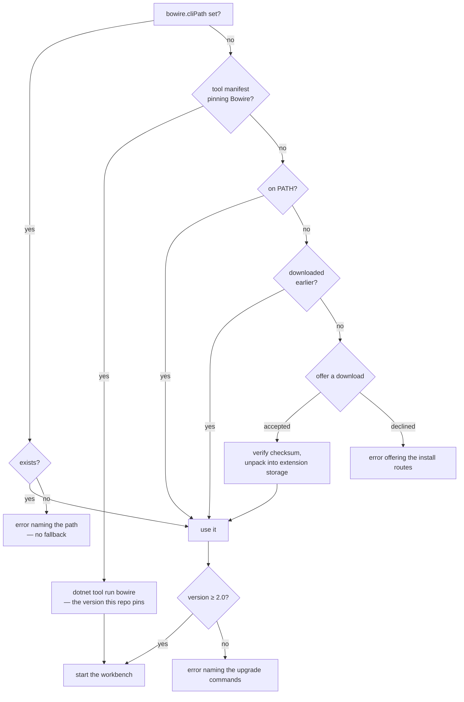

# Bowire for VS Code

The [Bowire](https://bowire.io/) multi-protocol API workbench, hosted in VS Code.

gRPC, REST, GraphQL, SignalR, MQTT, NATS, WebSocket, SSE, SOAP, OData, MCP — the same workbench you get from the standalone tool, in a side panel, with collections and environments stored in your workspace so they travel with the repo.

## Requirements

VS Code 1.90 or newer, and Bowire 2.0 or newer.

**You do not have to install Bowire first.** If the extension finds none, it
offers to fetch one and manages that copy itself — nothing is downloaded
without you saying yes, and the archive is verified against its digest before
anything is unpacked.

Bring your own if you prefer, which is the better choice when your CI already
pins a version and you want the editor on the same one:

```bash
winget install Kuestenlogik.Bowire     # Windows
choco install bowire                   # Windows (Chocolatey)
dotnet tool install -g Kuestenlogik.Bowire.Tool
```

The extension does **not** *bundle* Bowire, which is a different thing from
fetching one on request. A self-contained build is roughly 120 MB per platform,
so bundling would mean one marketplace package per platform to keep in step and
a new extension release for every Bowire release. It would also be a second,
private copy of a CLI you most likely already have — the one your CI and your
terminal use. Driving that same CLI keeps the extension small and keeps one
Bowire in play instead of two; the managed download exists for the case where
there is no CLI to drive yet.

## How the extension finds Bowire

Four places are checked, in this order — specific beats shared beats ambient beats fallback:



Each step answers a different question. The setting is *this exact binary, because I said so*. The manifest is *the version this repository is tested with*, pinned in git and shared with everyone who clones it. `PATH` is *whatever this machine has*. The download is *nothing else was here, so we brought our own*.

**`bowire.cliPath`** points at an executable directly. Use it for a build that is not on `PATH` — a local checkout, a portable copy, a second version alongside the installed one. It supports `${workspaceFolder}`, so a project-local build can be committed to `.vscode/settings.json` and shared:

```jsonc
{ "bowire.cliPath": "${workspaceFolder}/tools/bowire" }
```

**A tool manifest** needs nothing from you here — if the repo has one listing Bowire, the extension runs that. Pin it the usual way:

```bash
dotnet new tool-manifest        # once per repo
dotnet tool install Kuestenlogik.Bowire.Tool
```

That needs the .NET **SDK**, not just the runtime. A machine without one falls through to `PATH`, and a tool that is pinned but not fetched yet gets told to run `dotnet tool restore` — not the install instructions, which cannot help there.

**A managed download** is the last resort, and it only ever happens after you say so. When none of the three above find anything, the extension offers to fetch a CLI into its own storage — about 60 MB, outside your workspace and off your `PATH`. Decline and you get the install instructions, exactly as before.

```jsonc
{ "bowire.autoDownload": "prompt" }   // default — "always" or "never" also work
```

`never` removes the offer entirely, which is what a machine with no outbound network wants. Deleting the extension's storage folder puts you back to the not-found state with nothing left behind.

That copy is pinned to the version this extension was tested against, which is the one correctness argument the other three routes cannot make: `PATH` resolves to whatever the machine happens to have. It still ranks *below* `PATH` on purpose — an installed Bowire is the one your terminal and your CI use, and having the editor quietly drive a different version would be its own kind of bug.

Nothing is unpacked before its SHA-256 matches the `checksums.txt` published with the release. The archive is streamed to a `.part` file and hashed on the way past, so the check runs against the bytes that actually landed on disk, and a mismatch is found while the payload is still an inert temporary file — which is then deleted.

Four details are deliberate. A configured path that does not resolve is reported as an error instead of quietly falling back — a typo that silently ran a different binary is harder to diagnose than one that says so. The version is checked before the process starts, because a CLI too old to understand the arguments the extension passes would otherwise just exit, and "Bowire exited before it started serving" names nothing. Both manifest locations are searched: `.config/dotnet-tools.json` is the documented one, but a bare `dotnet-tools.json` also resolves and is what `dotnet new tool-manifest` produced when this was tested against a real SDK. And a platform Bowire publishes no build for is told so rather than offered a download that could only 404.

The **Bowire** output channel records which executable was chosen, where it came from, and what version it reported.

## Use

Run **Bowire: Open workbench** from the command palette. The extension starts Bowire with your workspace folder as its working directory and opens the workbench beside your editor. Closing the panel stops the process.

## Where your work is stored

Collections, environments, recordings and presets, as plain JSON. Nothing lives in IDE-proprietary storage, and nothing is locked to VS Code: the same data is what the standalone tool and the CLI use, so a collection you build in the editor replays unchanged in CI.

**Where** depends on the repository, not on the editor:

| | |
|---|---|
| by default | `~/.bowire/` — machine-wide, shared by every workspace |
| with the opt-in below | the repo's own `.bowire/` — travels with the checkout |

To keep a project's data beside its code, add one line to that repo's `.bowire/project.json`:

```jsonc
{ "version": 1, "storage": "project" }
```

The collections then commit, diff and review like any other file, and two repos open in two windows keep separate sets.

It is opt-in on purpose: a manifest that says nothing keeps the machine-wide store, so nobody's existing data moves under them. Switching an existing setup over is a copy, not a migration — Bowire reads whatever is in the store it resolves to, so moving the files is the whole operation:

```bash
mkdir -p .bowire
cp ~/.bowire/collections.json ~/.bowire/environments.json .bowire/   # whichever you want to share
```

Copy rather than move while you are deciding: the machine-wide store is left untouched, so nothing is lost if the repo turns out not to be the right home for it. And because the answer comes from the repository, the same checkout resolves to the same store whether you opened it here, ran `bowire` in a terminal, or replayed it in CI — the editor is not a special case.

No file-system bridge is involved either way: the Bowire process reads and writes those files itself, and the webview only speaks HTTP to it.

## Ports

The extension asks for a port derived from the workspace path (5099–6098), so reopening the panel reuses the same one and two windows do not collide. It stays clear of Bowire's own default 5080, so a workbench you started by hand keeps working. If the CLI binds elsewhere, the extension follows the port it reports rather than the one it asked for.

## Related

- [JetBrains plugin](https://github.com/Kuestenlogik/Bowire/issues/588) — the same shape for the IntelliJ platform family, tracked separately.
- [Bowire documentation](https://bowire.io/docs/)
